# Lab app — package G: lesson library, editors, catalogue

Phone = Pixel Fold folded (412dp); "unfolded" = the inner screen (841dp).

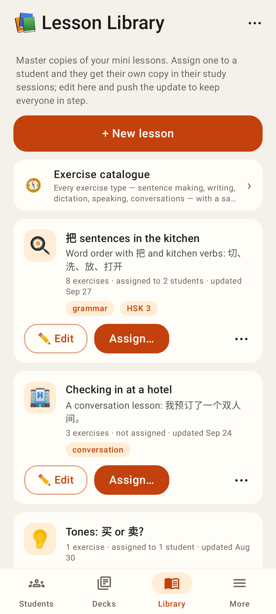
Lesson Library: cached-first list, Edit / Assign / ⋯, catalogue link.

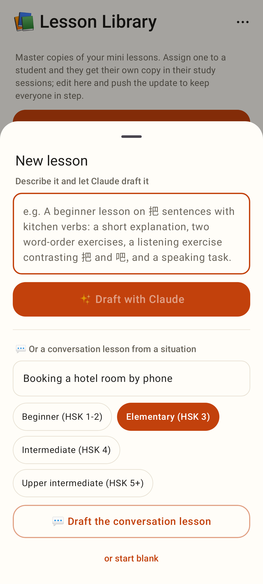
New lesson: Draft with Claude, a conversation lesson from a situation, or start blank.

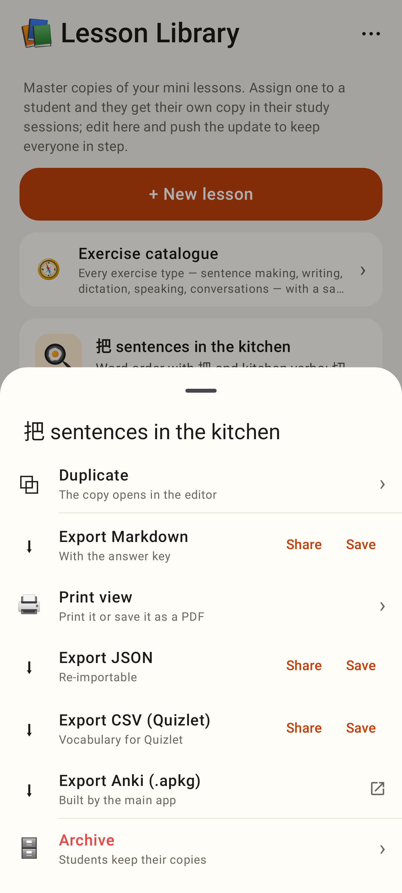
Card ⋯: duplicate, export (share / save), print, Anki (main app), archive.

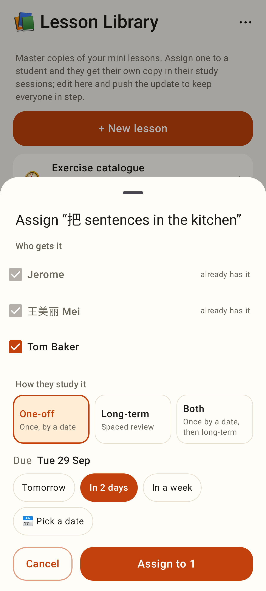
Assign: students who already have it are ticked; One-off / Long-term / Both with a due date.

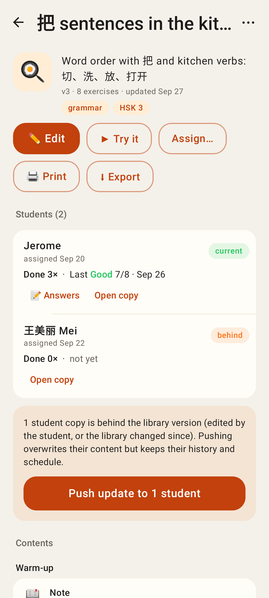
Library item: students with current / behind, push update, contents.

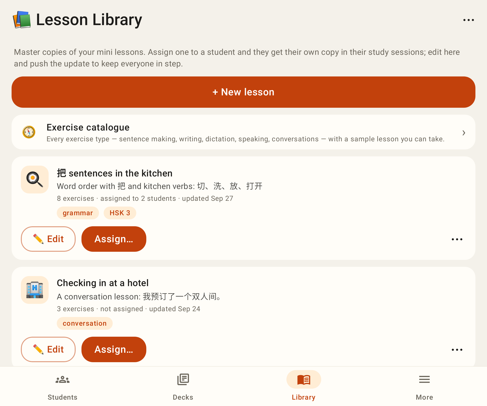
Unfolded.

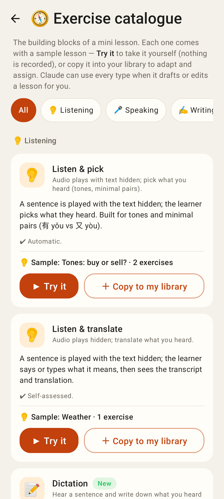
Exercise catalogue: every type, sample lesson, Try it / Copy to my library.

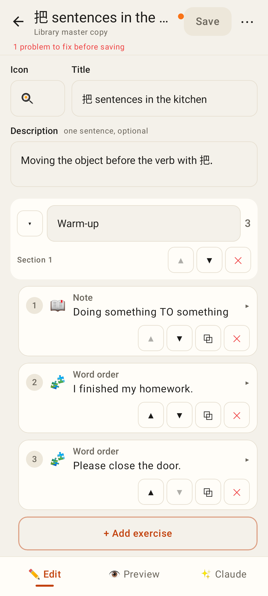
Lesson editor: live validation, collapsible sections and exercise cards.

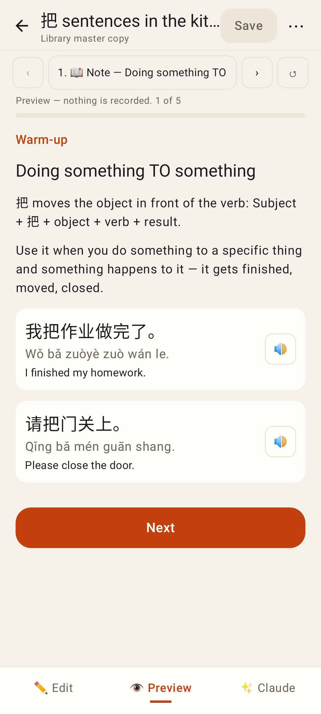
Preview walkthrough (nothing recorded).

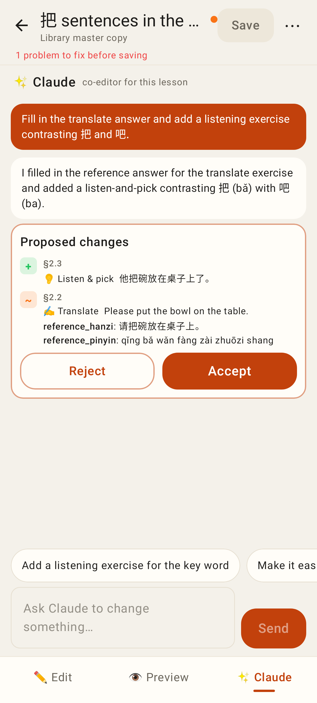
Claude co-editor: proposal diff with Accept / Reject.

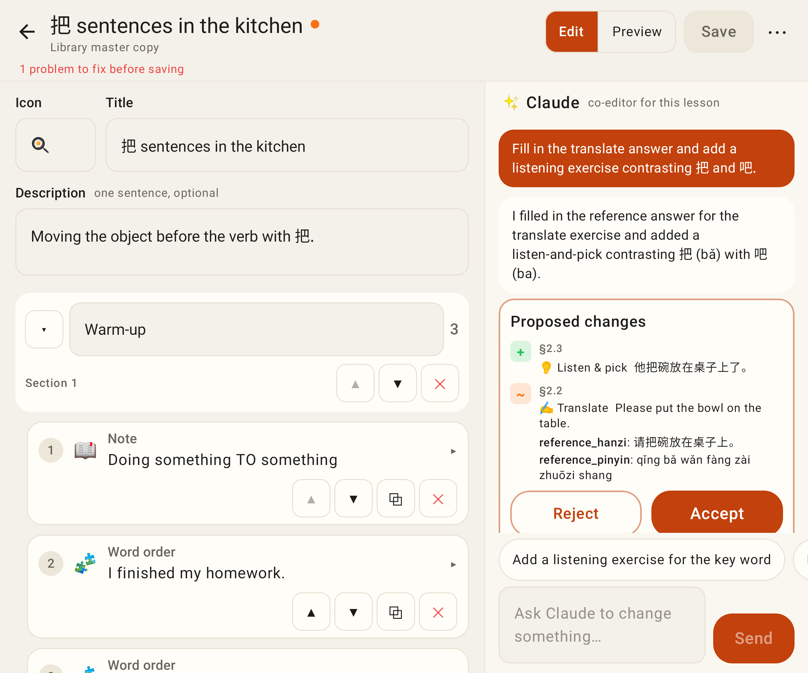
Unfolded: form and chat side by side.

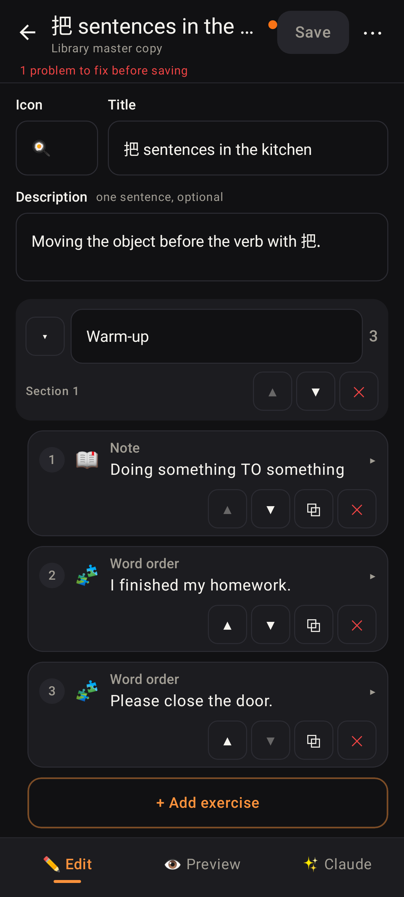
Dark mode.

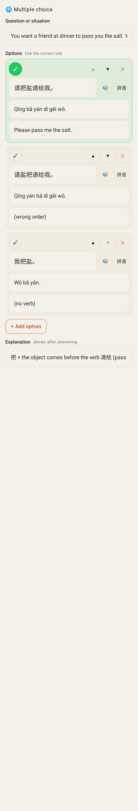
Multiple-choice form (✓ marks the answer).

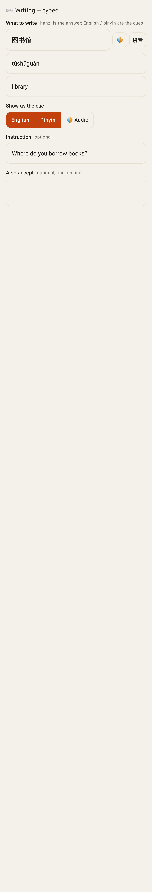
Writing — typed: cues, alternatives.

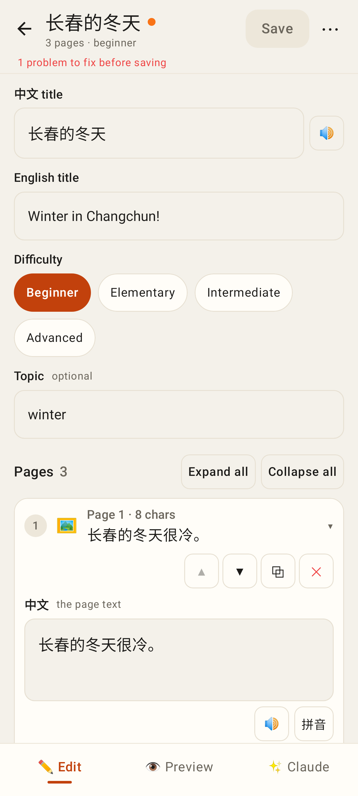
Reader editor: titles, difficulty, page cards with 🔊 / 拼音.

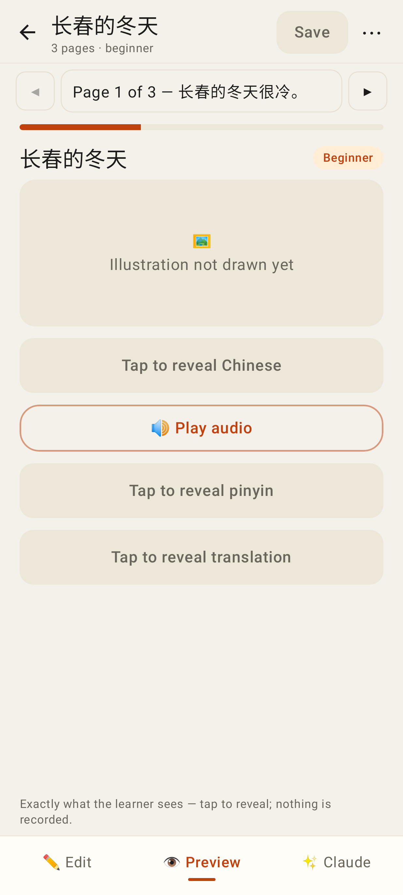
Reader preview = the reading view.

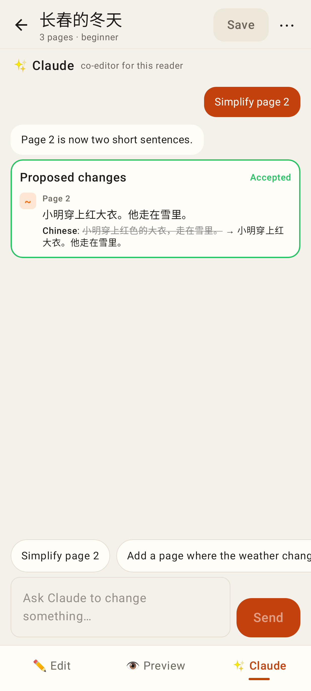
Reader co-editor with an accepted page change.

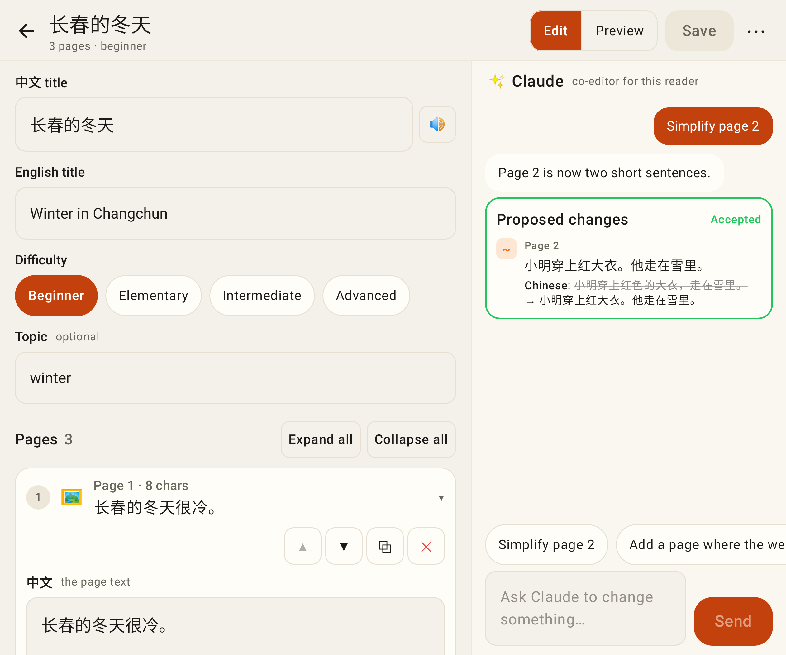
Reader editor unfolded.

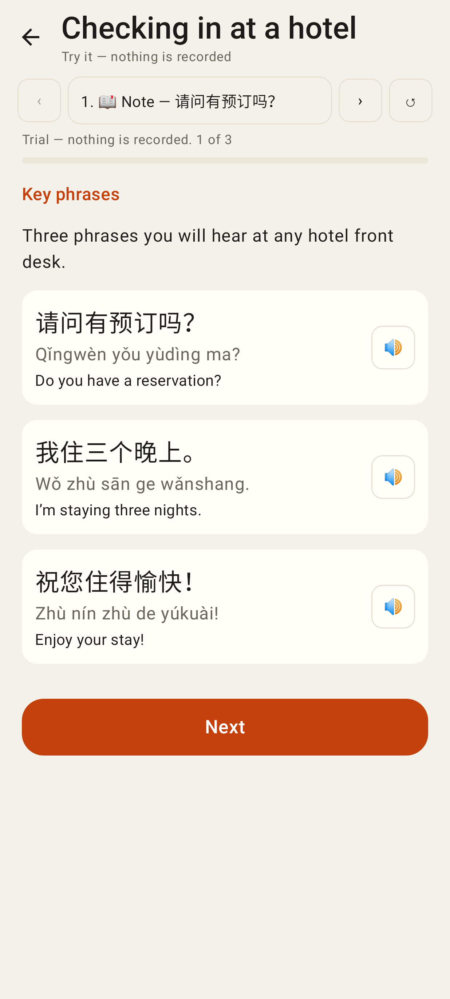
Catalogue trial of the conversation sample.
