# Lab app — Sentence Coach, Sentence Breakdown, Quests (package H, part 2)

Roborazzi renders (Pixel Fold folded 412dp unless noted), realistic data.

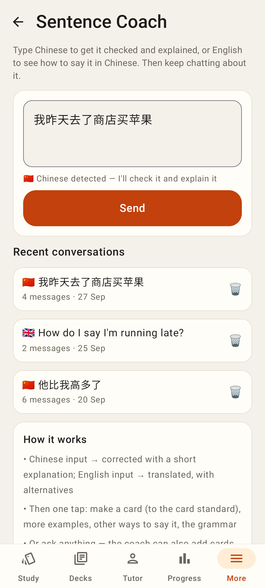 — `/coach`: Chinese detected, recent conversations
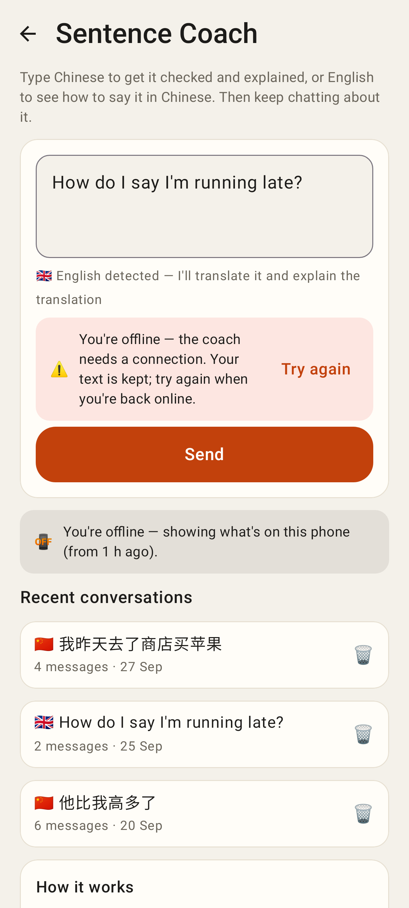 — offline: the text is kept, the notice says why
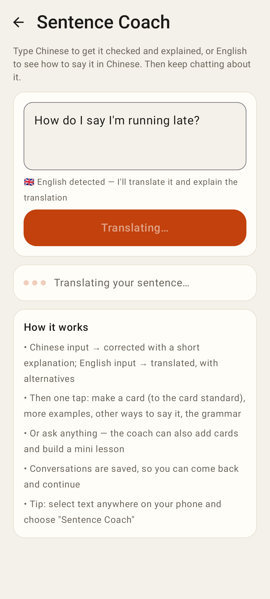 — English detected → Translating…
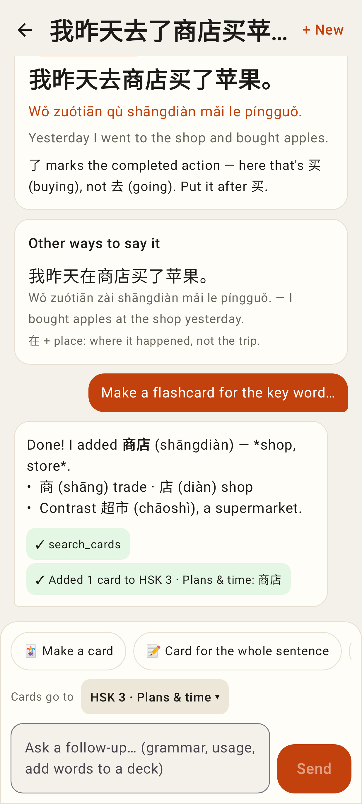 — correction, other ways to say it, a made card (tool chips), quick-action chips + "Cards go to"
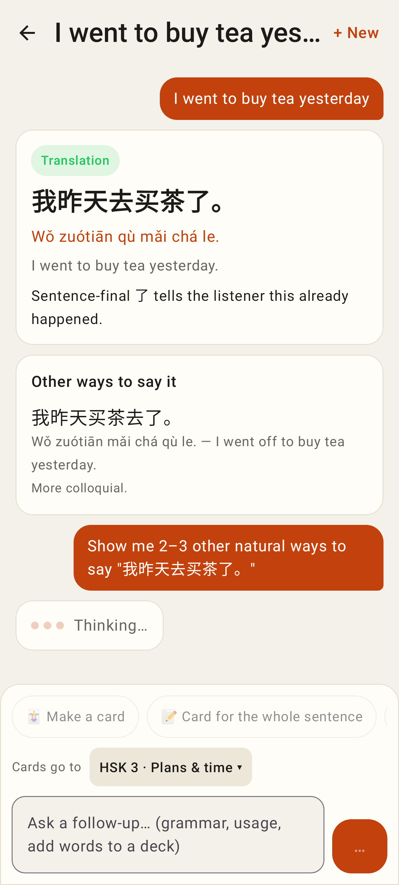 — English → Chinese reply, a quick action sending
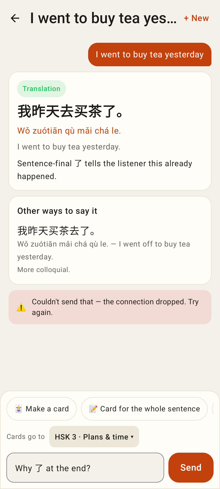 — a failed follow-up as an inline notice
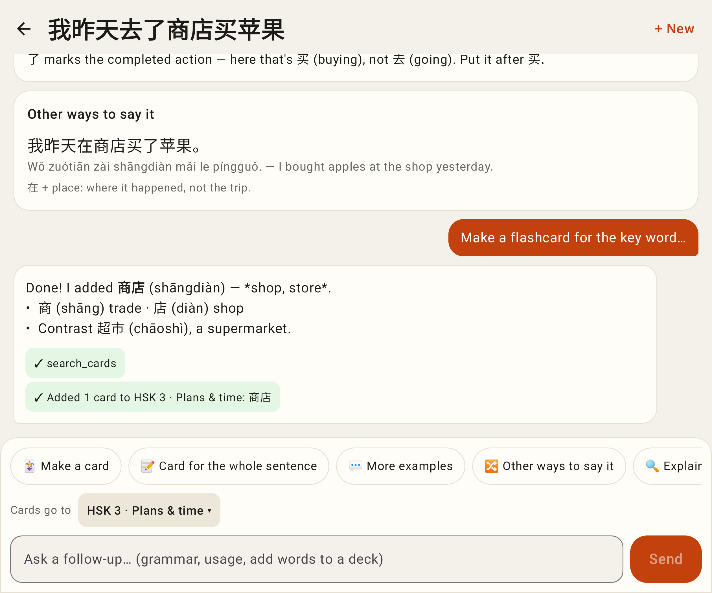 — unfolded
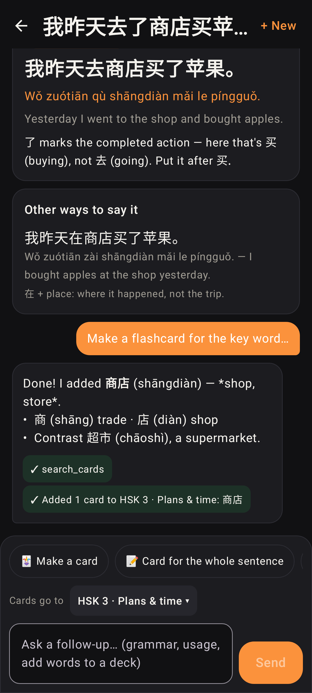 — dark
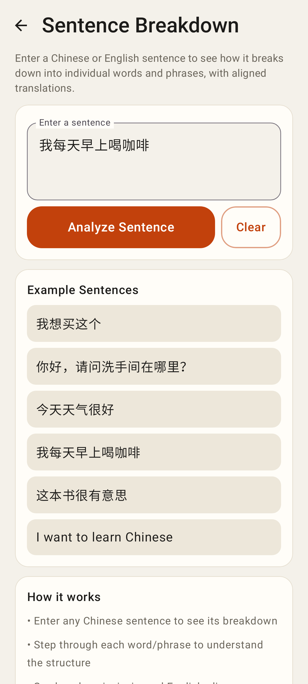 — `/analyze`
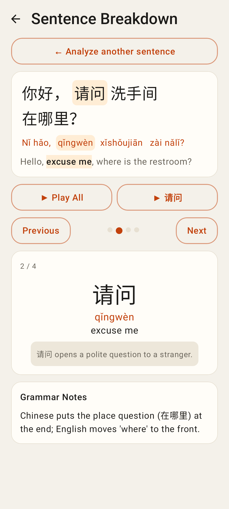 — chunk 2 of 4 highlighted across hanzi / pinyin / English
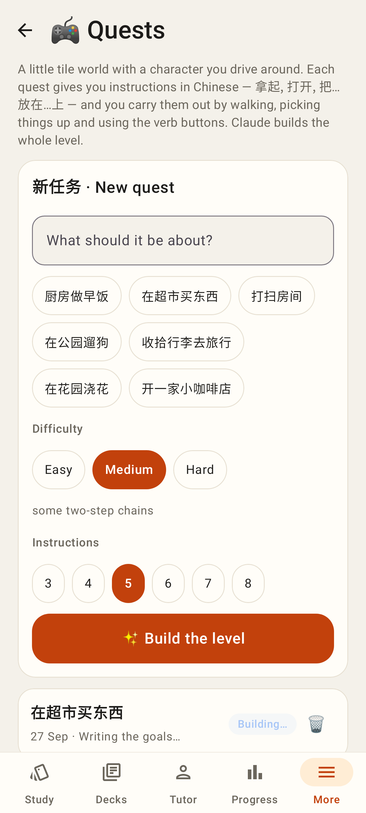 — `/quests`: build a level, list with Building… / Replay / Play / Retry
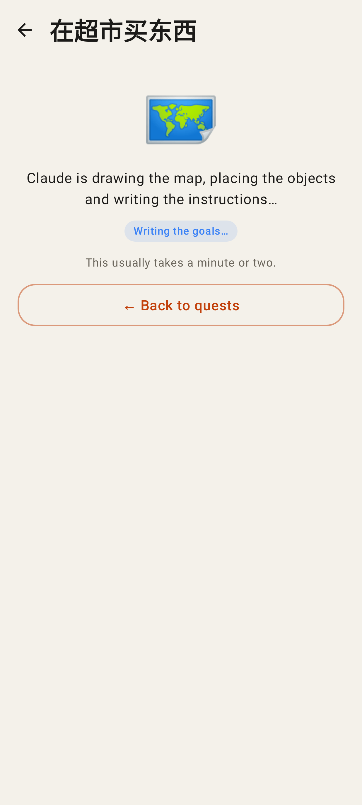 — generating, with the progress breadcrumb
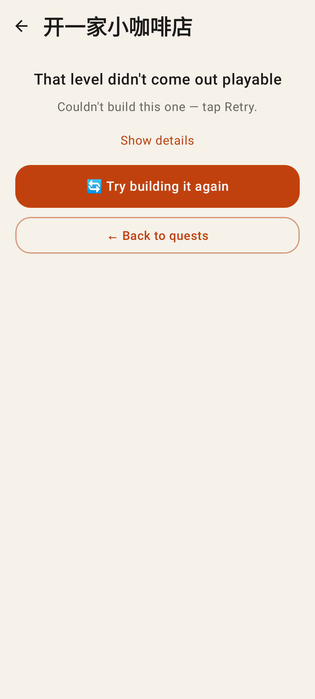 — failed generation, details + Try again
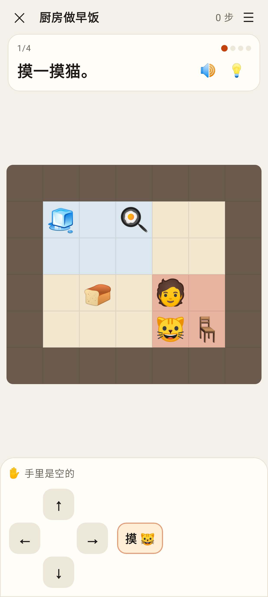 — the level: instruction, map, arrows, verbs
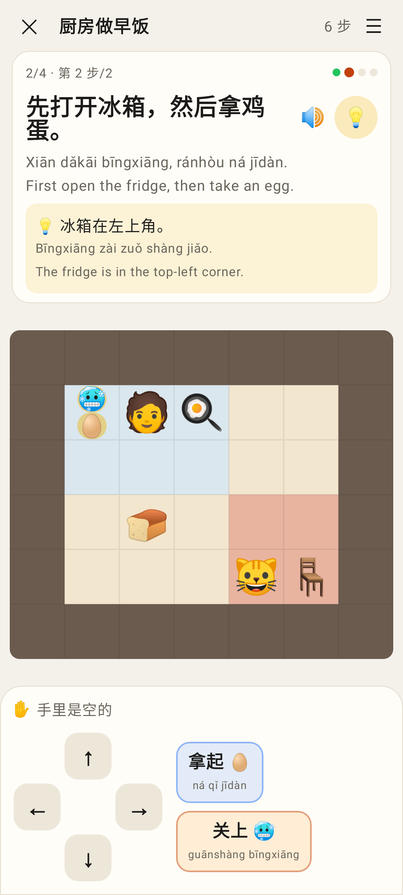 — 先…然后… step 2/2, 💡 hint, pinyin/English on
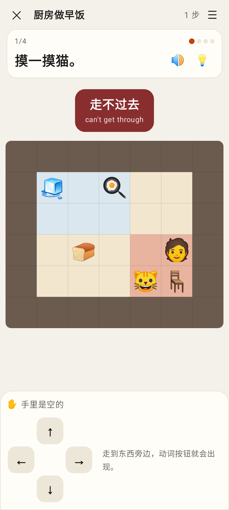 — walking into a wall: 走不过去
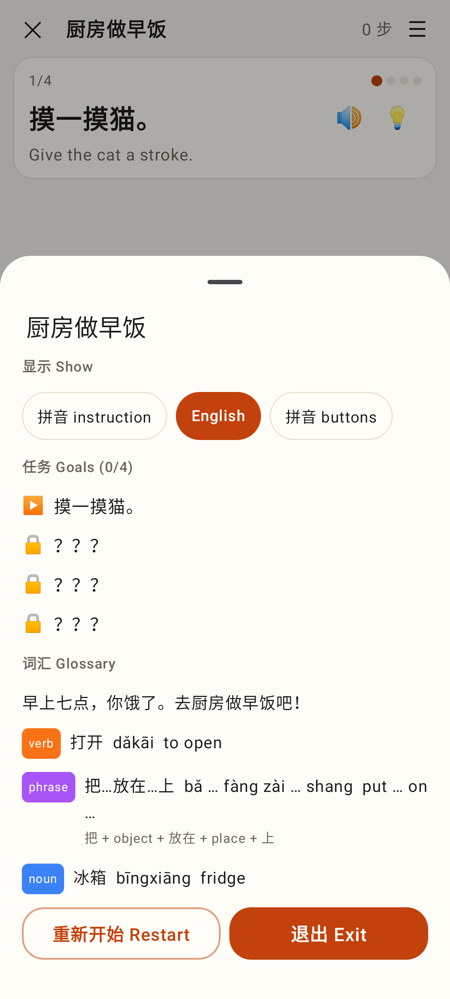 — show toggles, goals, glossary
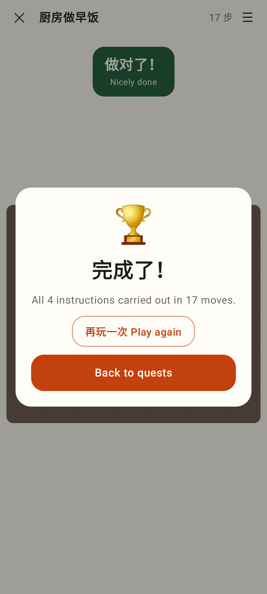 — 完成了！
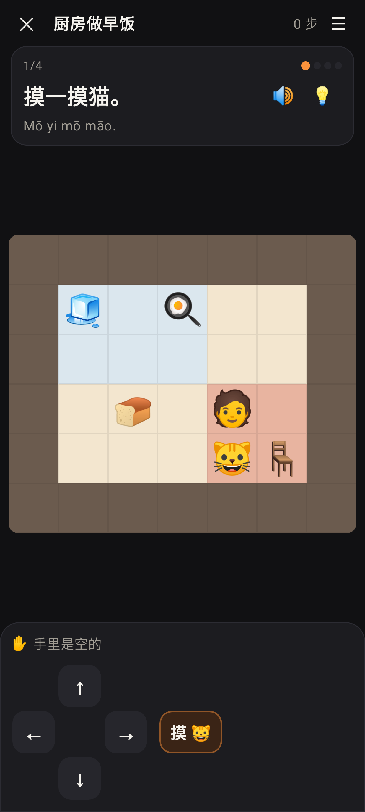 — dark
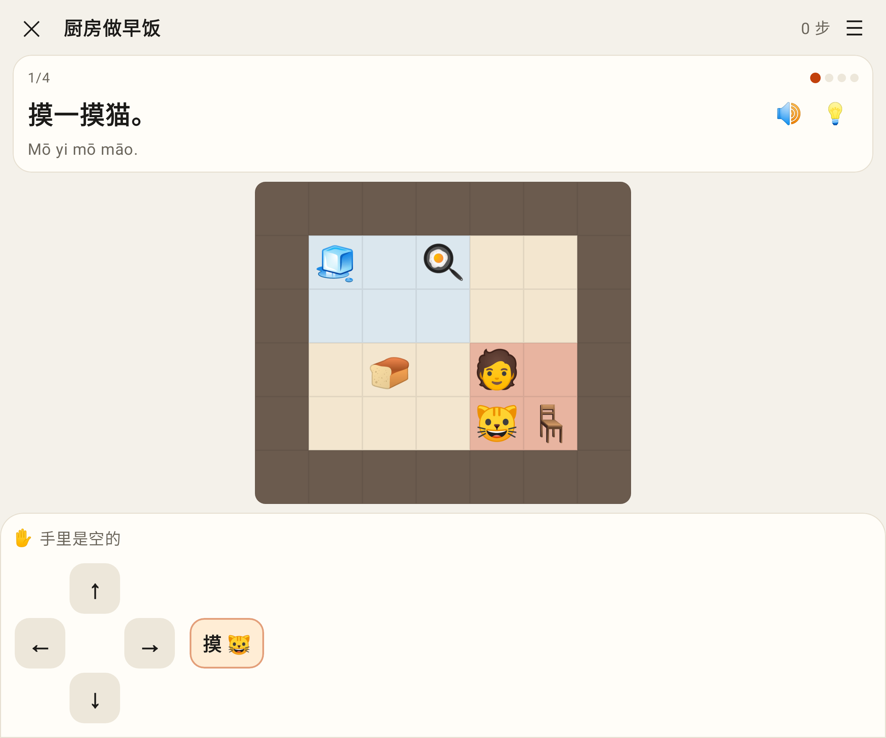 — unfolded
