# Lab app — handwriting / stroke-order practice (package H)

Rendered by `StrokesScreenshots` (Roborazzi, Pixel Fold folded 412dp unless noted), with real
stroke data and strokes "drawn" by the tests.

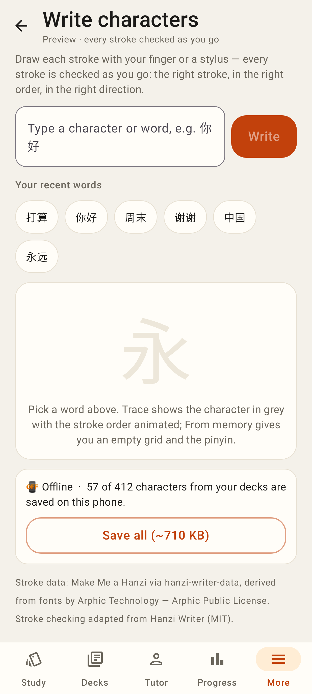 — `/practice/strokes`: recent words, offline card with Save all
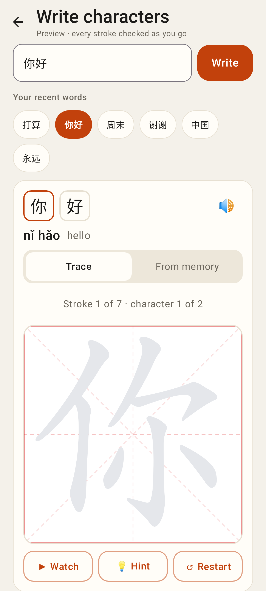 — a word picked: Trace mode over the grey outline
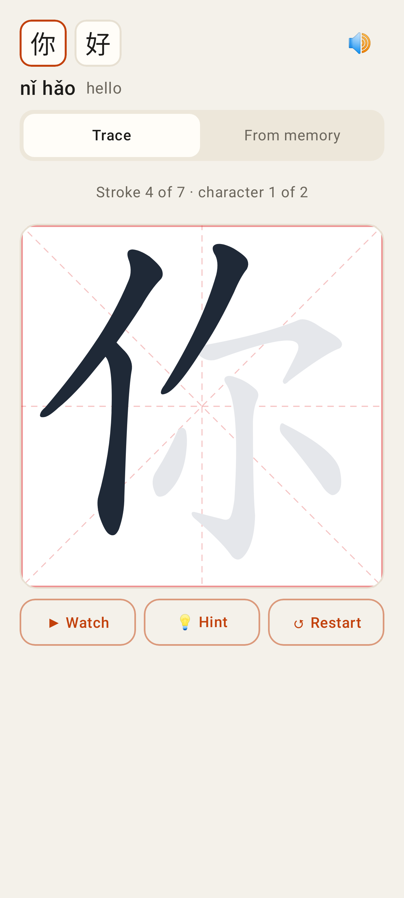 — three strokes written in trace mode
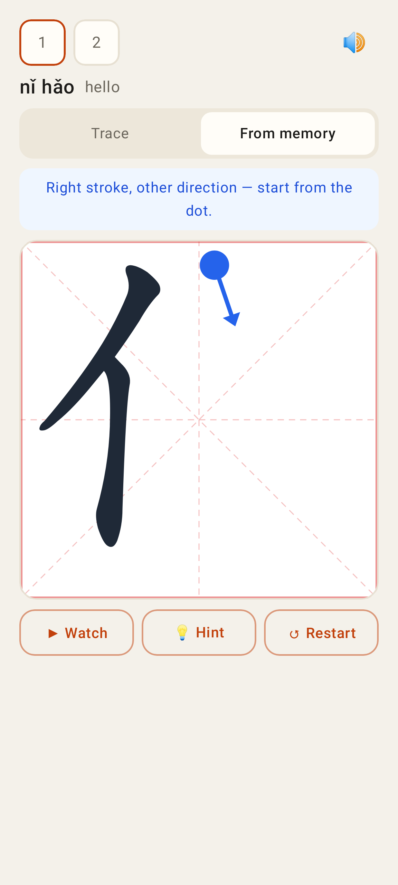 — From memory: a stroke drawn backwards → message + start dot/arrow
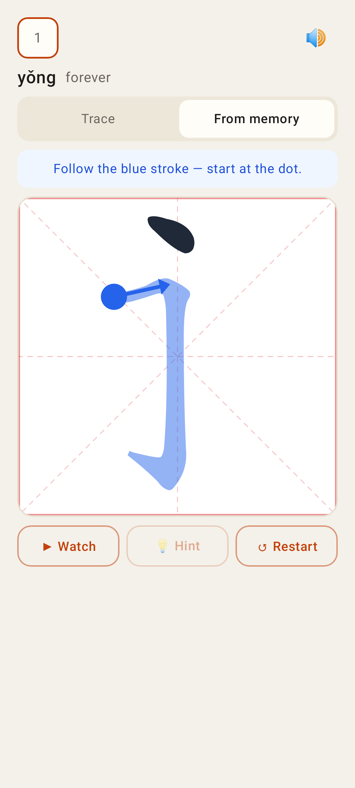 — 💡 Hint: the expected stroke painted in blue
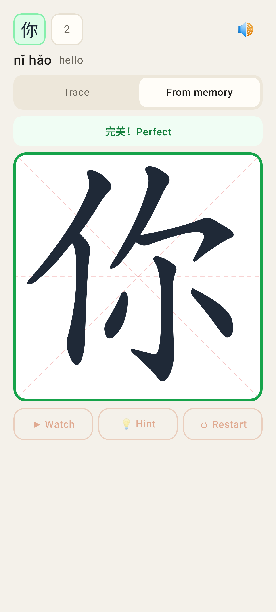 — character finished perfectly: green glow + 完美
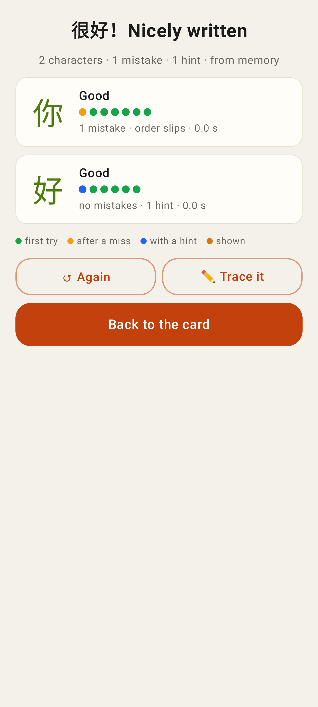 — summary: per-stroke dots, mistakes, hints, Again / Trace it / Back to the card
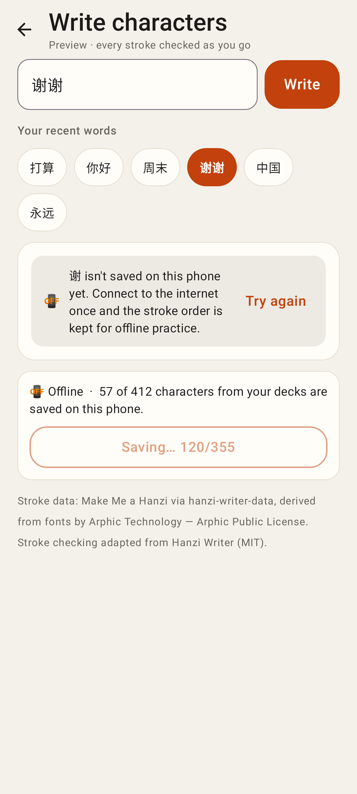 — character not saved yet and no connection; Save all in progress
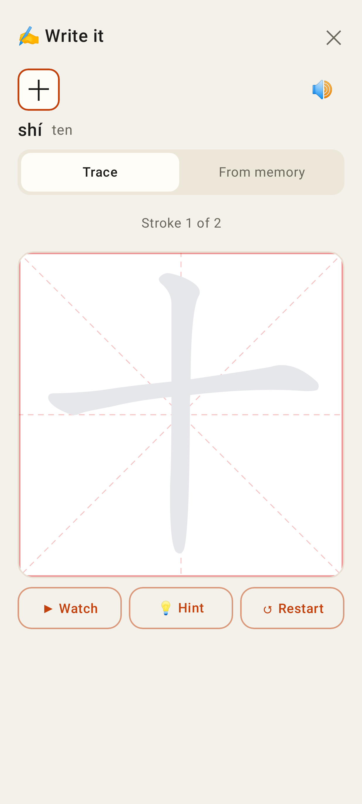 — the "✍️ Write it" sheet for the study card
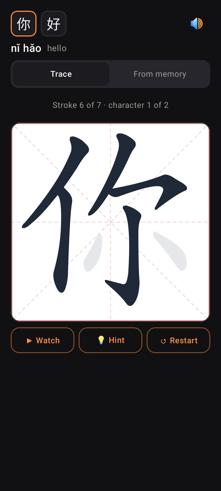 — dark theme
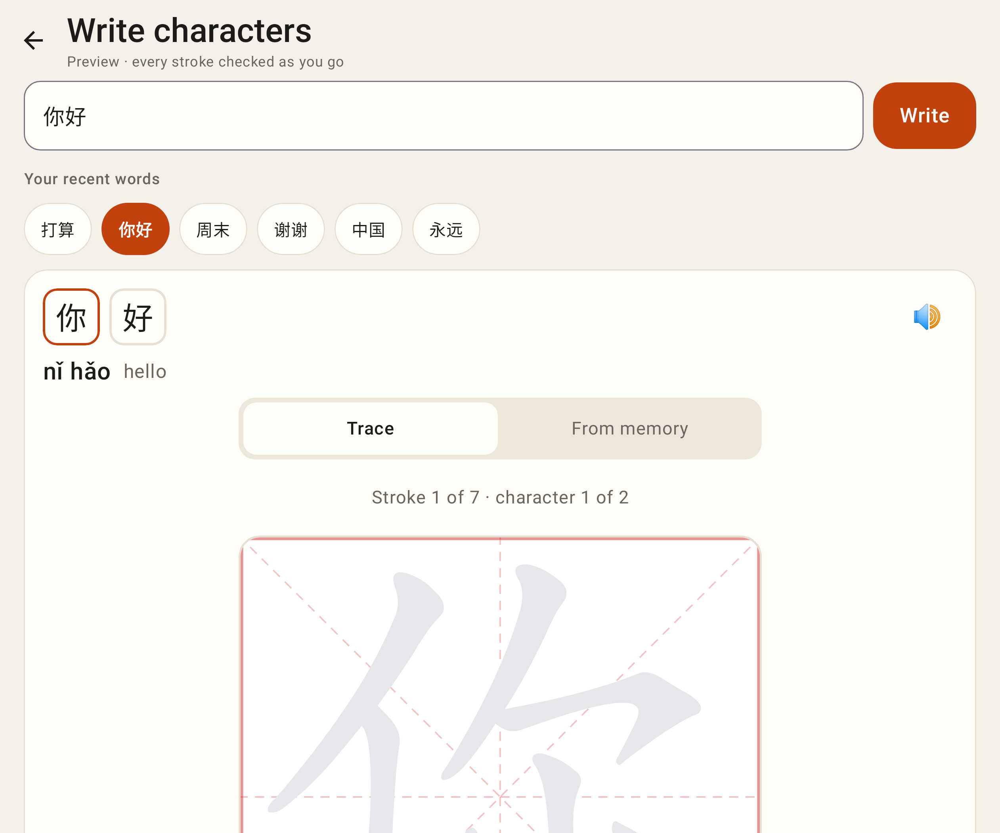 — unfolded (841dp)
