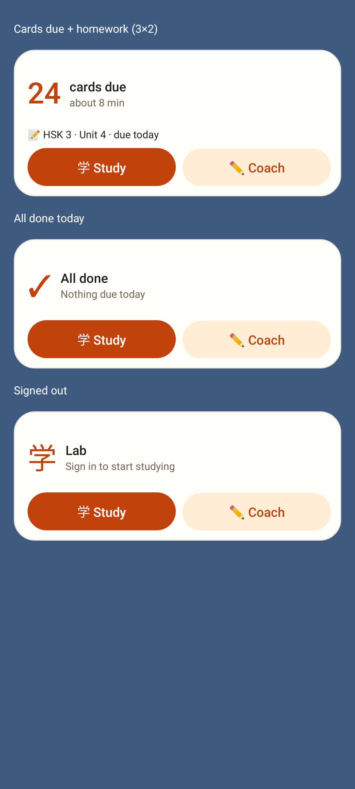
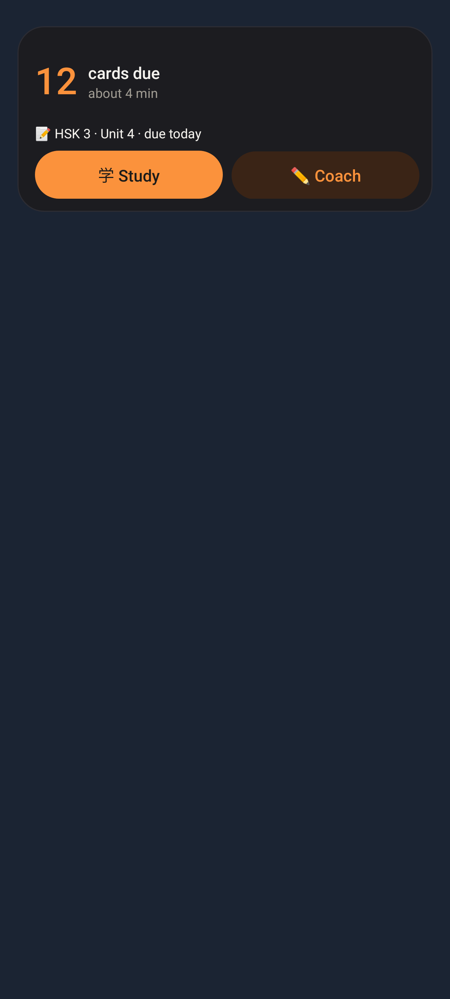
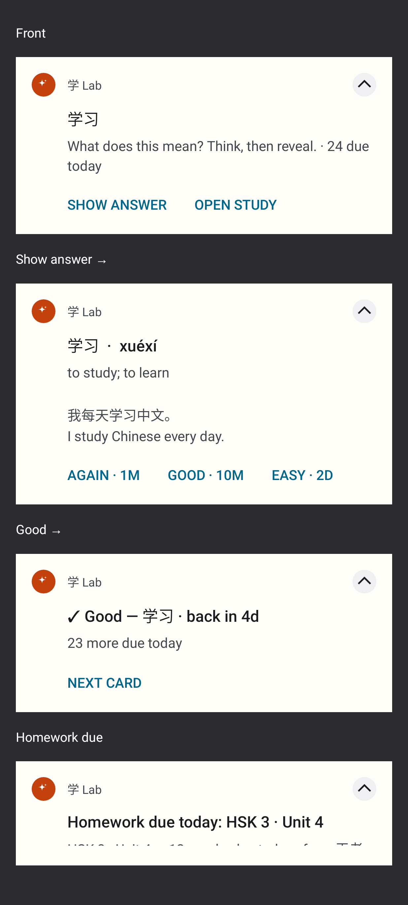
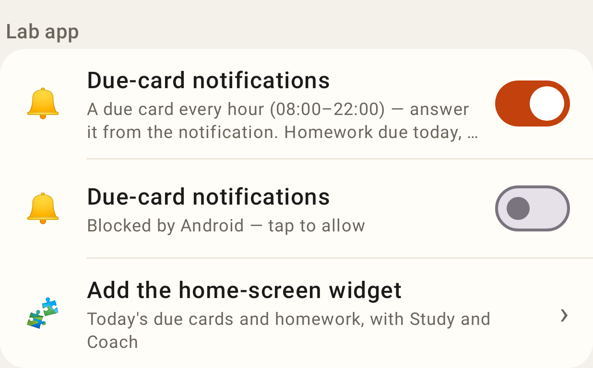

# Lab app — native shell (package I)

Home-screen widget: cards due + homework due today, all done, signed out (real RemoteViews, 3×2).

The widget in dark mode.

Due-card notification: front → Show answer (pinyin, meaning, example; Again / Good / Easy with intervals) → rated with Next card; homework due today (system templates rendered by Robolectric, which clips the last one's body line).

More → Lab app: the notifications toggle (on / blocked by Android) and "Add the home-screen widget".
