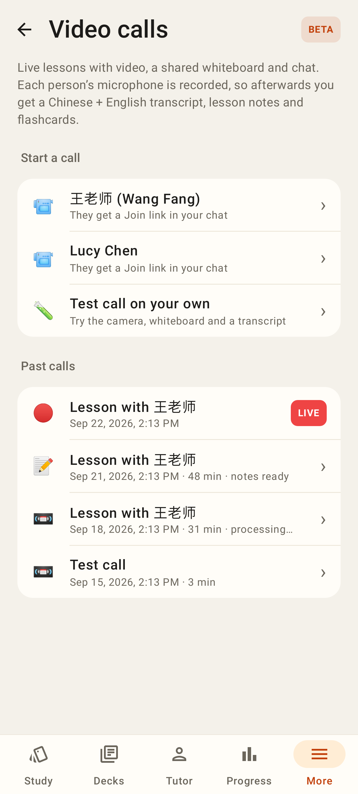
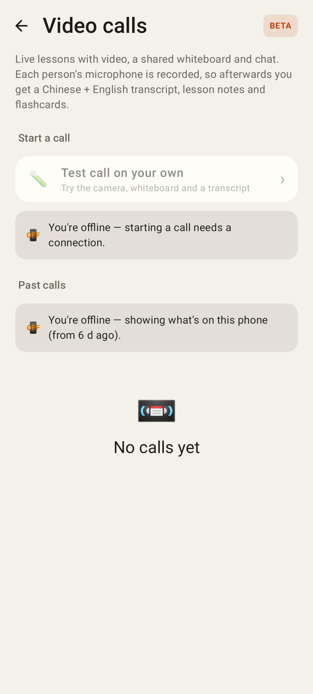
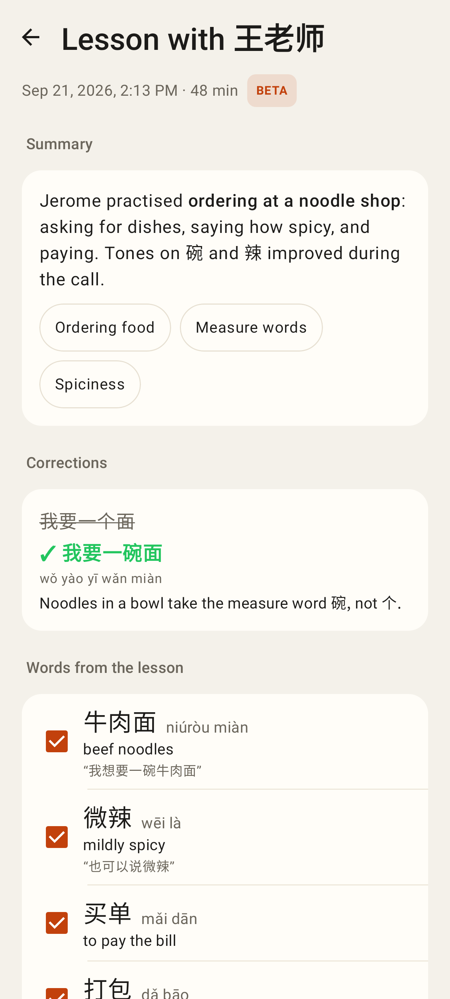
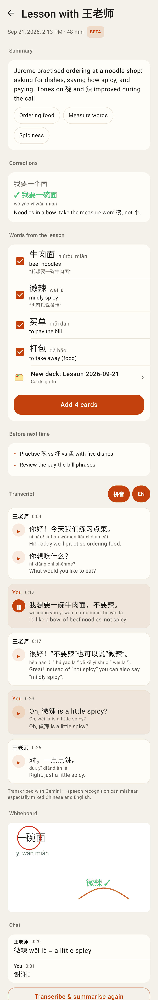
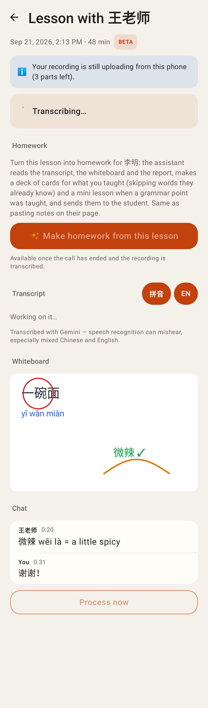
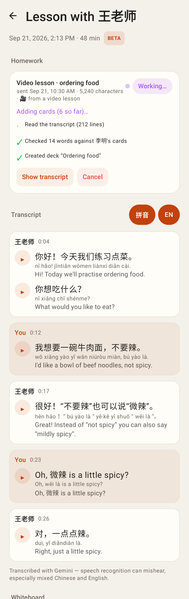
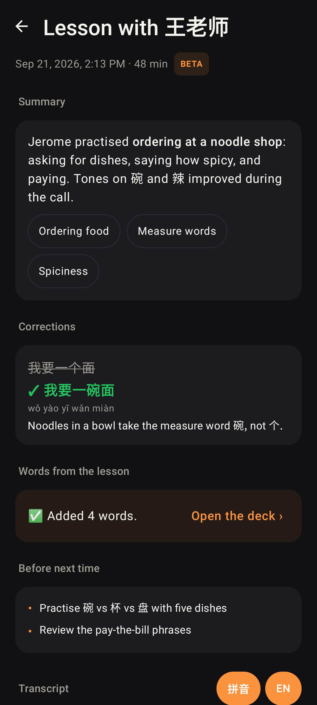
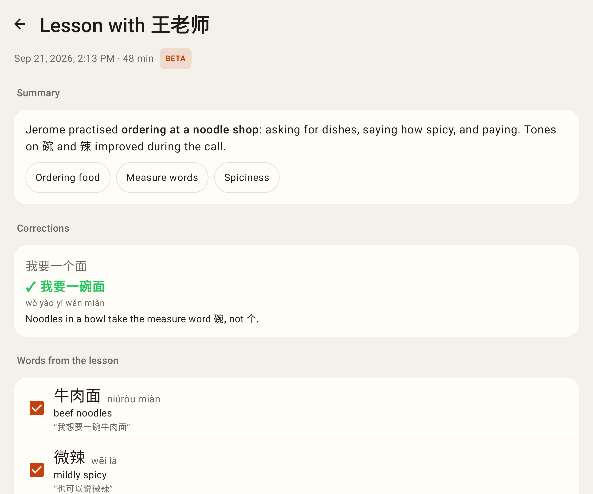

# Lab app — video calls, part 1 (list, review, upload queue)

Robolectric + Roborazzi renders (Pixel Fold folded 412dp, 2.625×; one unfolded).

`/calls` in the tab shell: start a call with a tutor / student or a solo test call; past calls with their state and a LIVE row.

Offline: starting is disabled and the cached (empty) list says so.

`/calls/:id/review` — summary, topics, corrections.

The whole review page: words → "Add 4 cards" with a deck picker, before next time, transcript turns (▶ per line — one playing — 拼音 / EN), whiteboard snapshot, chat, Transcribe again.

Still transcribing, 3 recording parts still uploading from this phone; the tutor's Make-homework button waits until the transcript is ready.

The tutor's homework job from the lesson, with live progress (the session-notes job card).

After "Add N cards" (dark theme).

The unfolded Fold: centred 720dp column.
