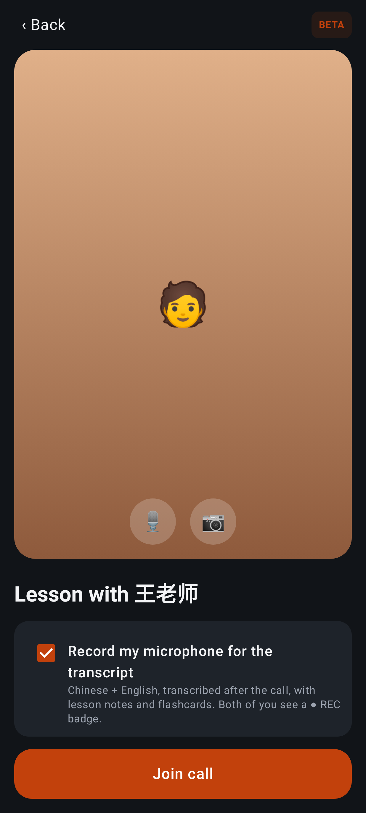
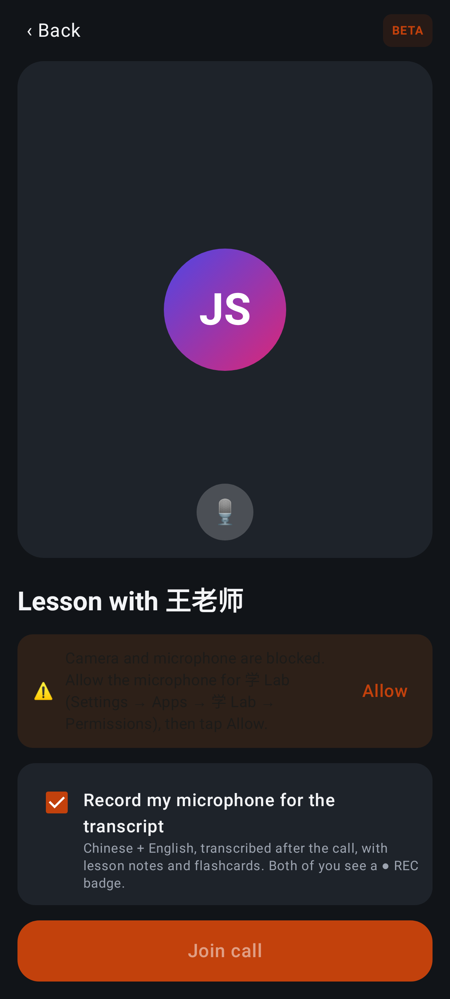
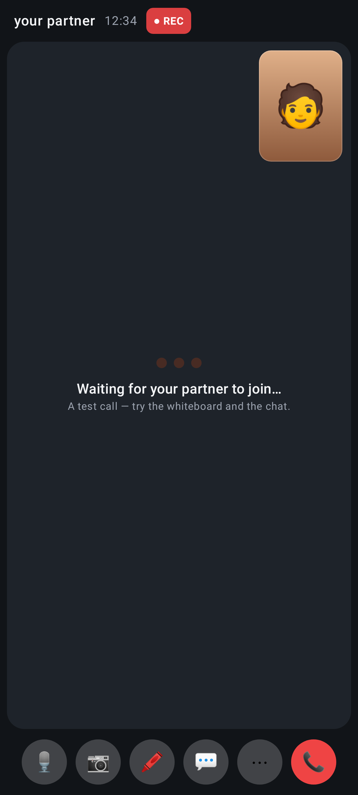
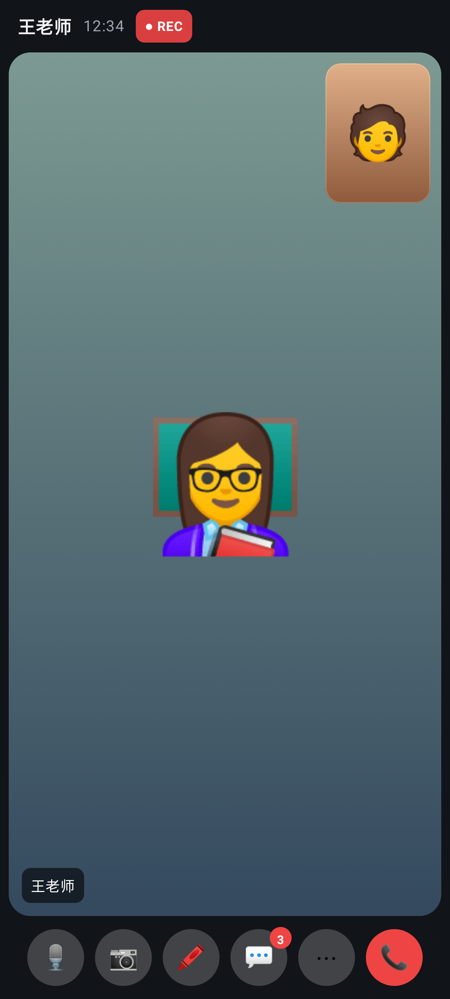
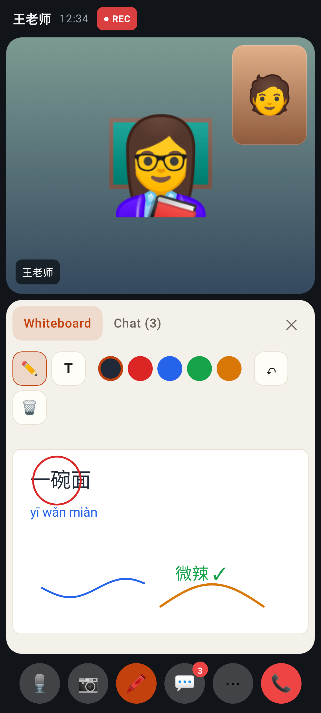
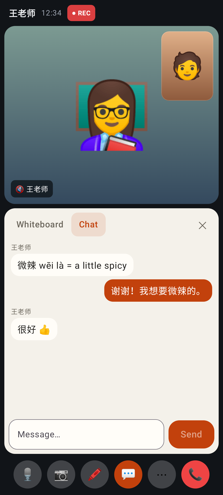
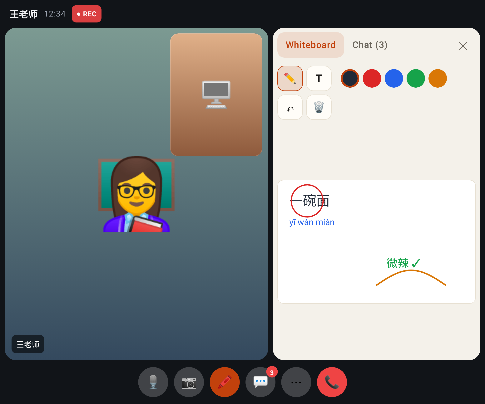
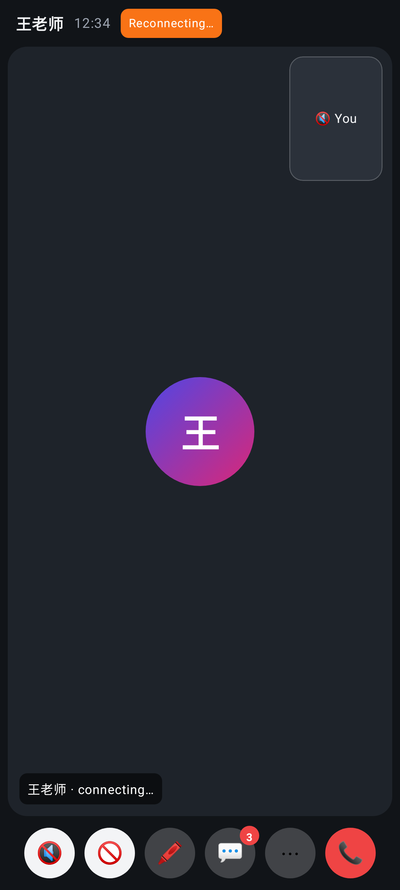
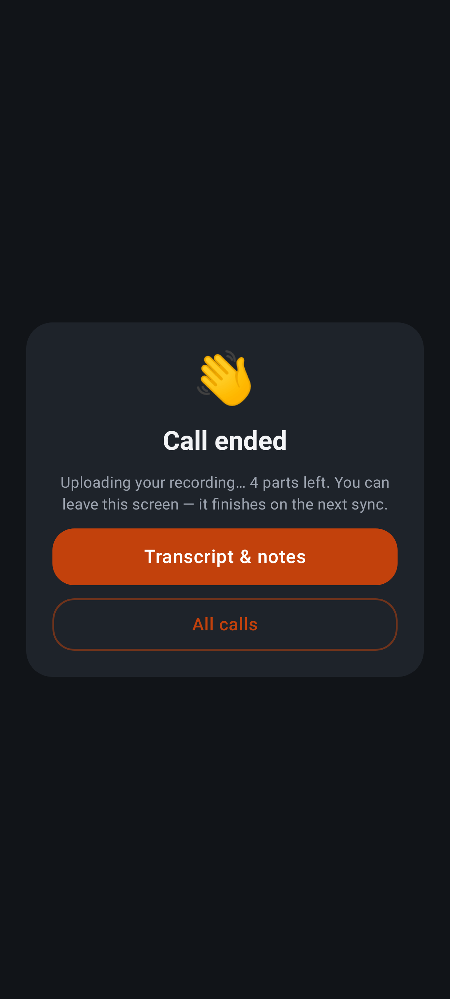
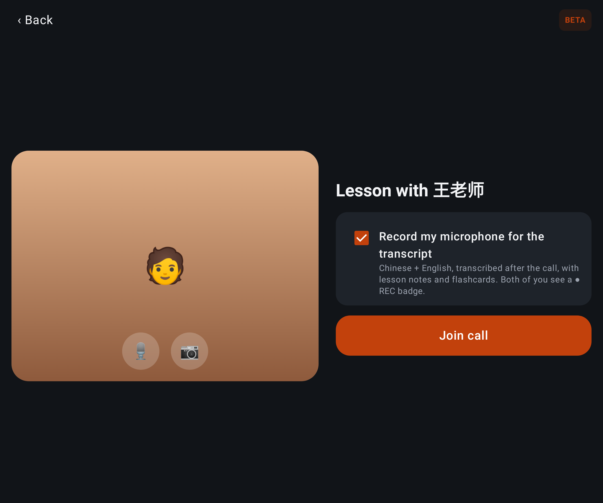

# Lab app — video calls, part 2 (the live call)

Robolectric + Roborazzi renders (Pixel Fold folded 412dp; two unfolded). Real WebRTC can't render
under Robolectric, so the videos are stand-ins (emoji on a gradient) drawn through the same video slot.

Pre-join: camera preview with mic / camera toggles, "Record my microphone for the transcript", Join.

Microphone refused: the reason and an Allow button (Join stays disabled).

A solo test call: waiting dots, recording (● REC), self view.

In the call: the tutor's video, my self view, REC badge, elapsed time, controls.

Whiteboard panel: the tutor's committed text and strokes plus the stroke they're drawing right now (blue), tools and colours, unread chat badge.

In-call chat; the tutor has muted (🔇 on their label).

Unfolded Fold: stage and whiteboard side by side, sharing my screen (self view shows the screen).

Room reconnecting, my camera and mic off, the tutor's connection still coming up.

Call ended: 4 recording parts still uploading, links to the transcript and all calls.

Pre-join on the unfolded screen.
