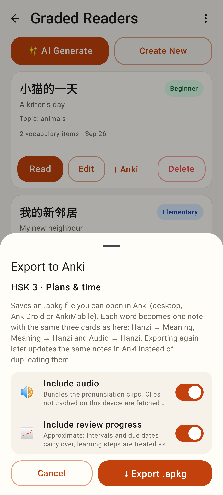
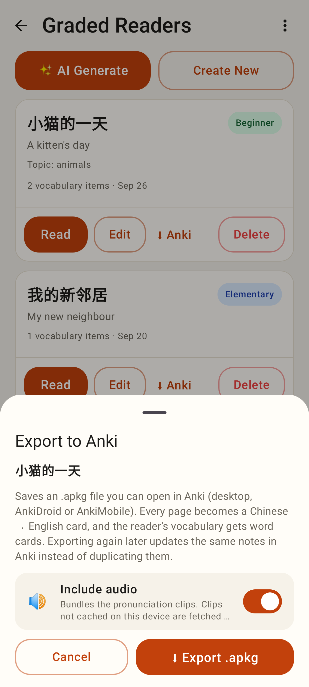
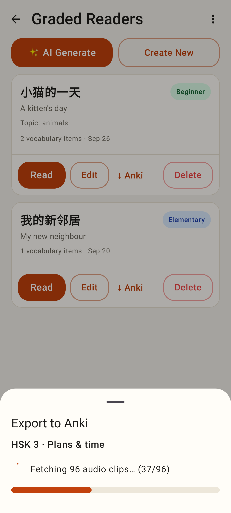
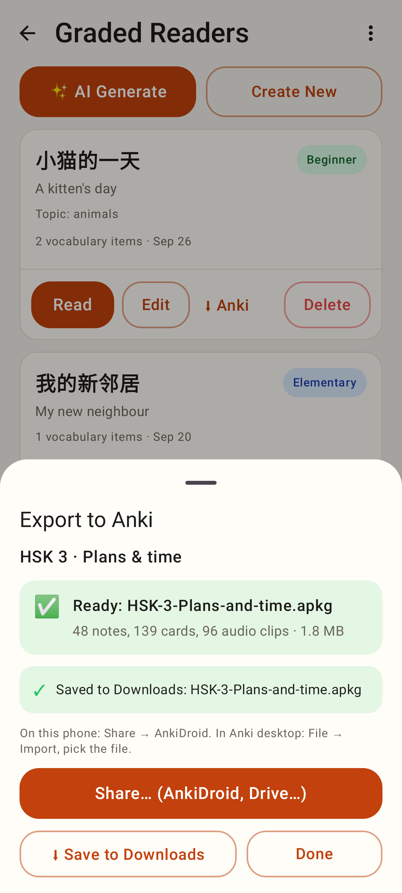
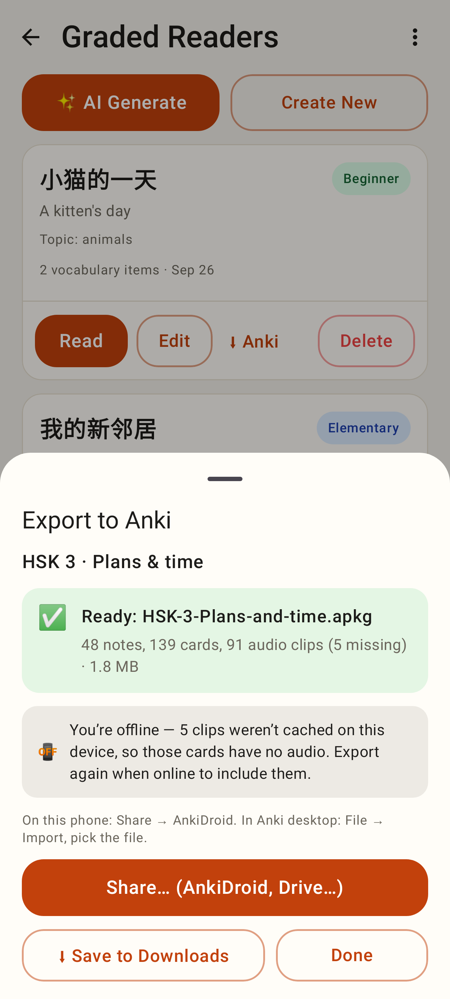
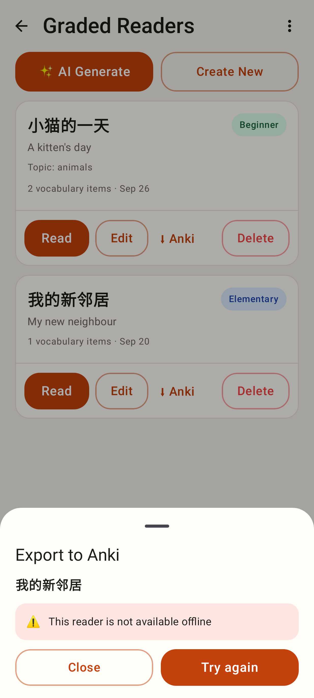
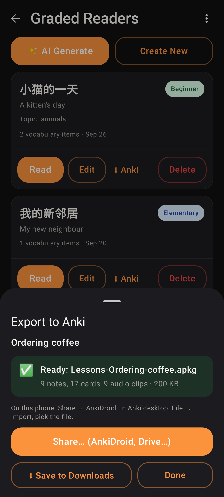
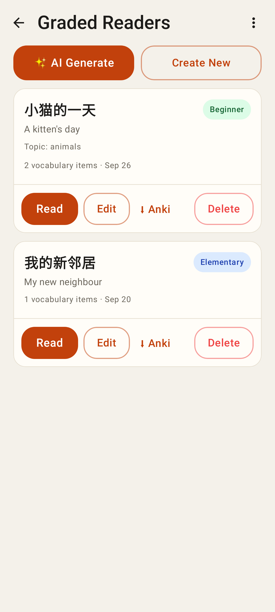
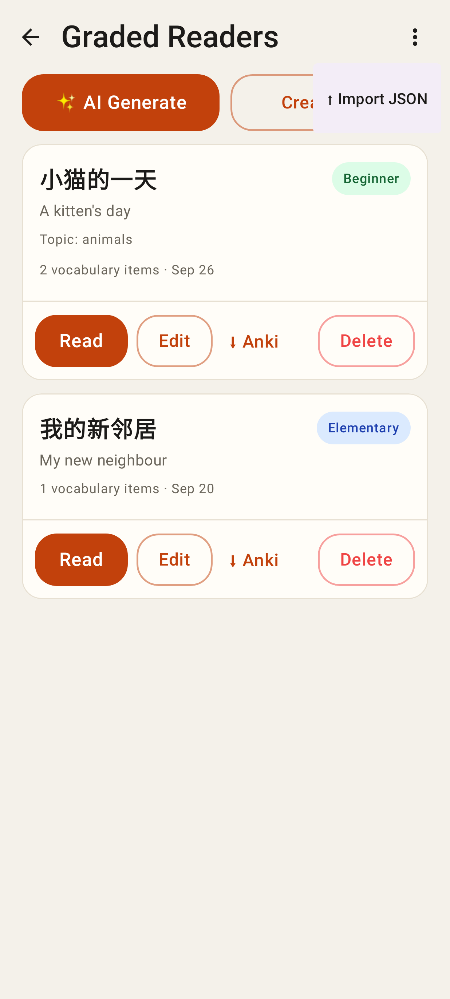
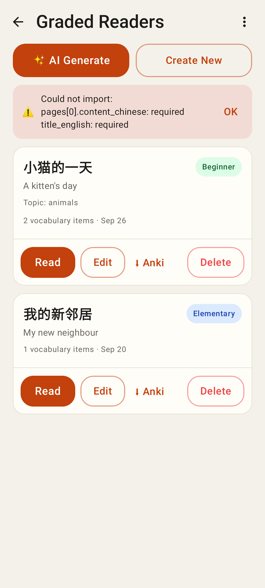

# Lab app: native Anki export (package K)

Roborazzi shots at the Pixel Fold's folded size (412×915dp), from `AnkiExportScreenshots`.

Export sheet for a deck: Include audio + Include review progress.

Export sheet for a reader (no progress option, reader help text).

Building: fetching clips with a springy progress bar.

Result: counts and size, Share (AnkiDroid, Drive…), Save to Downloads, with the "saved" notice.

Exported offline: missing clips explained.

Failure (reader not cached offline) with Try again.

A lesson's result in dark mode.

Readers list: ⬇ Anki on each card and the ⋯ menu in the title.

⋯ → ⬆ Import JSON.

An import the server refused, with its problems listed inline.
