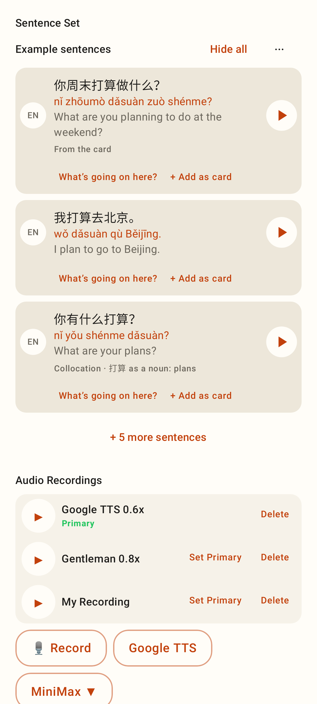
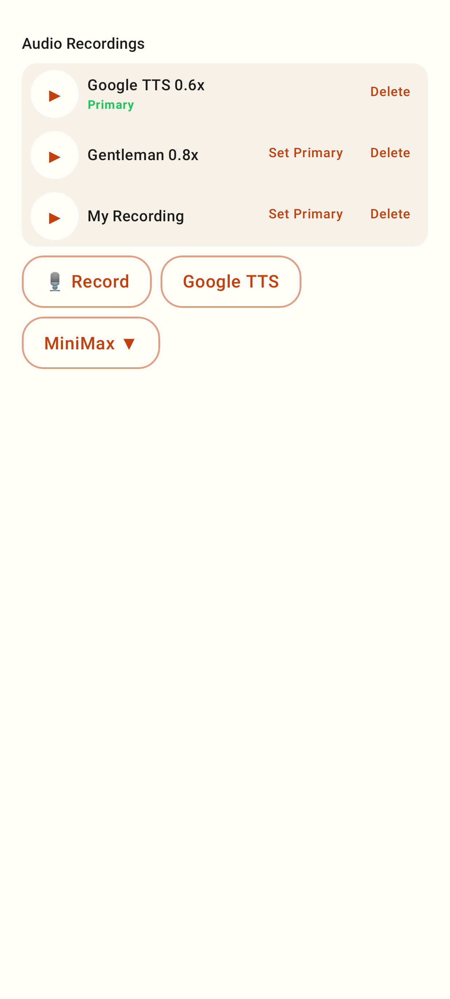
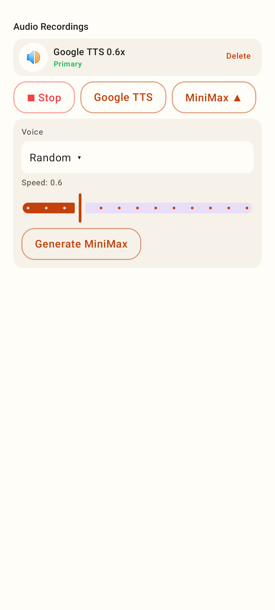
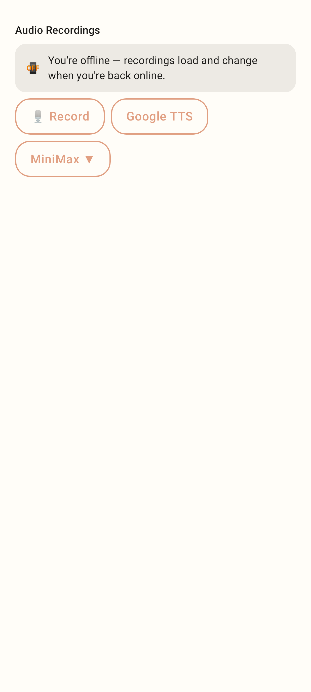
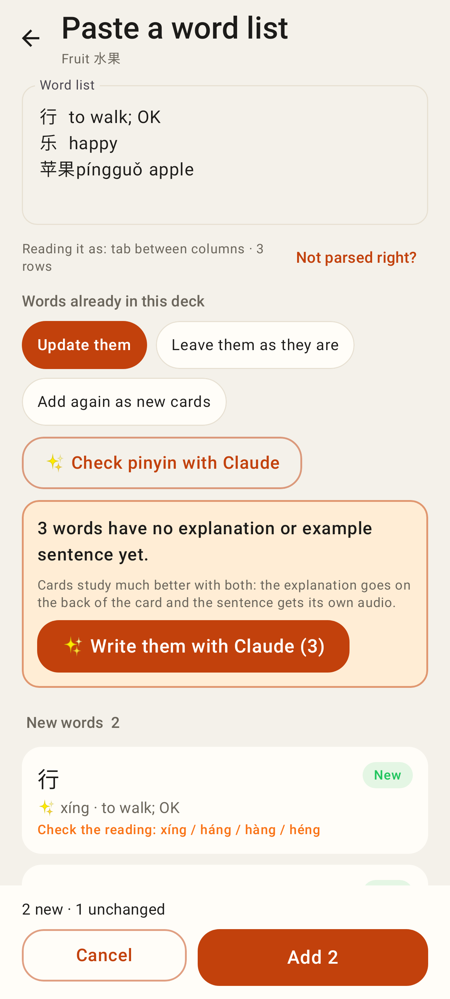

# Lab app — card editor media + "check the reading" (package K)

Phone viewport (412dp), Roborazzi renders.

The card editor's new sections: the Sentence Set (row 1 is the card's sentence as typed) and Audio Recordings.

Recordings with ▶, a Primary badge, Set Primary, Delete, and 🎙 Record / Google TTS / MiniMax ▾.

MiniMax options (voice, or Random, and speed 0.3–1.5) while a recording is running (■ Stop).

Offline: recordings load and change once back online.

Paste a list: a one-character word whose pinyin was filled in on the phone gets "Check the reading: xíng / háng / hàng / héng".
