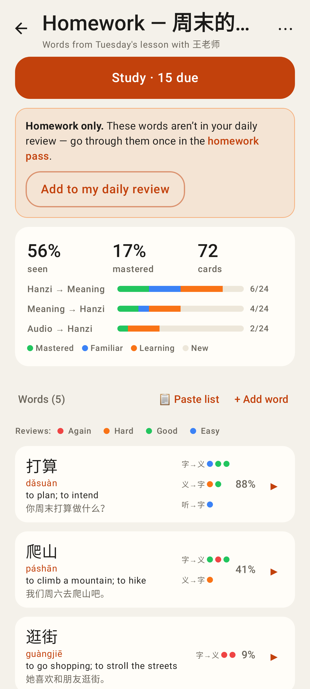
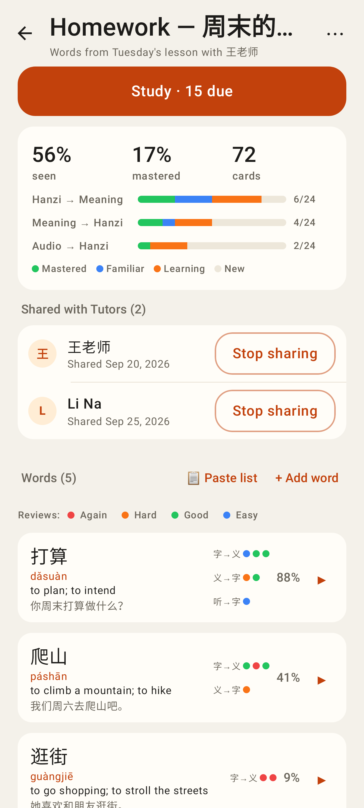
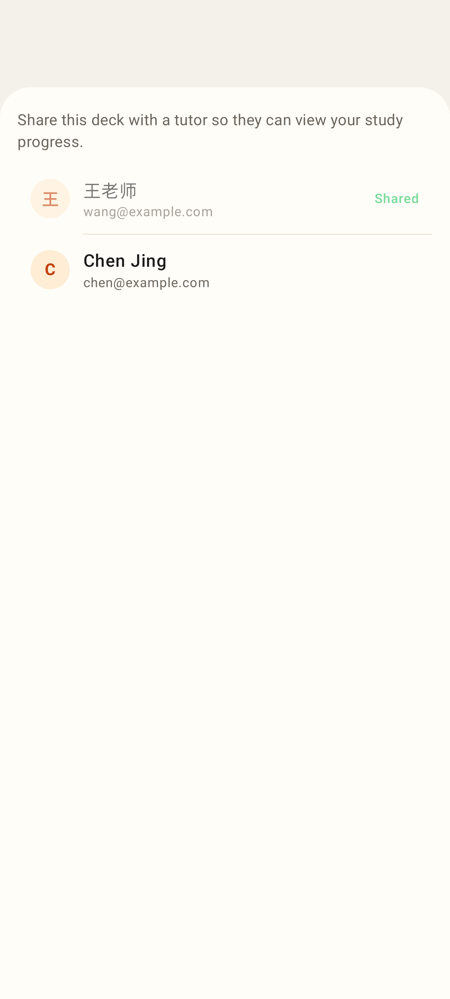
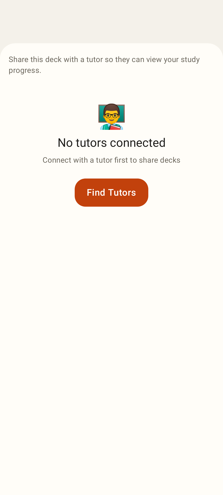
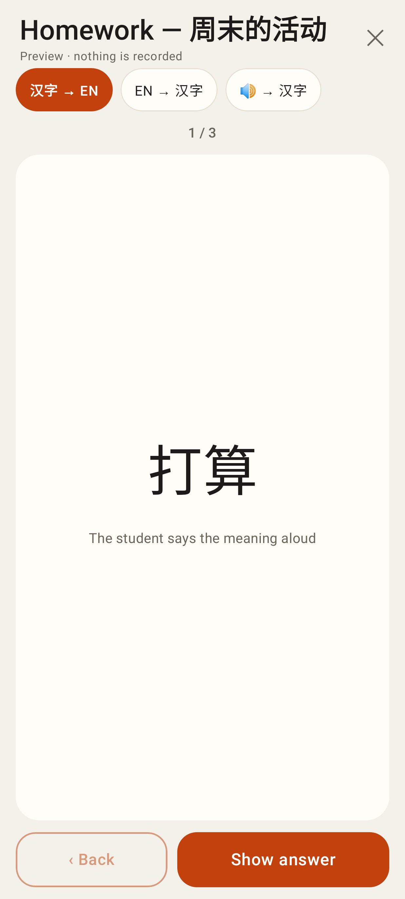
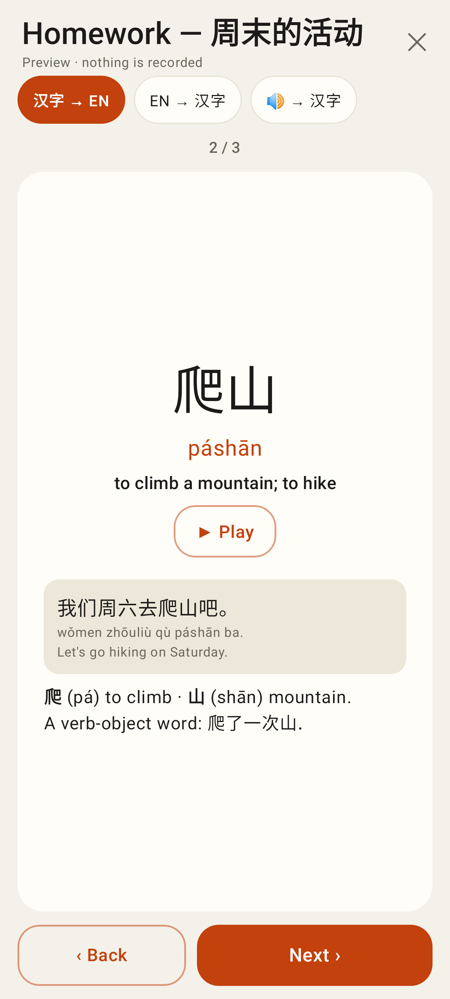
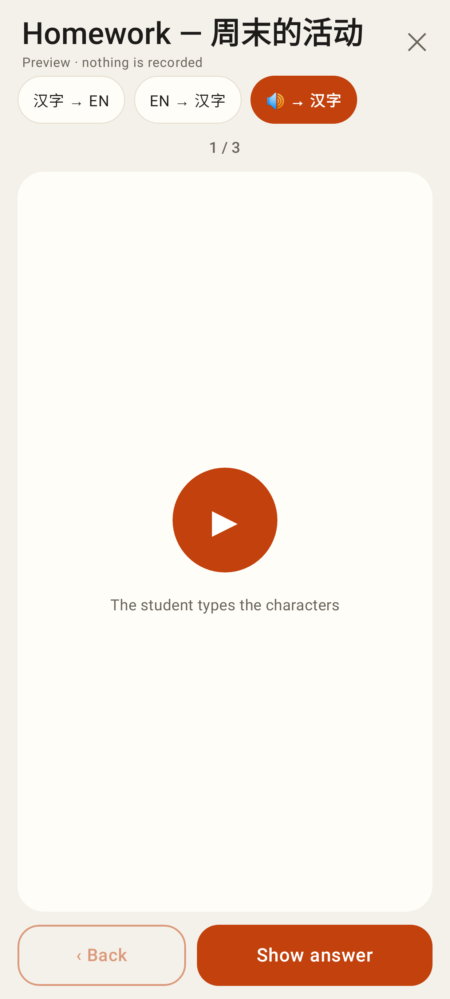
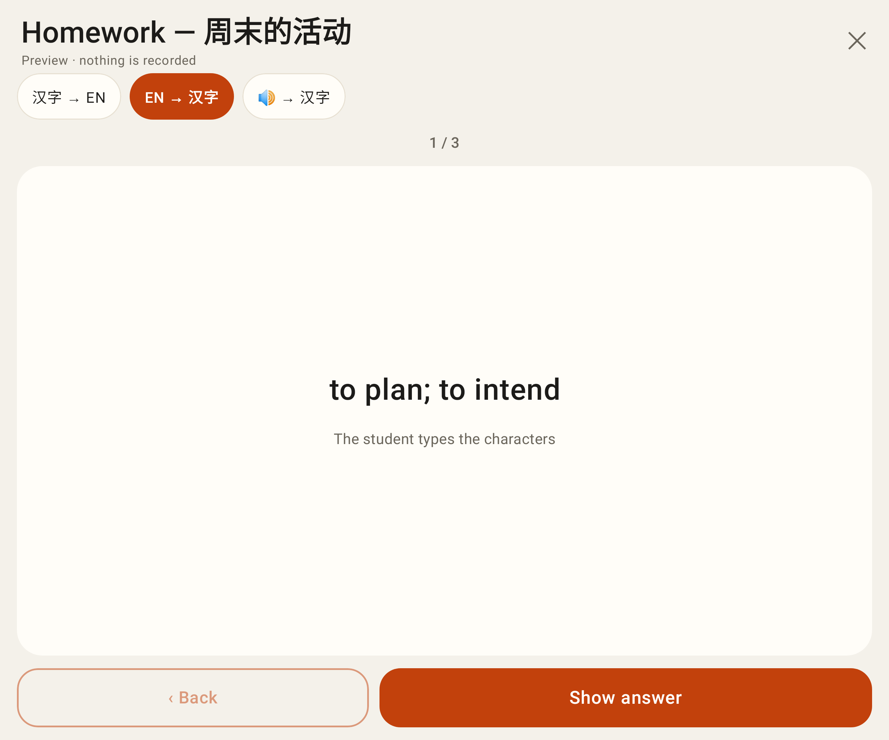
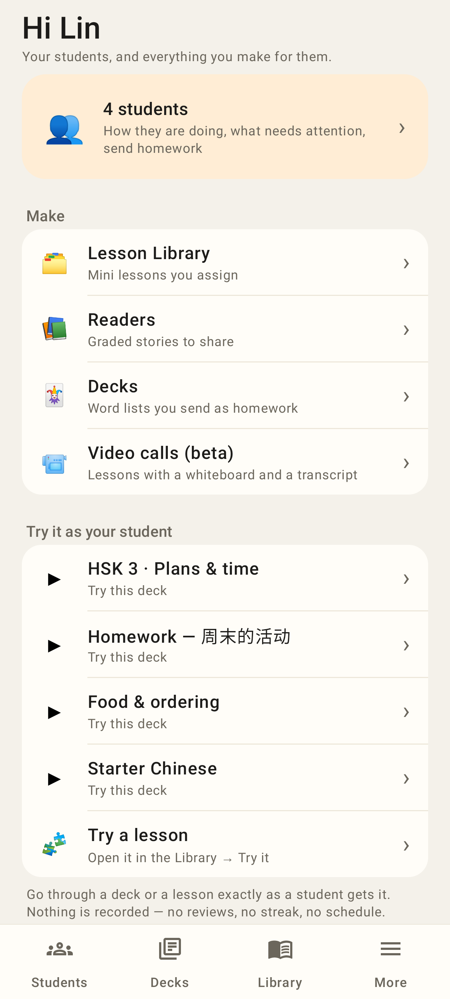

# Lab app — deck parity (package K)

Phone viewport (412dp), Roborazzi renders.

A deck sent as one-off homework (caps 0 + 0): "Homework only", a link to the pass, and "Add to my daily review".

"Shared with Tutors (N)" on the deck page, with Stop sharing.

⋯ → Share with tutor: my tutors, with the ones already shared greyed out.

The same sheet with no tutor connected.

`/decks/:id/try`: the deck as a student sees it, nothing recorded.

The revealed answer with the sentence and the explanation.

The audio → hanzi card, which autoplays.

Try it unfolded, EN → 汉字.

Tutor home: the deck rows open the native Try it, and a new "Try a lesson" row points to the Library.
