# Lab app: real lesson player everywhere + lesson attempt review

Roborazzi renders of the native Lab app (Pixel Fold folded, 412×915dp; one unfolded shot).

## Homework pass: lesson / reader items play natively

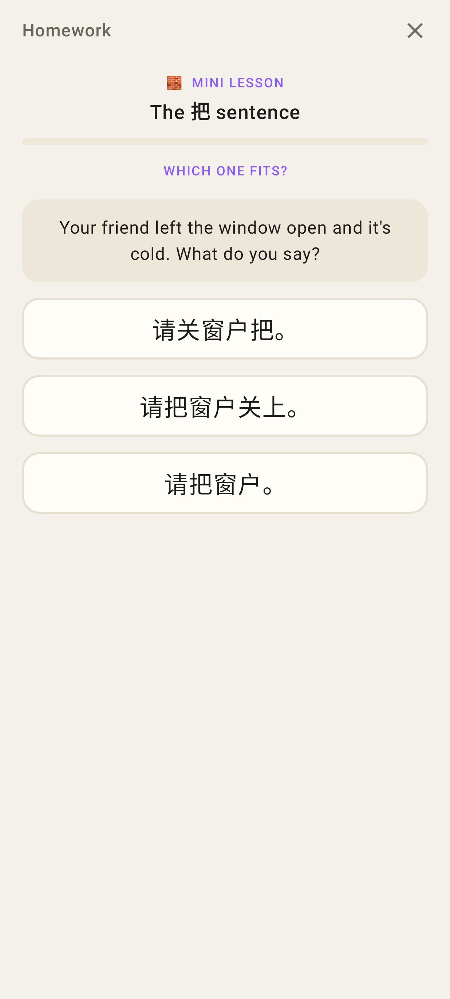
A one-off lesson in the homework pass runs in the Lab's own lesson player (Homework context).

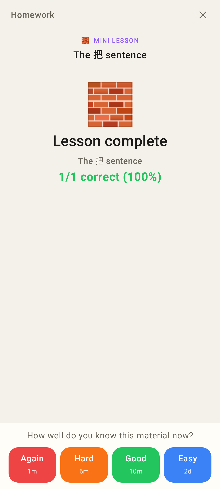
Finished: the same FSRS rating bar as in a session; rating records completion + attempt + recordings + the homework `done`.

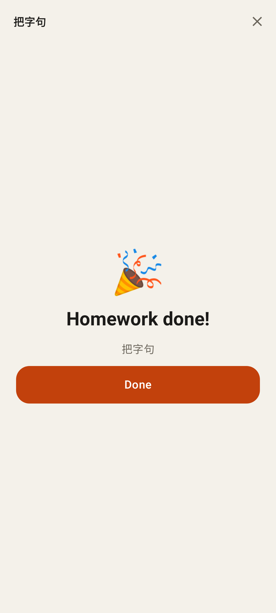
An item already complete opens as done.

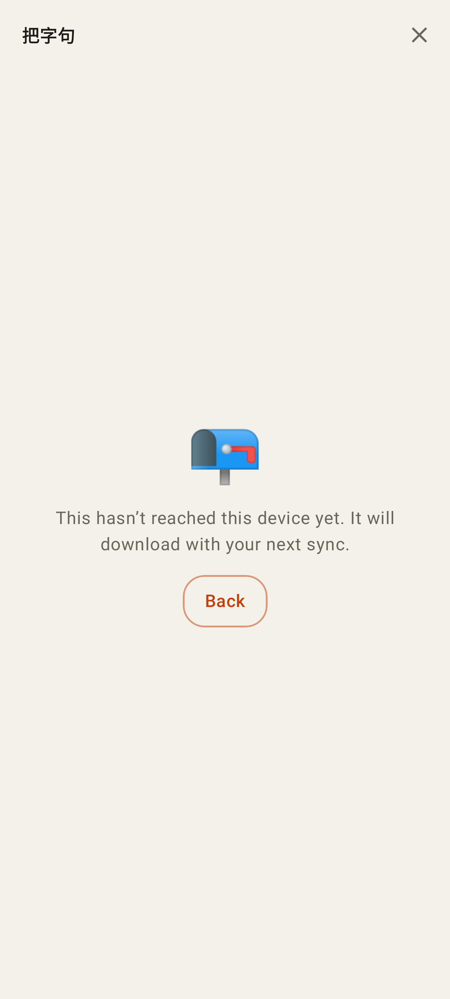
The lesson hasn't synced to this phone yet.

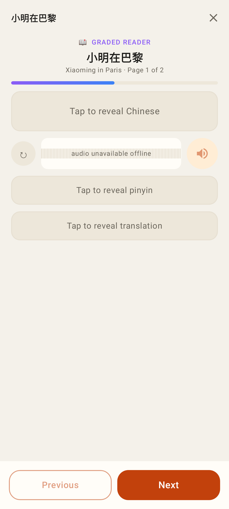
A reader item plays in the session's reader view (rated on its last page).

## Try it / catalogue trial / editor Preview: the real player, nothing recorded

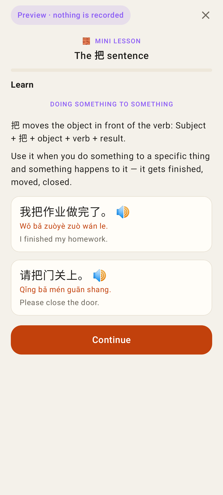
`/library/:id/try` — the real player in Preview mode.

End of a preview: Try again / Done instead of a rating.

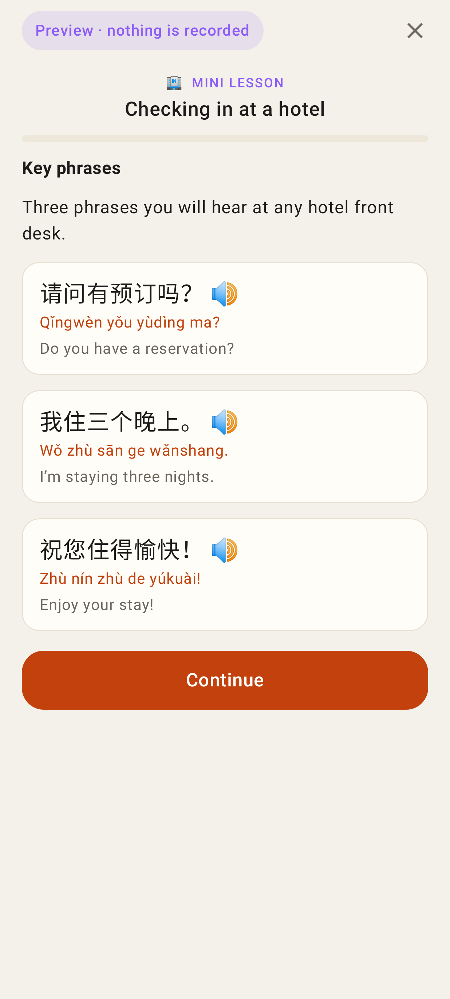
A catalogue sample lesson (conversation) in the same player.

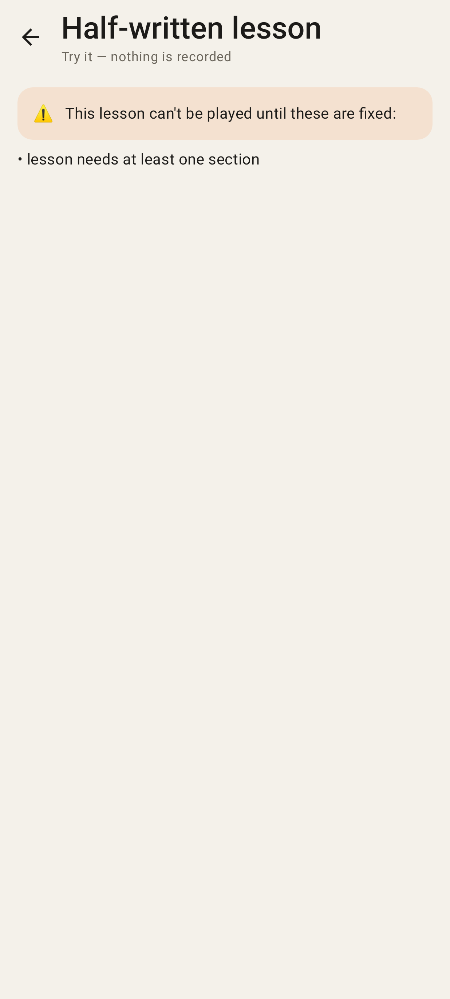
A spec that can't be decoded lists its validation problems instead of crashing.

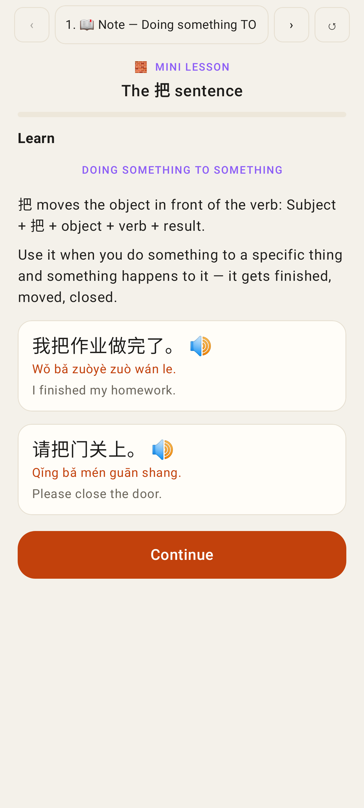
The lesson editor's Preview tab: the real player with ‹ › / restart / jump list.

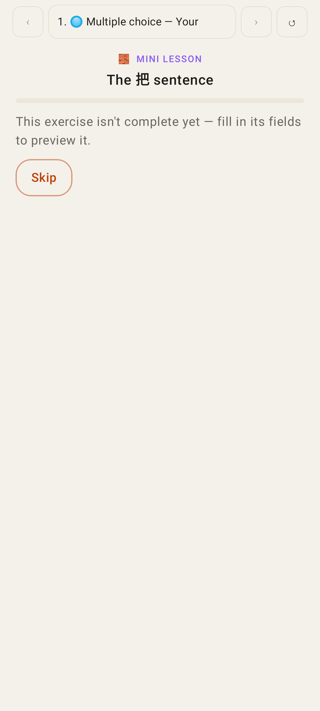
A half-typed exercise says so (with Skip) instead of rendering.

## Tutor: a student's lesson answers

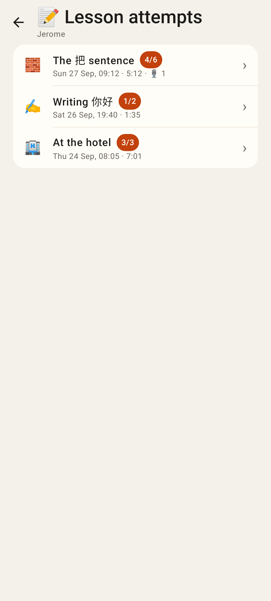
`/connections/:relId/lesson-attempts` — the student's attempts.

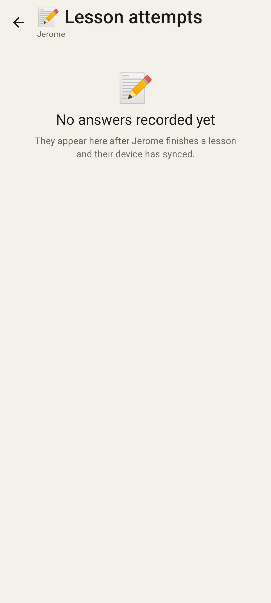
Nothing recorded yet.

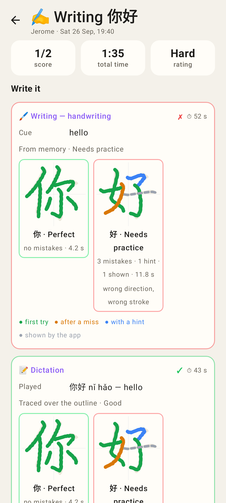
One attempt: handwriting re-drawn stroke by stroke over the model outline (first try / after a miss / with a hint / shown), grade, mistakes, legend.

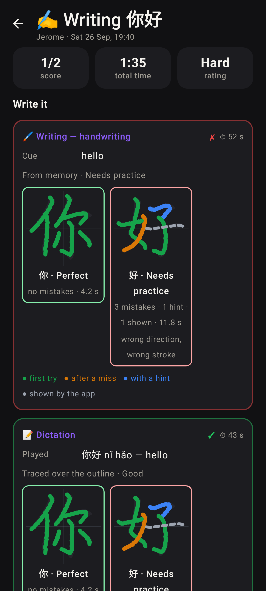
Same, dark theme.

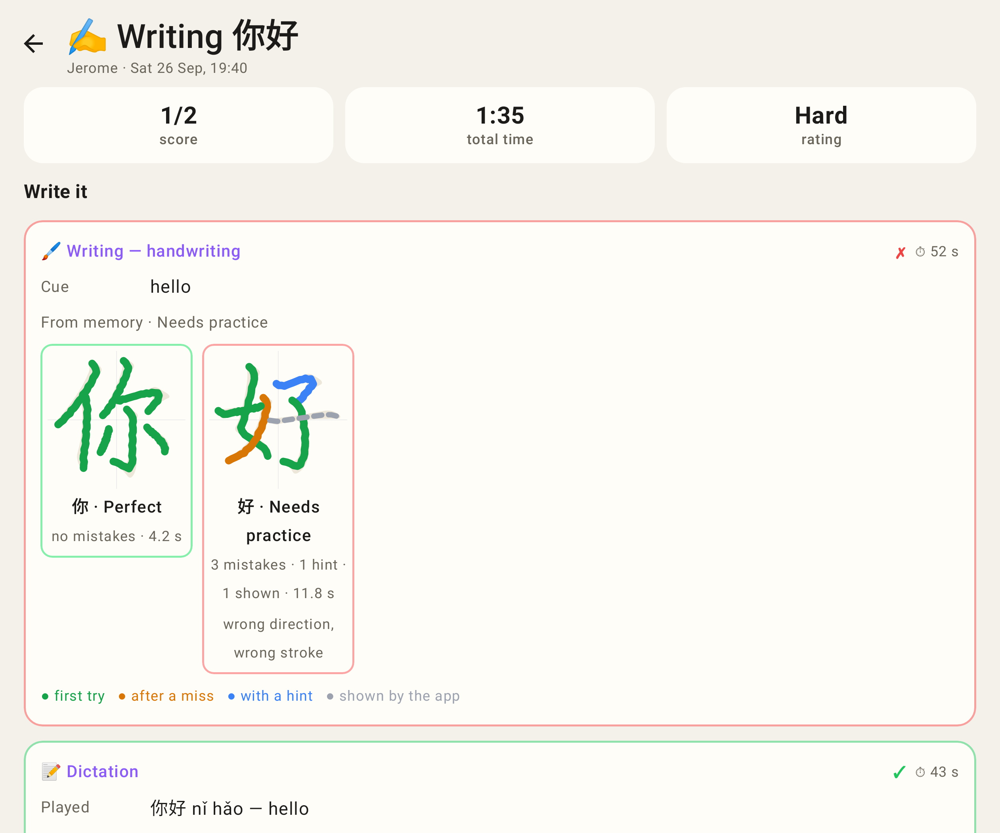
Unfolded.
