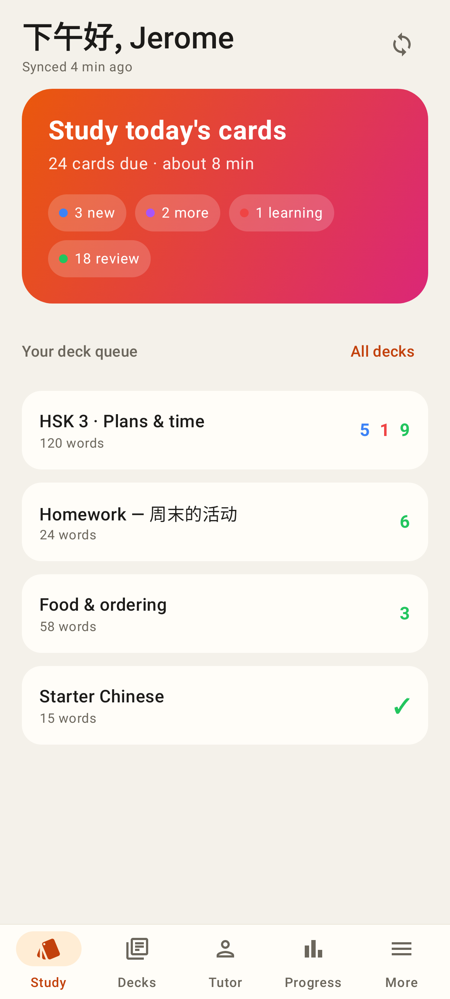
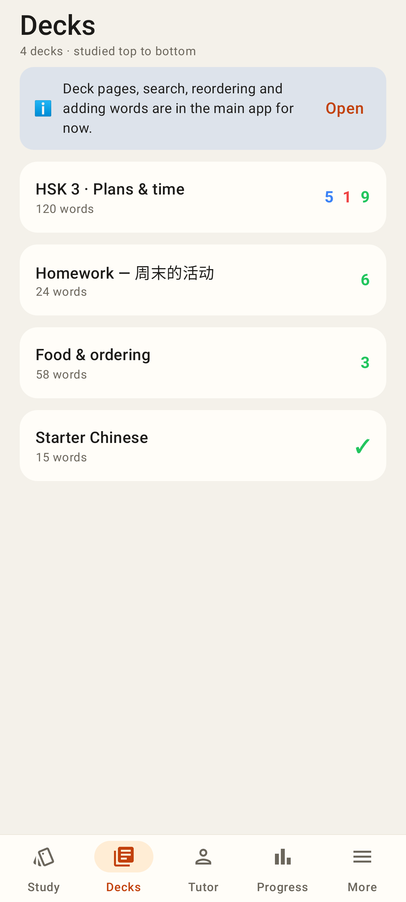
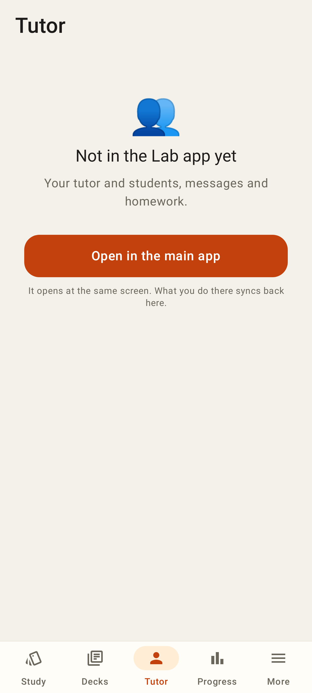
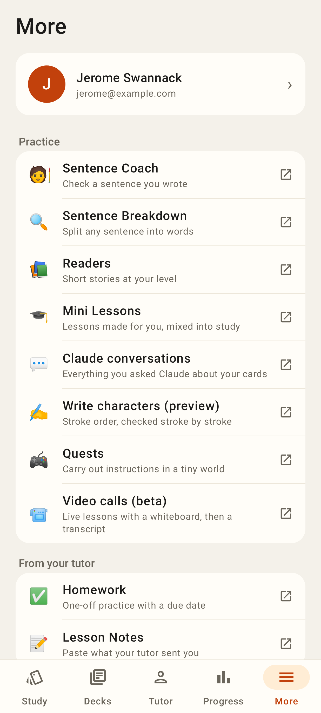
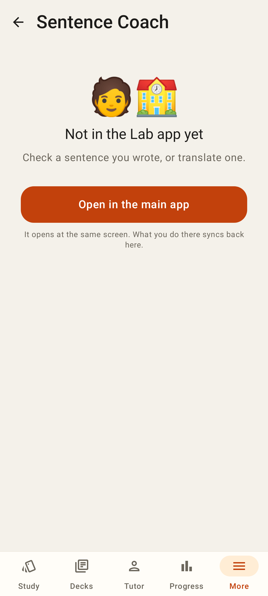
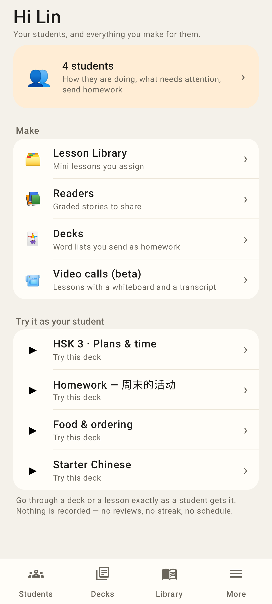
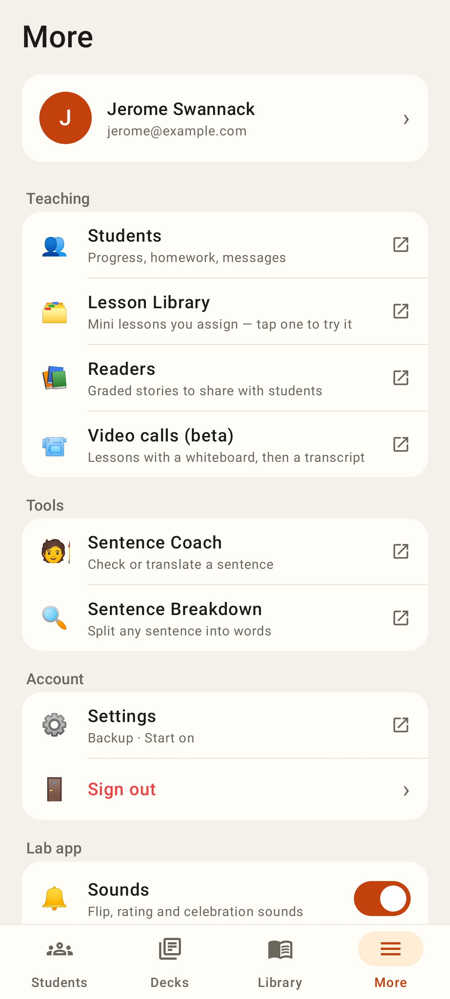
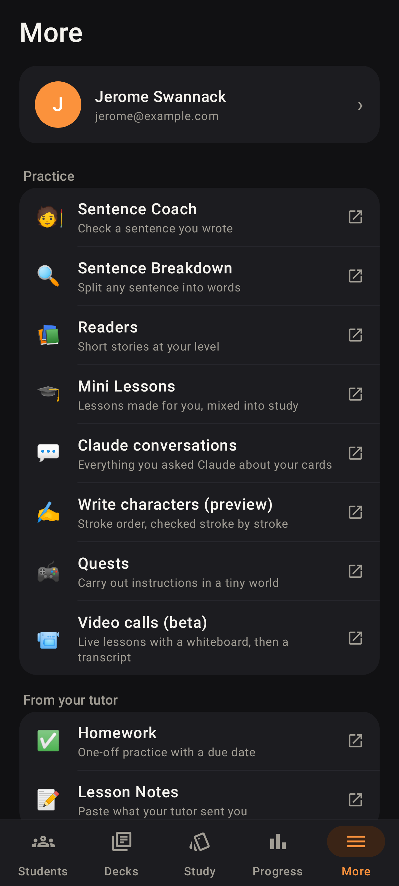
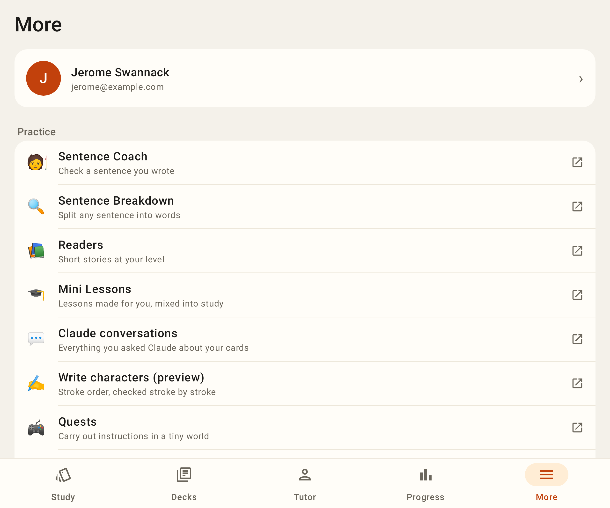
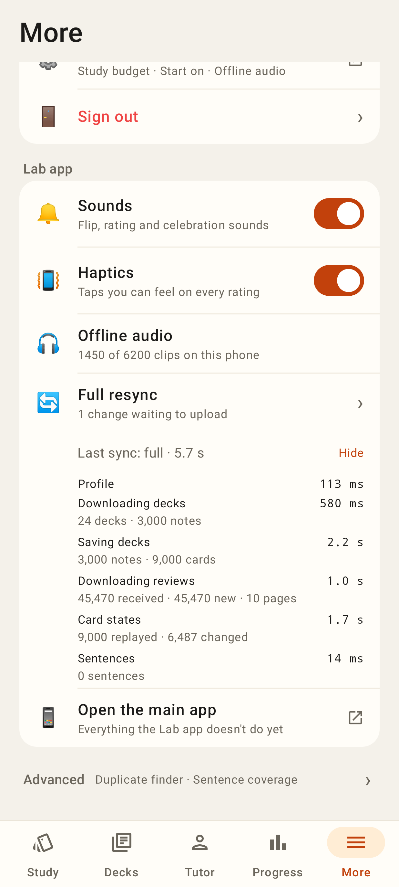

# Lab app: navigation shell, More tab, placeholders

Roborazzi renders (Pixel Fold folded, 412×915dp) from `ShellScreenshots.kt`. The two-glyph 🧑‍🏫 is a Robolectric font limit; phones draw one emoji.

Study tab (student tab set: Study · Decks · Tutor · Progress · More); settings moved off Home into More.

Decks tab (interim deck queue until package C lands).

A tab whose screen is not native yet: says what it is, opens the main app at the same route.

More: the web groups row for row (↗ = opens the main app) + Lab app settings and the extra-row slot (Send debug report lives there now).

Any unbuilt web route opened from inside the app (here /coach), with back.

Tutor account (users.role = tutor): Students · Decks · Library · More and the teaching home.

Tutor account More: Teaching / Tools.

Dark theme, account with students (Students · Decks · Study · Progress · More).

Unfolded (841dp): content capped at 720dp.

More → Lab app: last sync with per-step timings (moved from the old home ⚙ sheet, #405).
