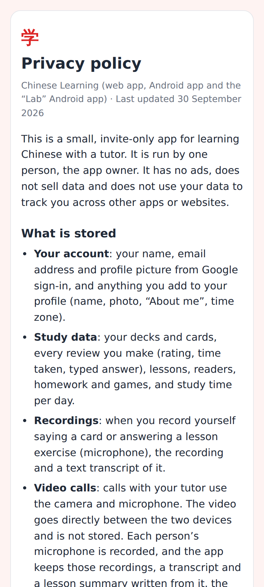
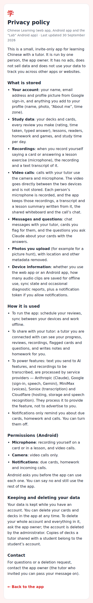
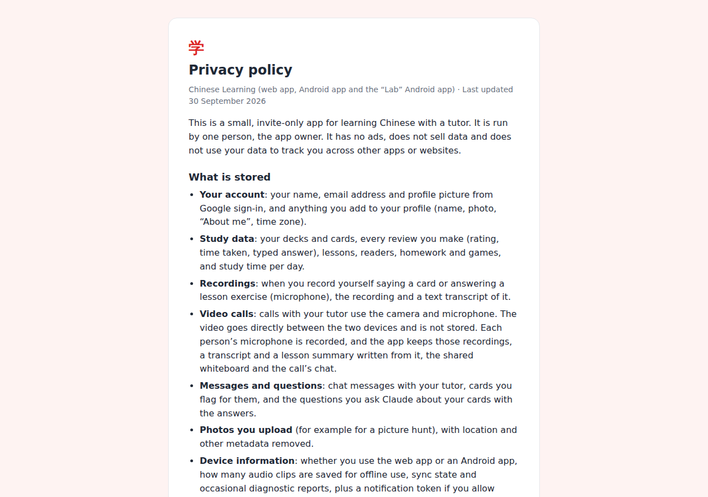

# Public privacy policy (/privacy) — for the Lab app's Google Play listing

Phone (412×915, 2×): the top of `/privacy` — no sign-in, no tab bar.

Phone, the whole page (1×): what is stored, how it is used, Android permissions, deletion, contact.

Desktop (1280px): the same card, centred at a readable width.
