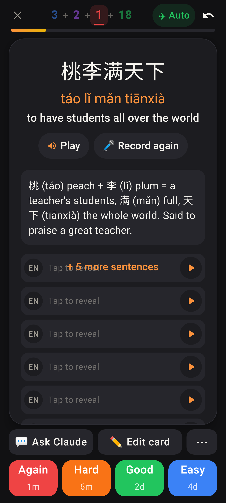
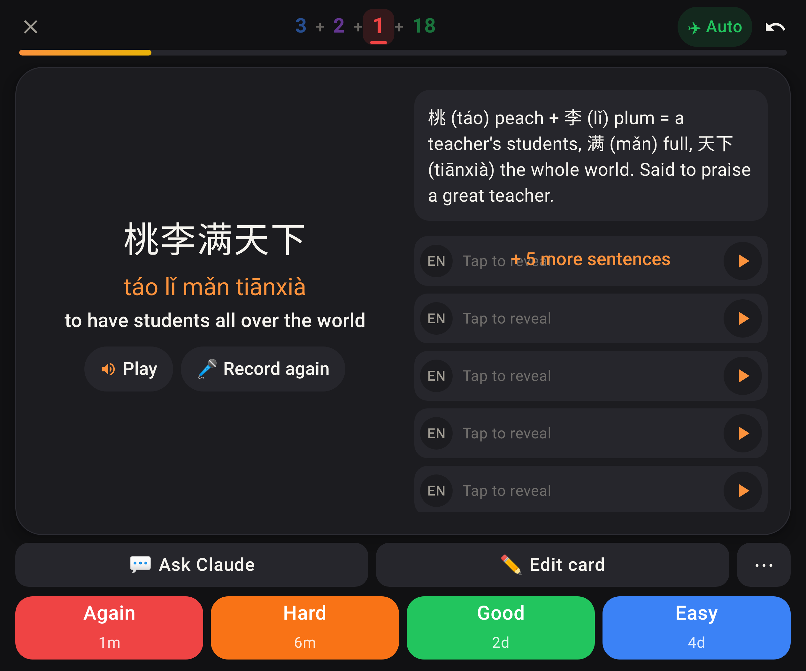
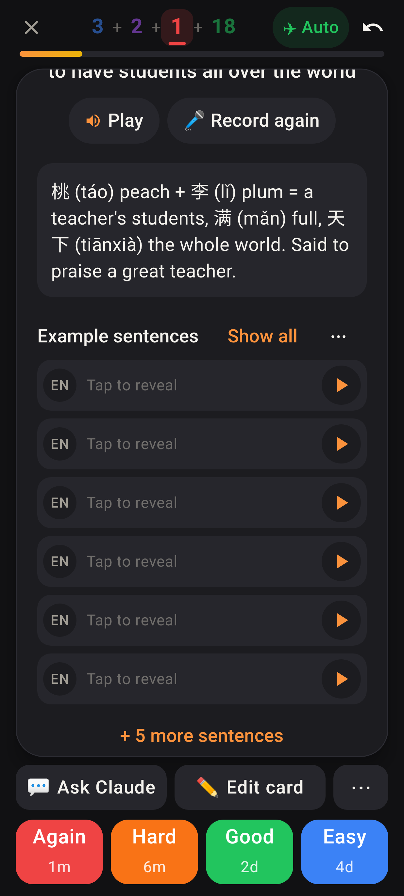
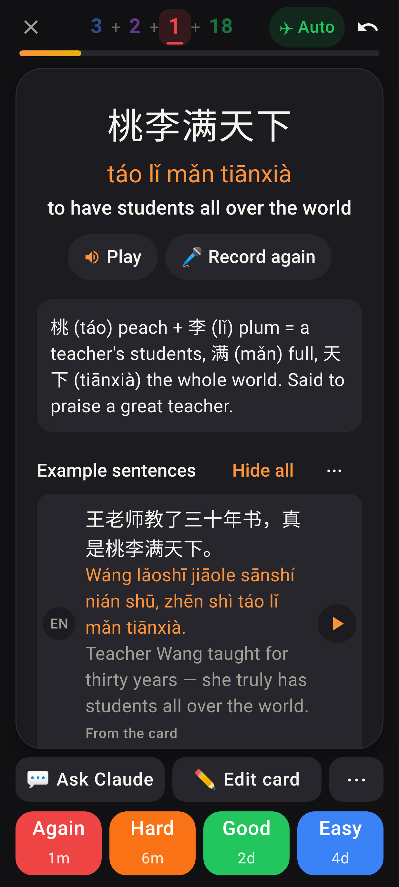
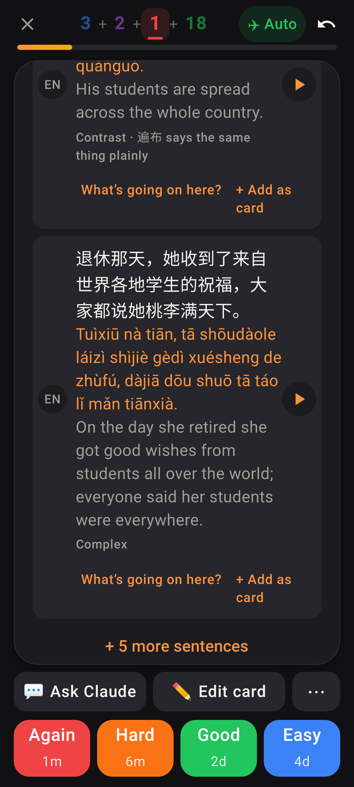
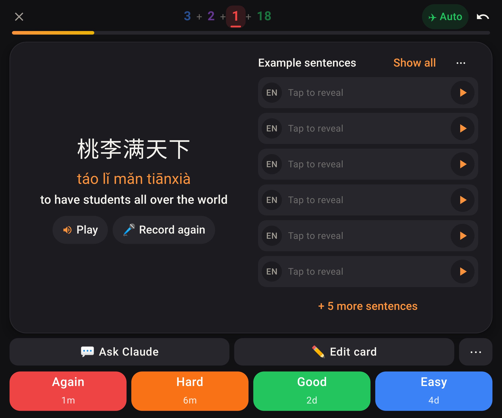

# Lab app: example sentences on the card back (dark theme, font scale 1.3)

Roborazzi shots from `SentenceRowsLayoutTest` — 桃李满天下 with its own sentence (row 1) and a set of five.

## Before (main after #446)

Folded: the header (Example sentences · Show all · ⋯) is hidden under the rows and "+ 5 more sentences" is drawn over the first row.

Unfolded: same stacking in the right column.

## After

Header, six rows (the card's sentence + five), and "+ 5 more sentences" on its own line underneath.

Show all: row 1 is the card's own sentence, badged "From the card".

The end of the opened list, with the tools line on each row and "+ 5 more sentences" below it.

Unfolded: the list in the right column, stacked the same way.
