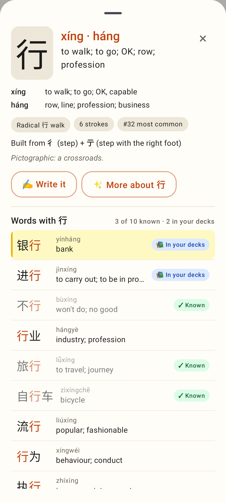
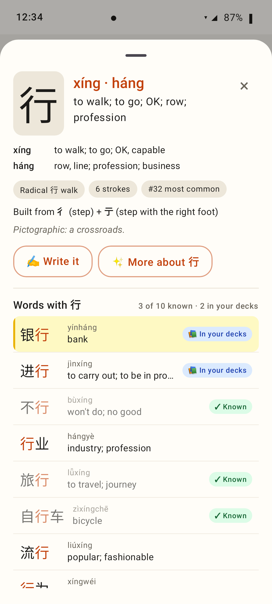
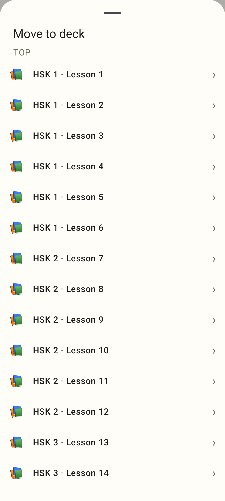
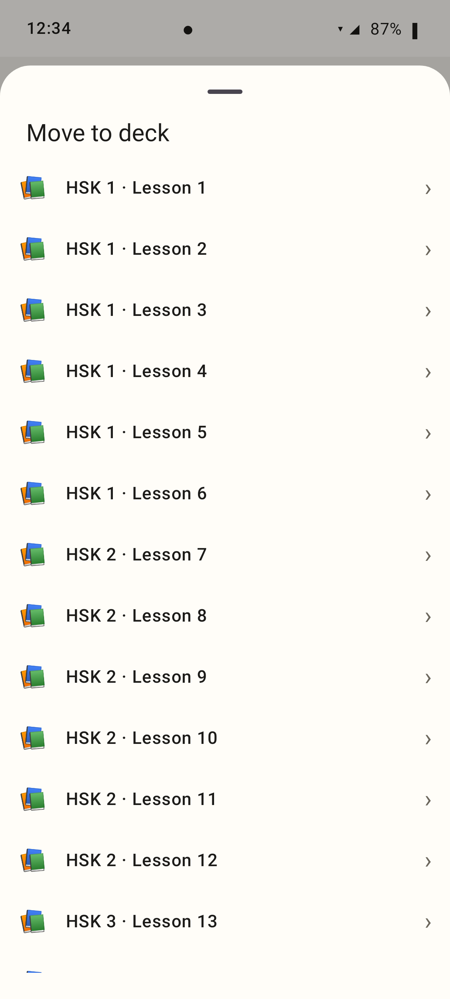
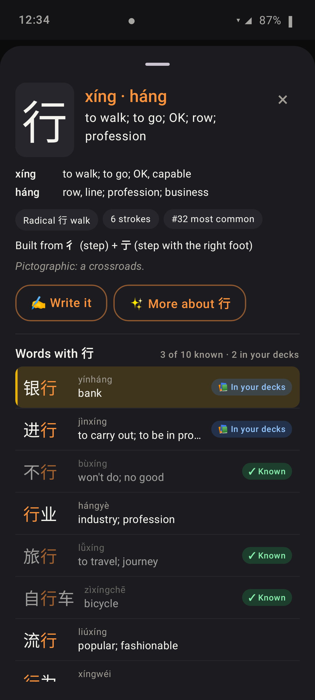
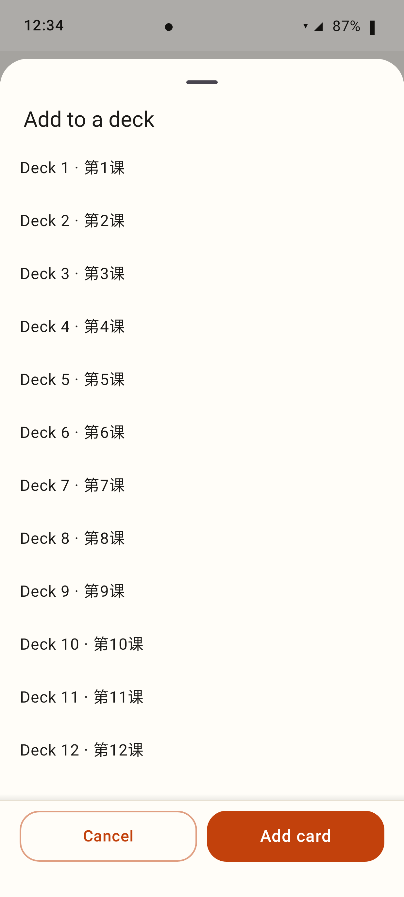

# Lab bottom sheets stay below the status bar

Roborazzi shots from `SheetInsetsTest` (412×915dp, Pixel Fold folded) with a real 52dp status-bar
inset dispatched to the sheet's window. The stand-in phone behind the sheet draws a status bar
(12:34 · camera dot · battery) of that height, dimmed by the sheet's scrim.

**Before** — the character sheet covers the status bar completely: the 行 tile and × sit where
the clock and battery are.

**After** — the sheet's top is 8dp below the status bar; the words list scrolls inside.

**Before** — any tall `LabBottomSheet` (here a 40-row picker) did the same.

**After** — same shared fix (`LabModalSheet`).

**After, dark theme.**

**After** — a tall `LabFormSheet`: title below the status bar, the list scrolls, Add card pinned at the bottom.

