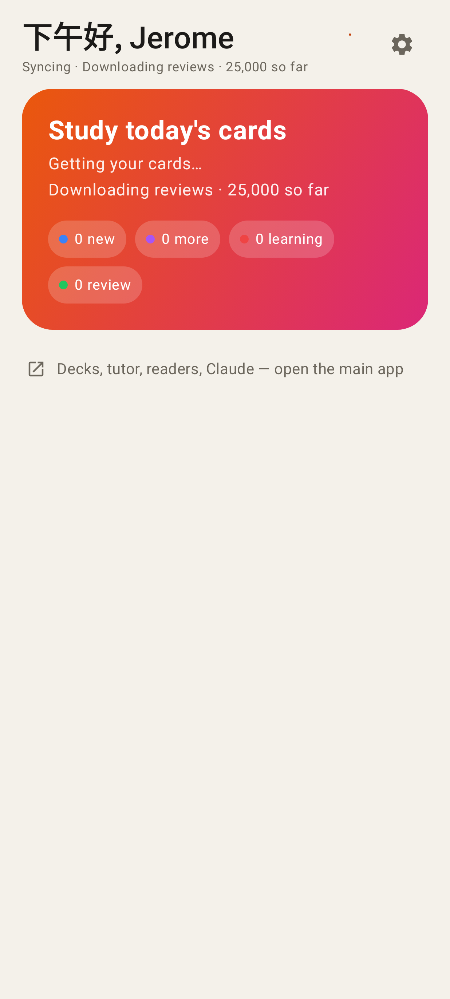
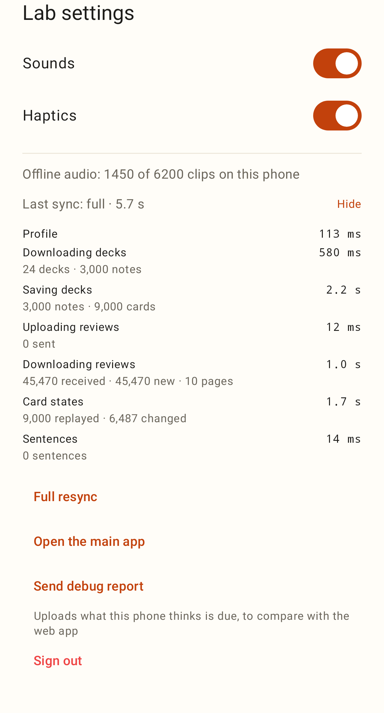

# Lab app: faster sync — screenshots

A first sync shows what it is doing and how far it has got (header line and the study card).

Lab settings → **Last sync** opens the per-step timings of the last sync (also sent in the debug report).
