# Lab: today split + resume half-done mini lessons

Lab-only UX experiment (web unchanged). Pixel Fold, folded (412×915 dp) unless noted.

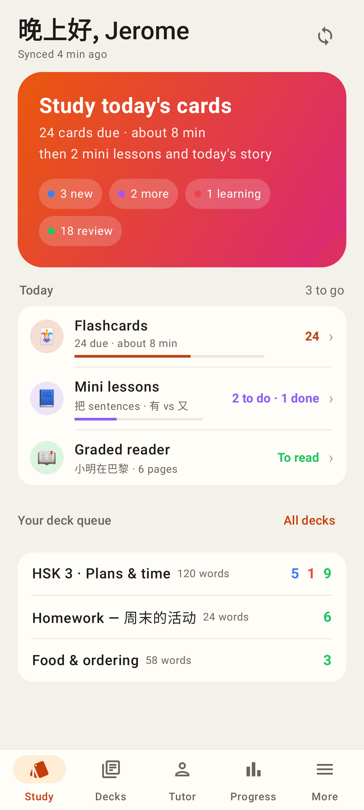
Home: the Study hero plus the new **Today** card — Flashcards (24 due · ~8 min), Mini lessons (2 to do · 1 done, titles), Graded reader (today's story).

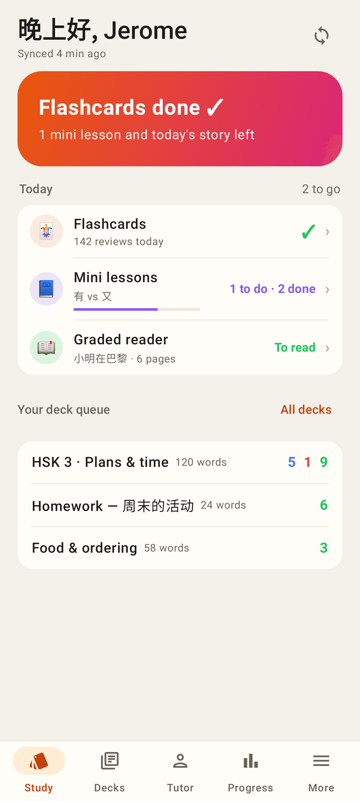
Cards done: the hero says "Flashcards done ✓ — 1 mini lesson and today's story left"; rows tick off.

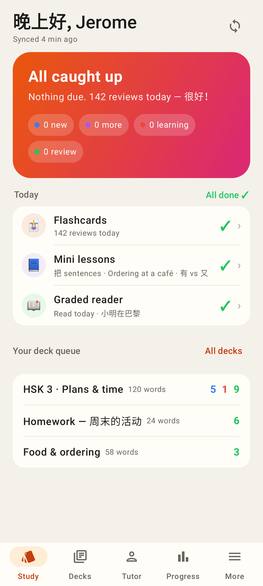
Everything done today: "All done ✓", three ticks.

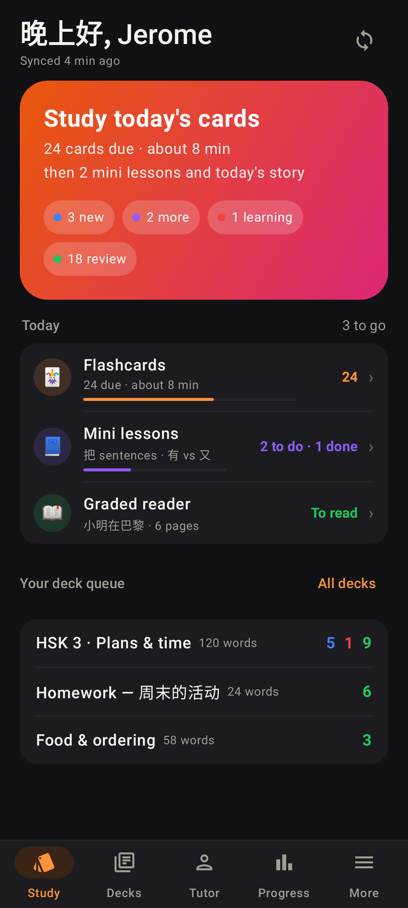
Dark theme.

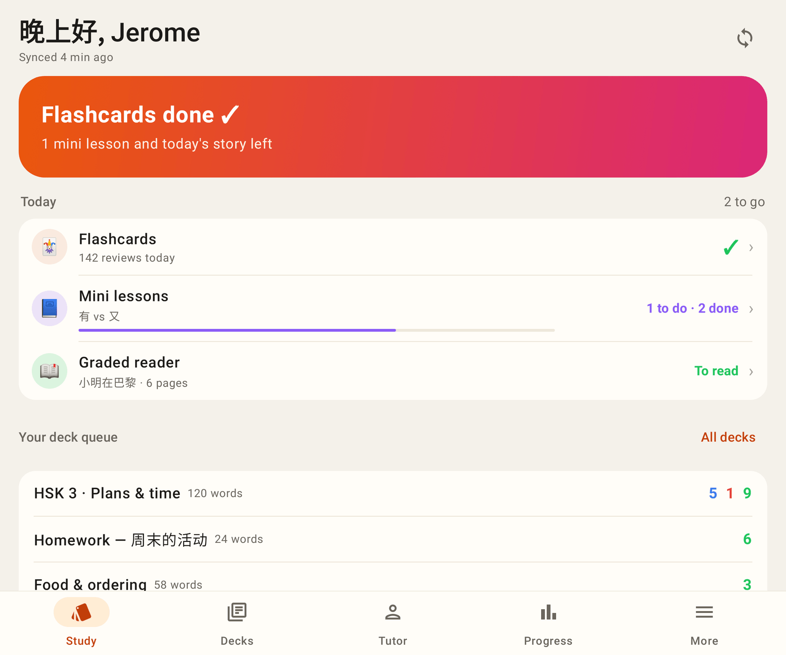
Unfolded.

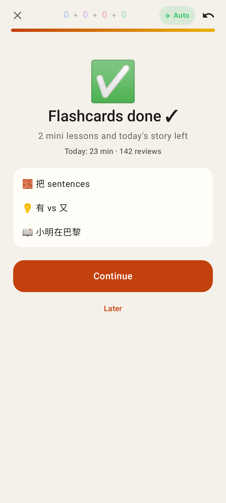
Study is flashcards only; when they run out: "Flashcards done ✓ — 2 mini lessons and today's story left · Continue / Later".

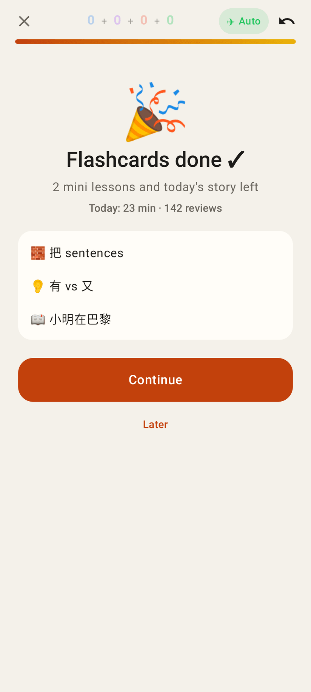
The day's first finish: the usual confetti fires here (after the flashcards).

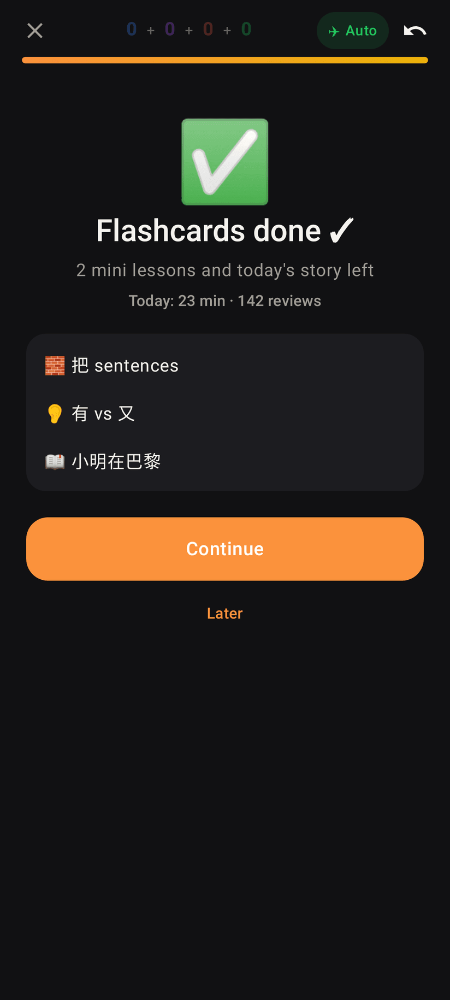
Dark theme.

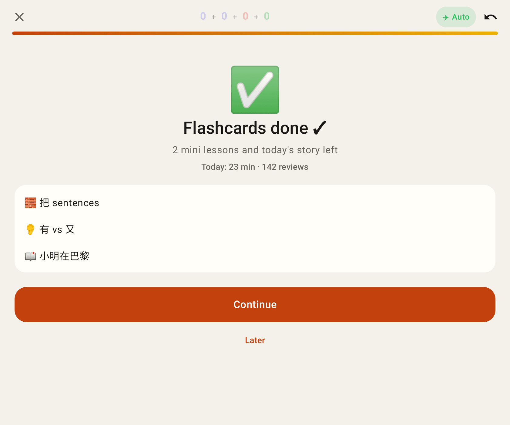
Unfolded.

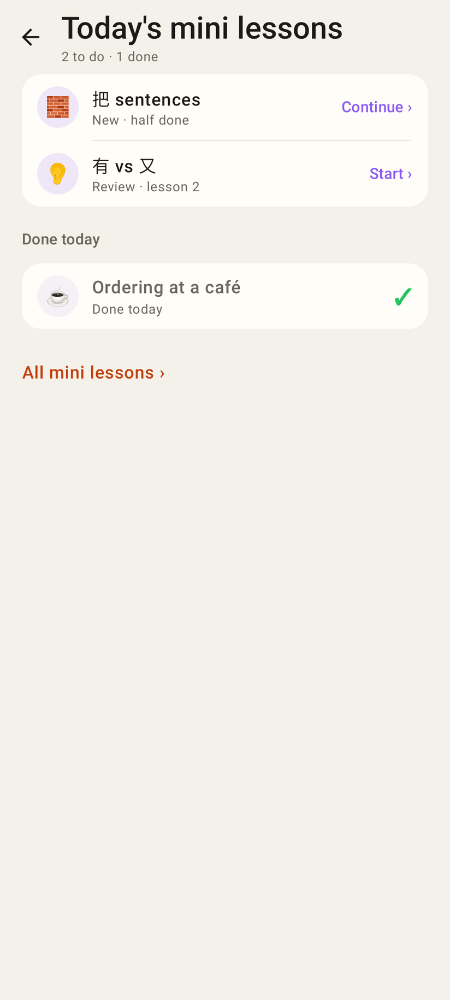
Mini lessons row → today's list: to do (a half-done one says "Continue ›"), done today ✓.

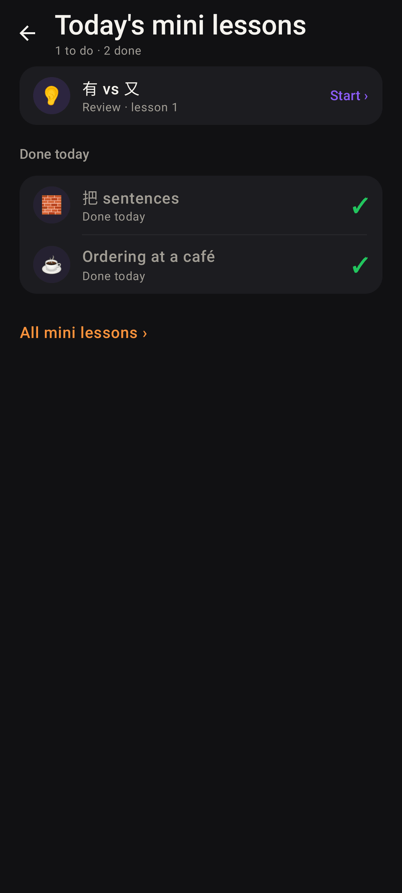
Dark theme.

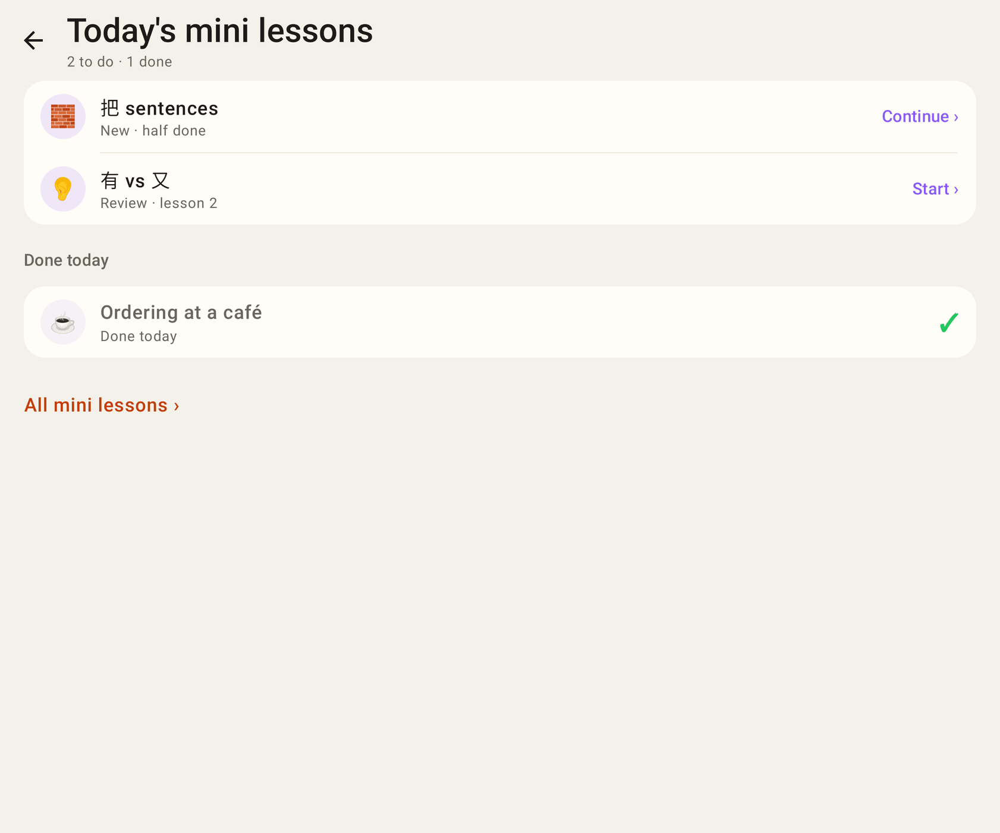
Unfolded.

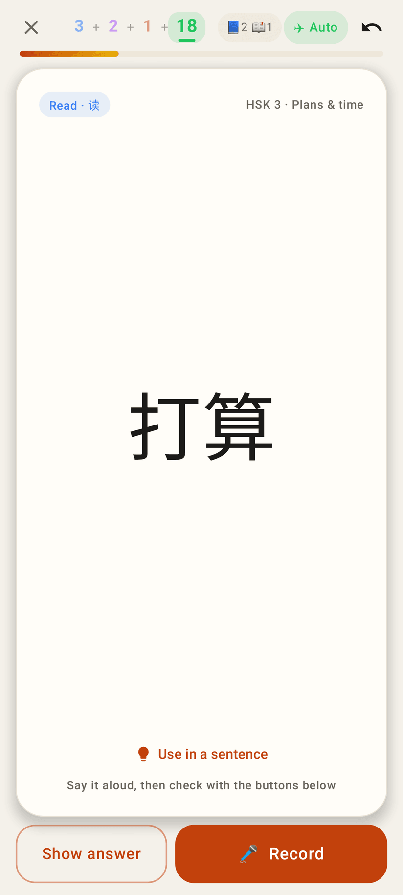
During the cards the top bar shows what's waiting after them: "📘2 📖1".

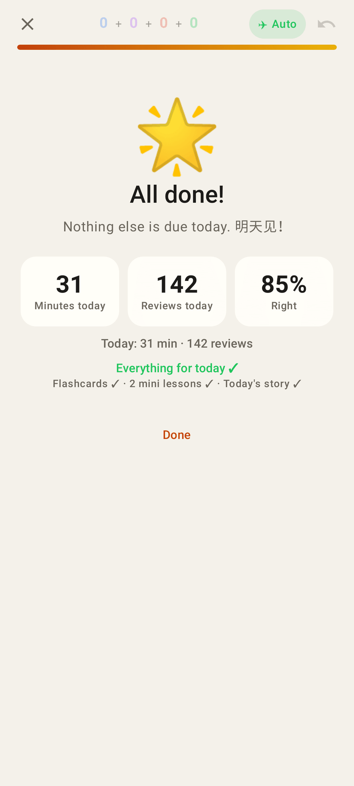
Flashcards, lessons and story all done: the second, smaller celebration — "Everything for today ✓".

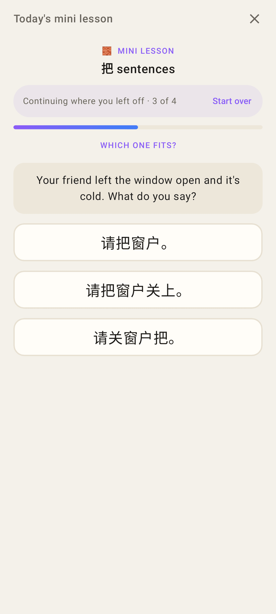
A lesson left half-way comes back the same day: "Continuing where you left off · 3 of 4 · Start over".

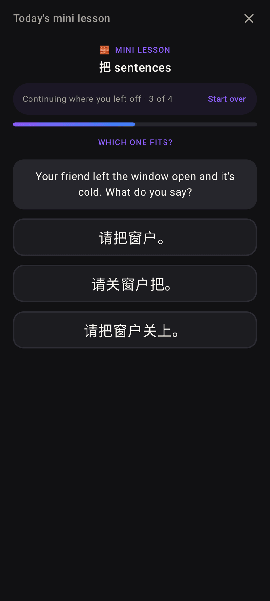
Dark theme.
