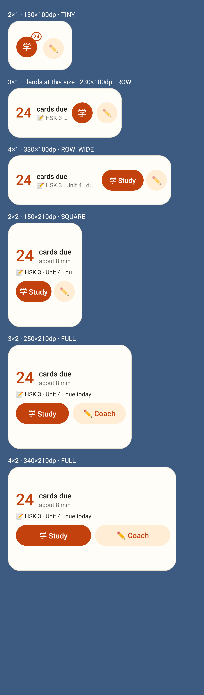
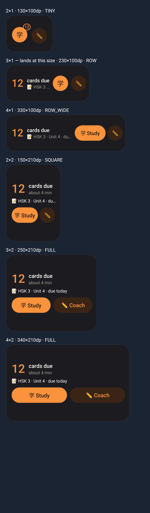
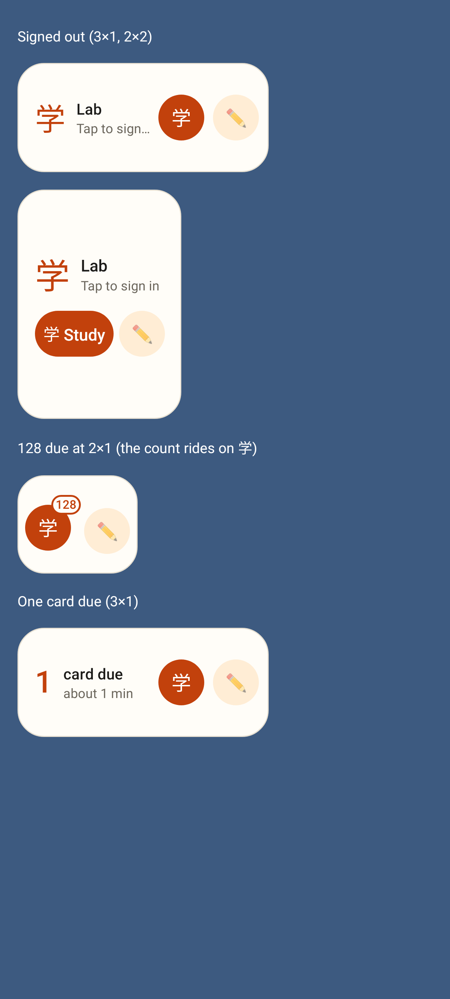

# Lab widget: the Sentence Coach at every size

Every size bucket at its real size: 2×1 学 (count badge) + ✏️, 3×1 count + 学 + ✏️, 4×1 学 Study + ✏️, 2×2 学 Study + ✏️, 3×2 / 4×2 学 Study + ✏️ Coach.

The same in the dark theme.

Signed out, 128 due on the narrowest 2×1 (110dp: the count rides on 学), one card due.
