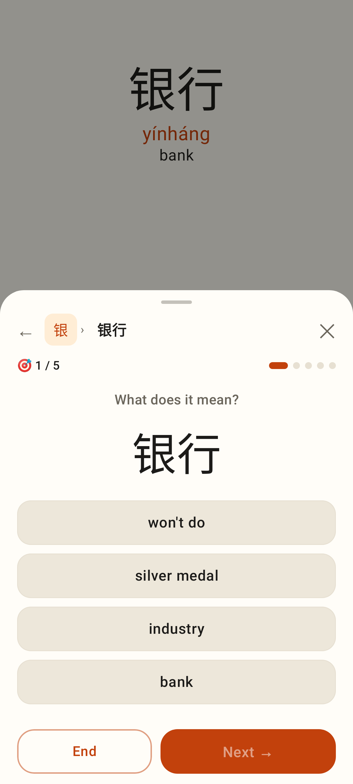
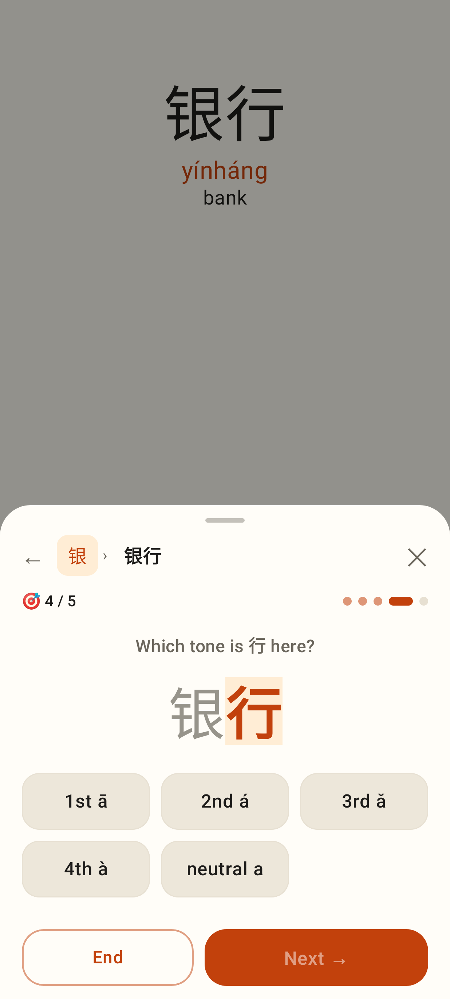
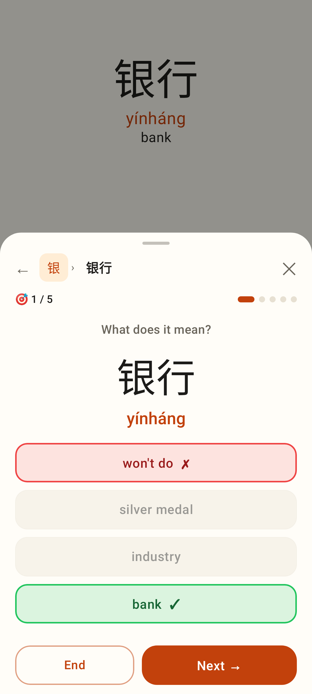
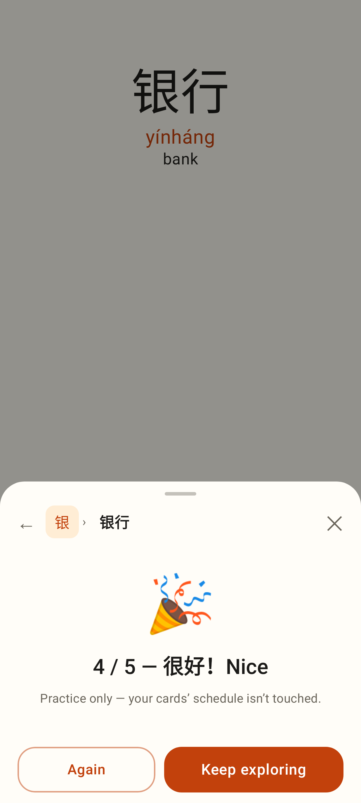

# Language explorer — quick drills

## Lab app (native, phone 412dp)

🎯 1 / 5 on the Word view of 银行: "What does it mean?" with four English options.

"Which tone is 行 here?" — the word with the character highlighted, five tone buttons.

Answered wrong: the pick in red (shake), the right one in green (pop), the pinyin revealed, Next →.

The score screen: 4 / 5 — 很好！Nice, 🎉 + confetti, "Practice only", Again / Keep exploring.
