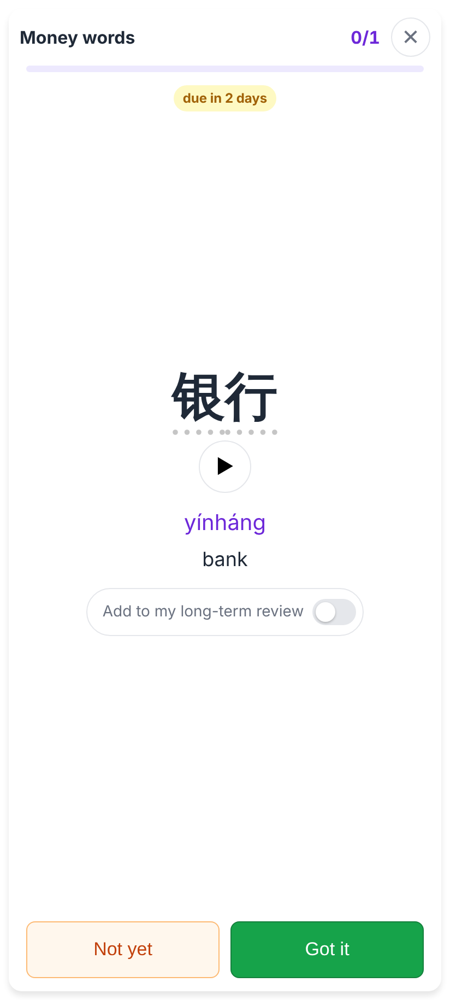
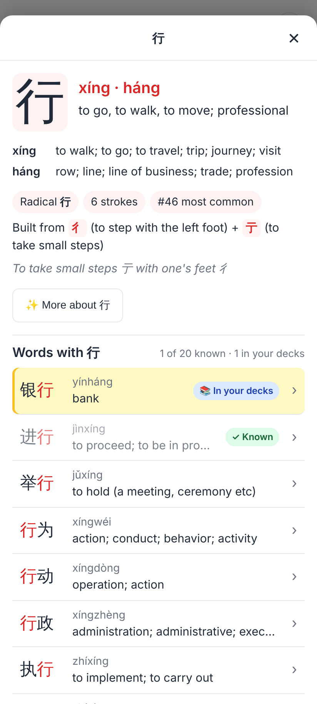
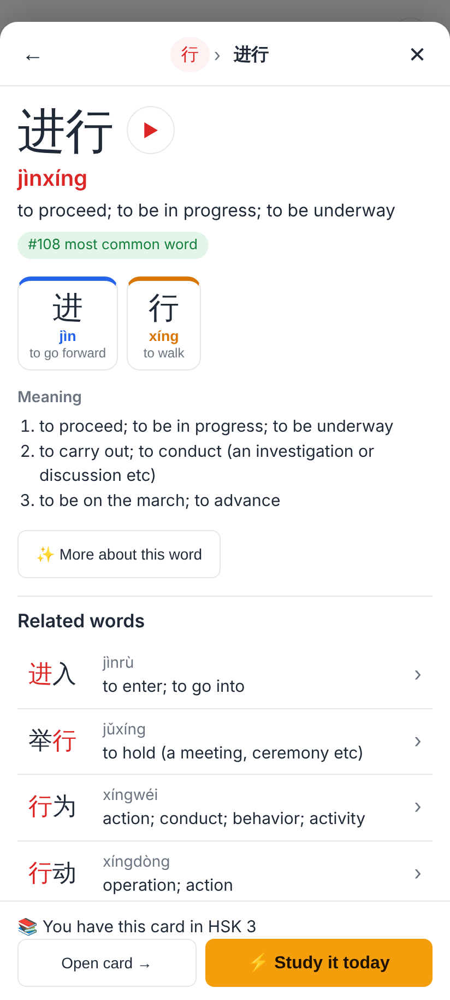
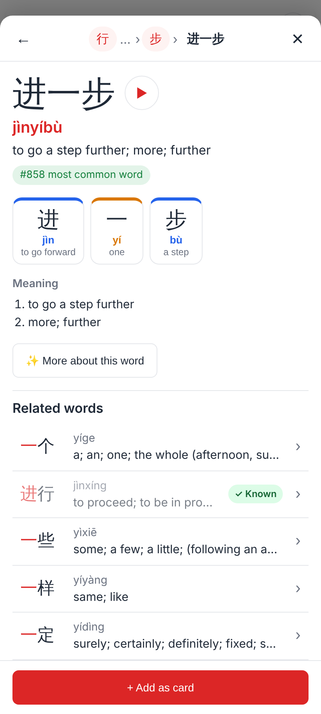
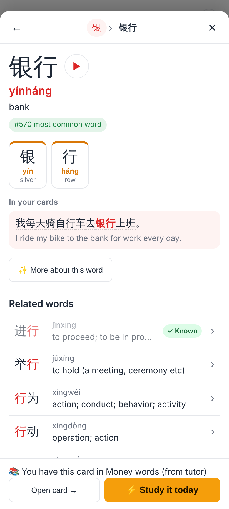
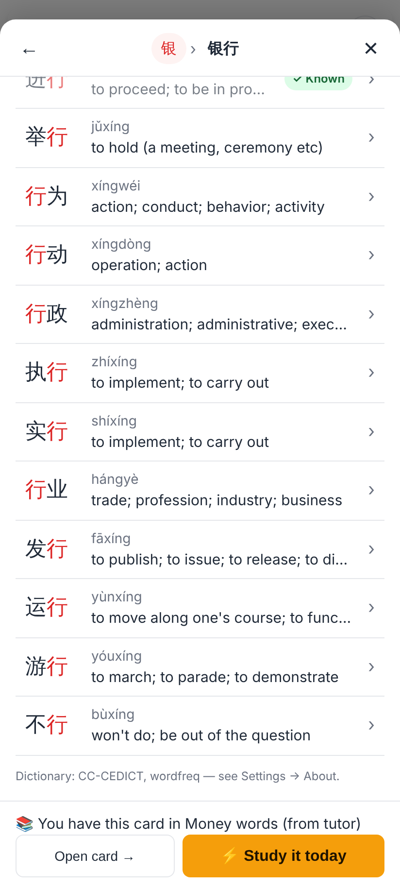
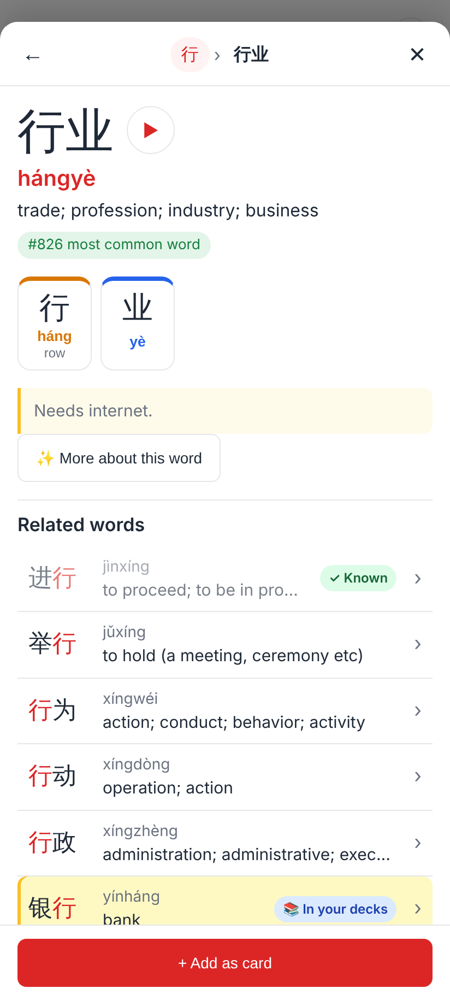

# Language explorer — screenshots (412×915, 2×)

Web app, homework pass for 银行 (from the tutor), with 进行 (mature) and 自行车 in the learner's own HSK 3 deck.

The pass's answer side: each character of 银行 is tappable (dotted underline).

Tap 行 → the Character view (the character sheet): readings, radical / components (tappable), "Words with 行" with ✓ Known / 📚 In your decks; every row opens a Word view.

进行 → the Word view: ▶, pinyin, "#108 most common word", a chip per character coloured by tone, dictionary senses, related words, and "You have this card in HSK 3" → Open card / ⚡ Study it today (pinned footer).

行 › 进行 › 进 › 进步 › 步 › 进一步: the breadcrumb collapses to first … last two; a word they don't have gets "+ Add as card".

银行 from the 银 Character view: the sentence from the learner's own card (自行车) with the word marked — itself explorable.

Scrolled: related words, most common first, with their badges.

Offline, a word never looked up: built from the cached character records; "More about this word" says "Needs internet".
