# Mini lessons: one "today" rule, closing never completes, ▶ Do it again

Phone viewport (412×915). Data: Jerome's 8 Oct situation — the homework lesson 你吃什么，我就吃什么 done in its pass, China trip 1 still today's new lesson.

## Lab app

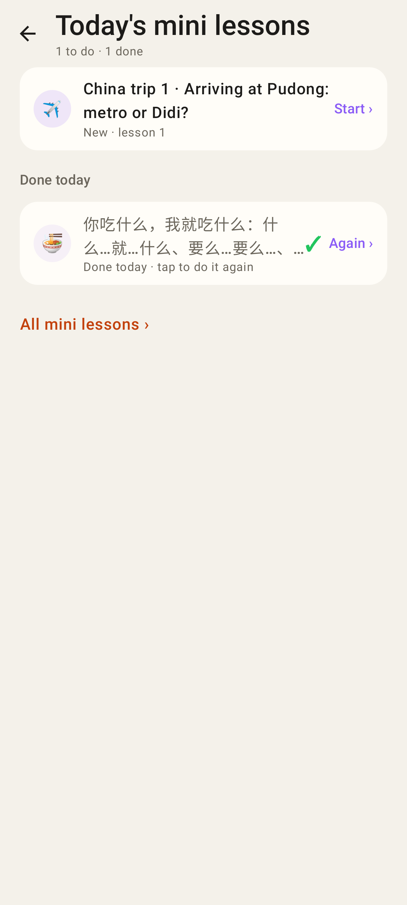
Today's mini lessons after the homework lesson was finished: China trip 1 is still to do (before: "All done for today ✓"); the done row replays ("Again ›").

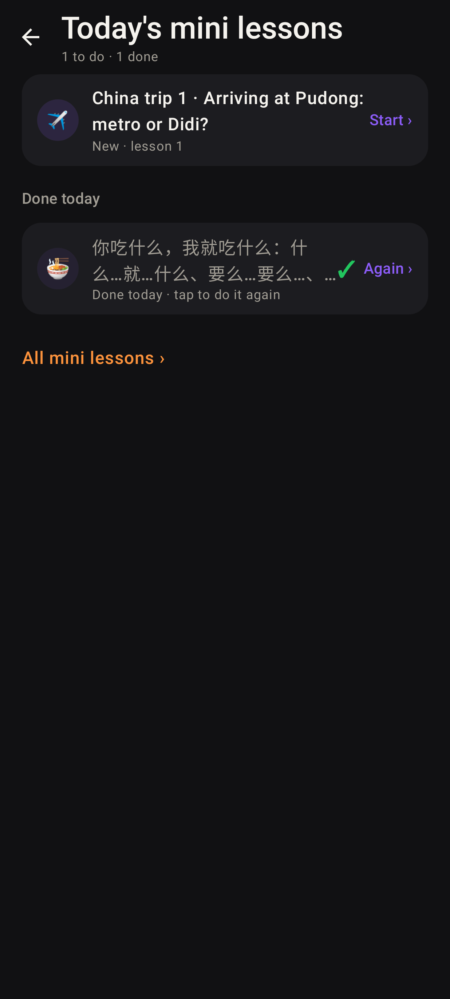
Same, dark.

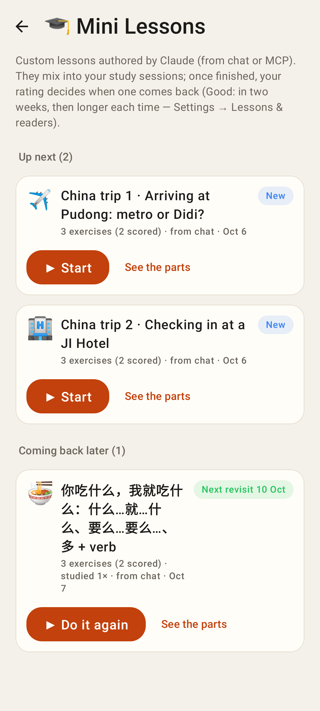
All mini lessons: ▶ Start on new lessons, ▶ Do it again on finished ones, "See the parts" for the listing.

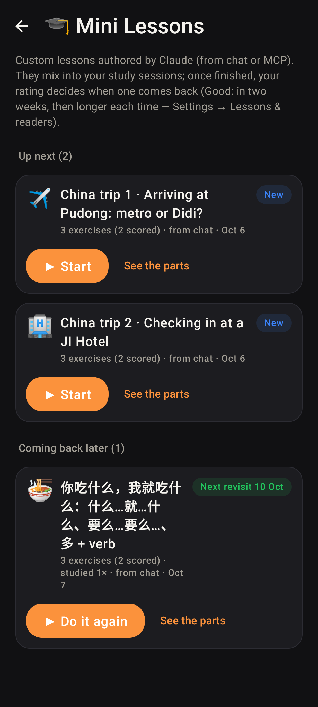
Same, dark.

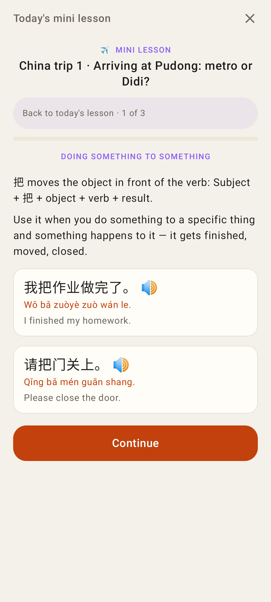
A lesson opened earlier today and closed on its intro says so when it comes back: "Back to today's lesson · 1 of 3".

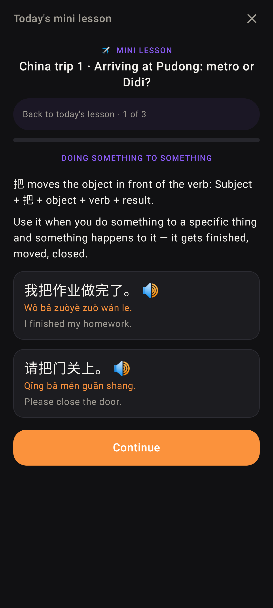
Same, dark.

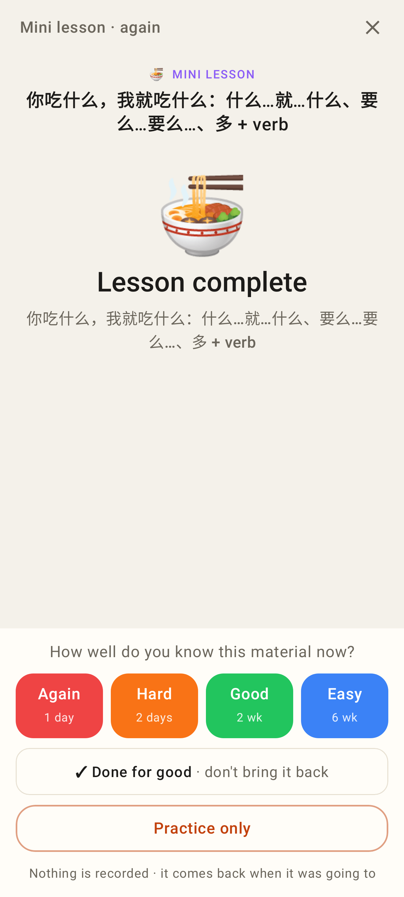
▶ Do it again on a lesson that isn't due: the ratings, Done for good, and Practice only (nothing recorded).

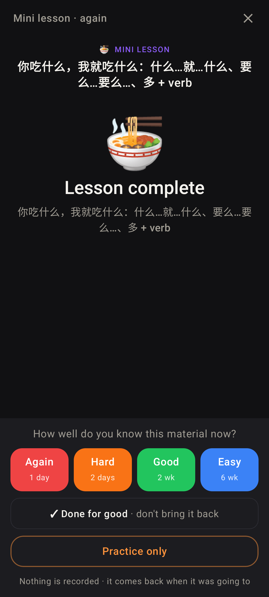
Same, dark.

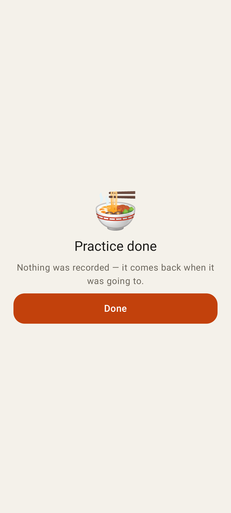
After Practice only.

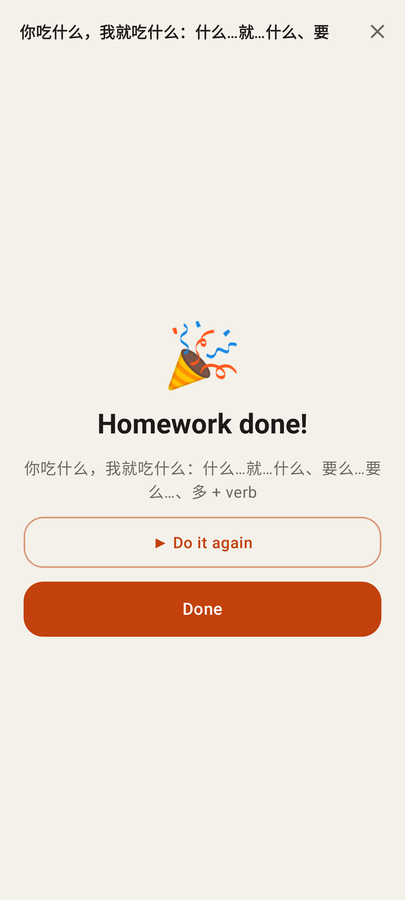
A finished homework lesson pass: ▶ Do it again.

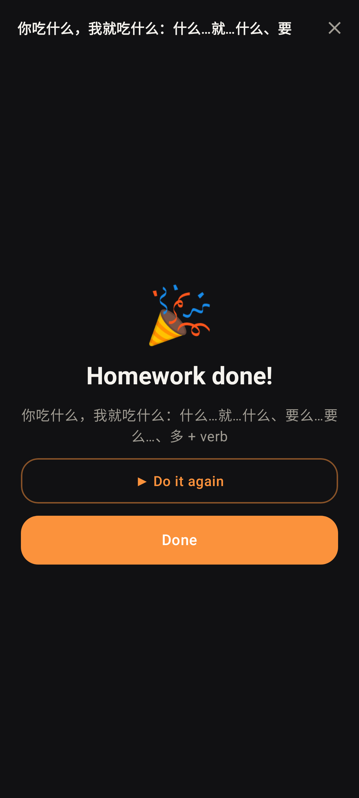
Same, dark.

## Web

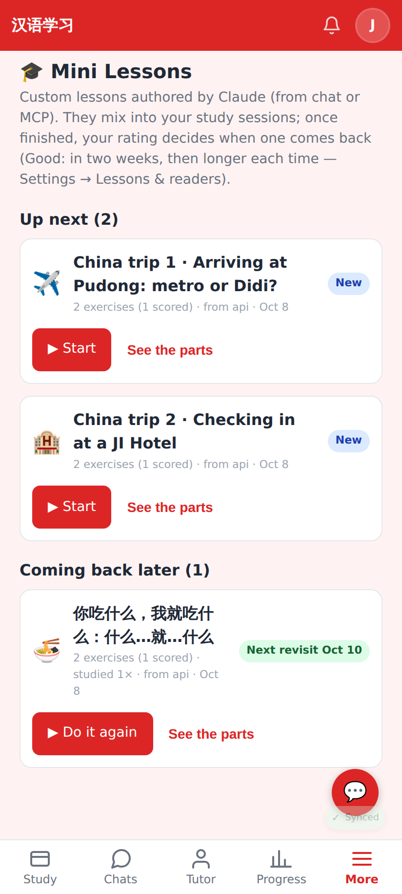
Mini Lessons page: ▶ Start / ▶ Do it again on every card.

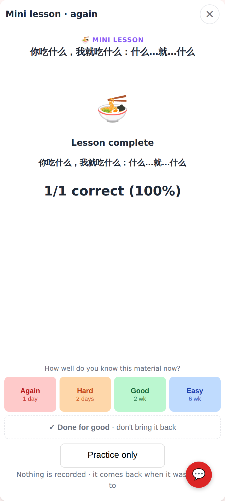
A replay of the homework lesson (not due): ratings, Done for good, Practice only.

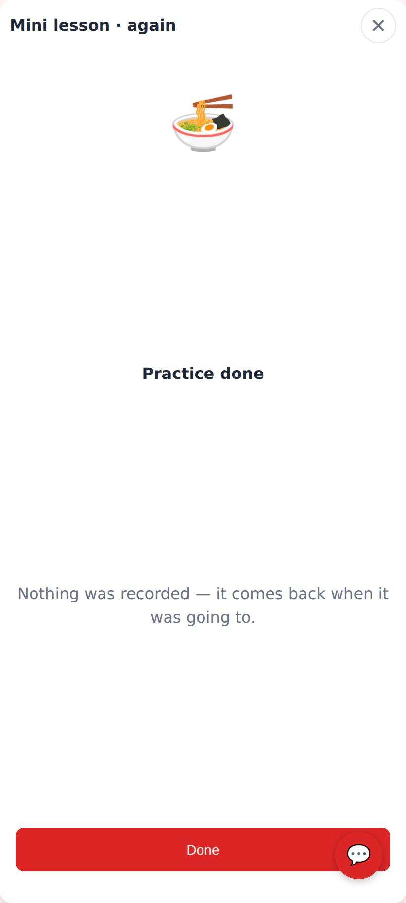
After Practice only.

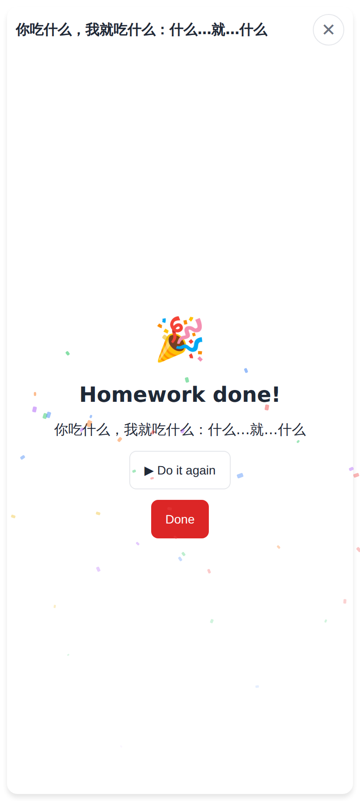
Finished homework lesson pass with ▶ Do it again.

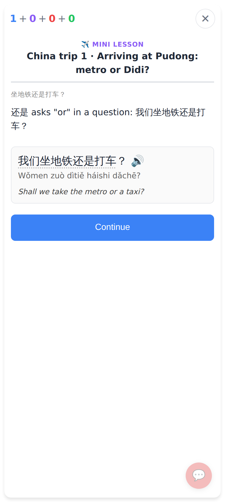
Study after the homework lesson was finished: China trip 1 is still today's new lesson.
