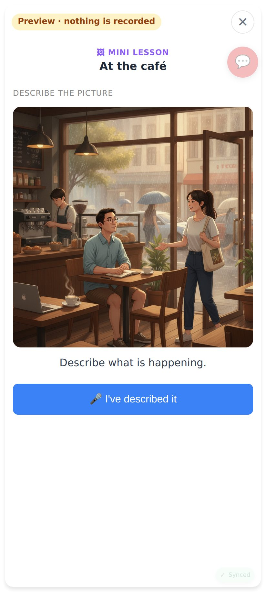
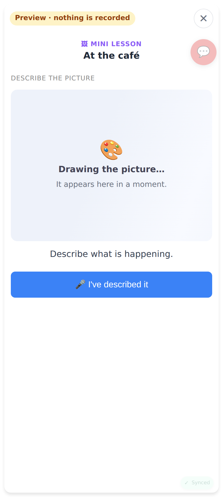
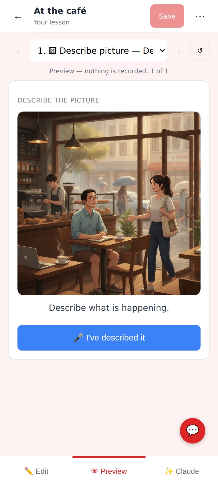
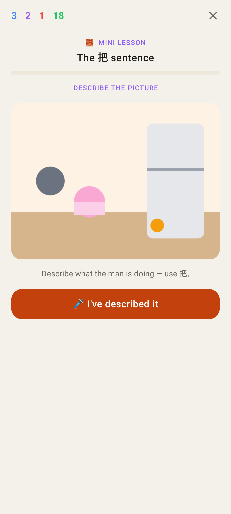
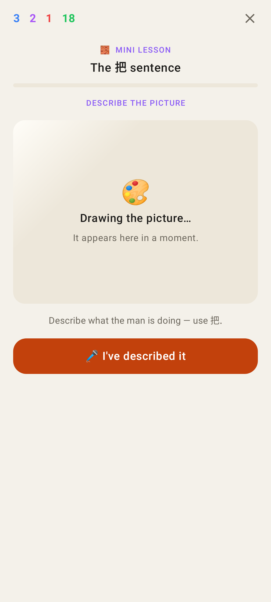
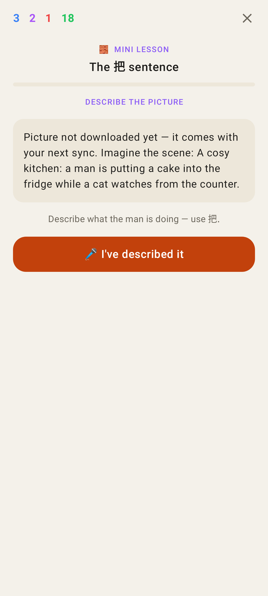

# Lesson pictures (describe_image) — web + Lab

Phone viewport (412×915, 2×). The café picture is served from local R2 through the real
`lesson_images` path (ready row → key written into the lesson / returned by ensure).

01 · Catalogue → "At the café" sample, Try it: the picture (asked by scene, cached). The 💬 feedback button, saved over the top-right corner, now sits below the top bar (faint), clear of ✕.

02 · The same while the picture is still being generated: "Drawing the picture…" — polled, replaced by the picture when ready.

03 · A real lesson (POST /api/custom-lessons): its stored spec carries `image_url` (written at creation because the scene was already drawn); Preview in the lesson editor. The 💬 button's default spot is now above the editor's Edit · Preview · Claude bar.

04 · Lab app, lesson player: the picture.

05 · Lab app: "Drawing the picture…" while it is generated.

06 · Lab app: offline and never downloaded — the scene text, saying why.
