# Long multiple-choice card: scrolls, prompt and button always on screen, characters only

The card from the bug report: 我们一边吃晚饭，一边练习说中文。 — 14 rows to pick, one of which
offered the pinyin "xi" as a "character".

## Lab app (folded Fold 412dp, dark, font scale 1.3)

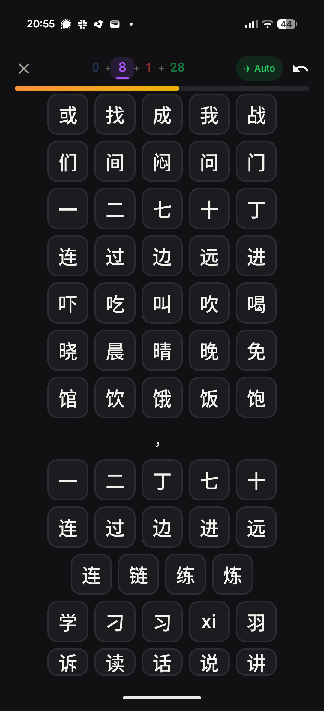
Before: the grid pushes the question off the top and the button off the bottom; "xi" is an option.

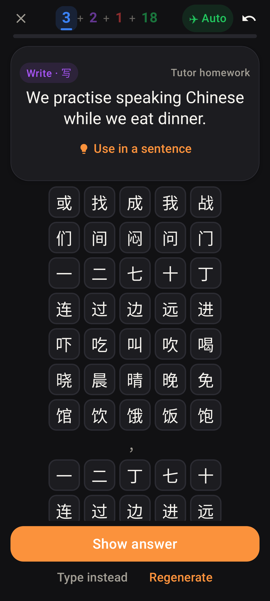
After: the question stays, the rows scroll (compact tiles past 6 rows), Show answer is pinned.

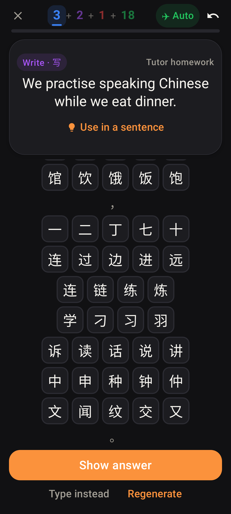
Scrolled to the last row — the button never moves; the 习 row has 4 real characters, no "xi".

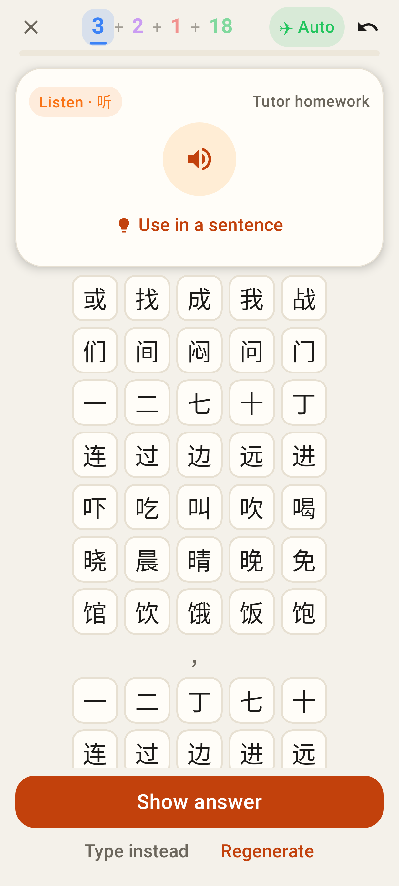
Listen card: a smaller ▶ on the short front.

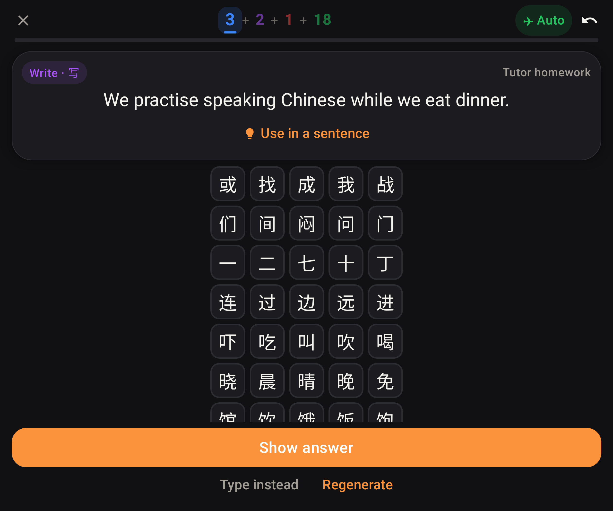
Unfolded (841dp) at font scale 1.3.

## Web app (412×915)

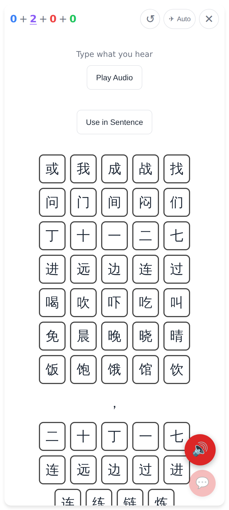
Before: the card scrolls as a whole, the button is off screen.

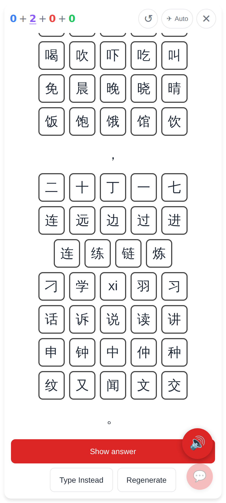
Before, scrolled: the prompt is gone and "xi" is offered.

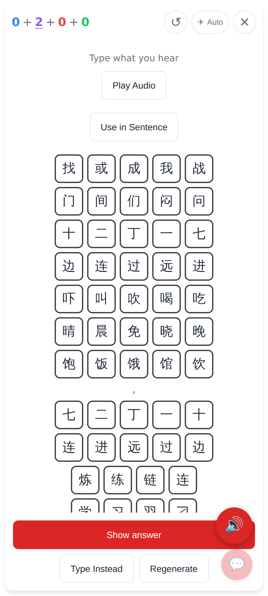
After: prompt on top, rows scroll, Show answer / Type instead / Regenerate pinned.

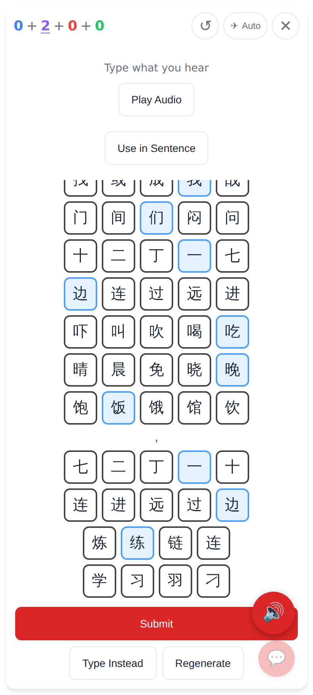
Each pick scrolls the next unanswered row into view.

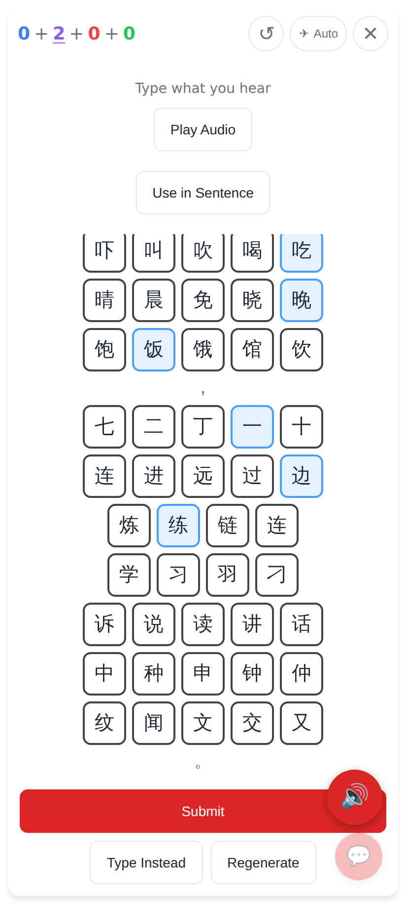
Scrolled to the end — characters only.

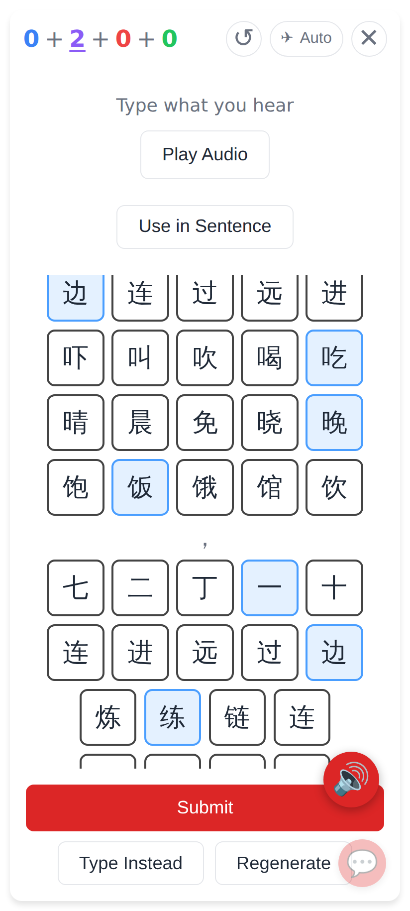
Browser text at 130%: the button still fits.
