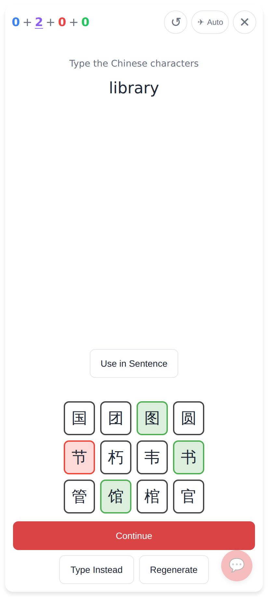
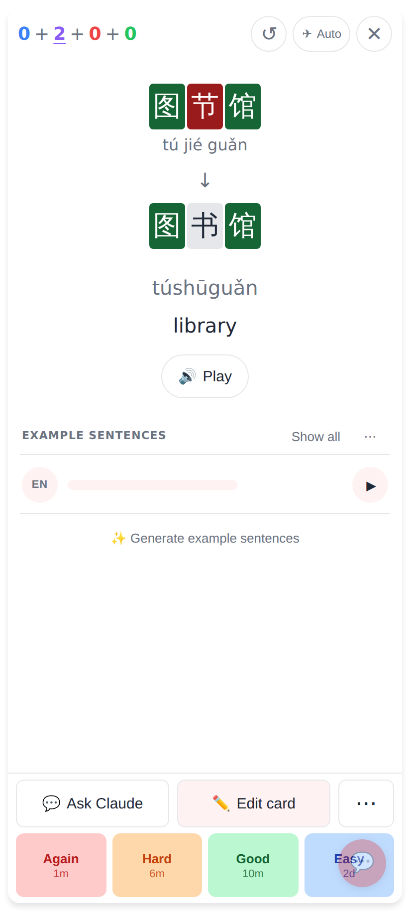
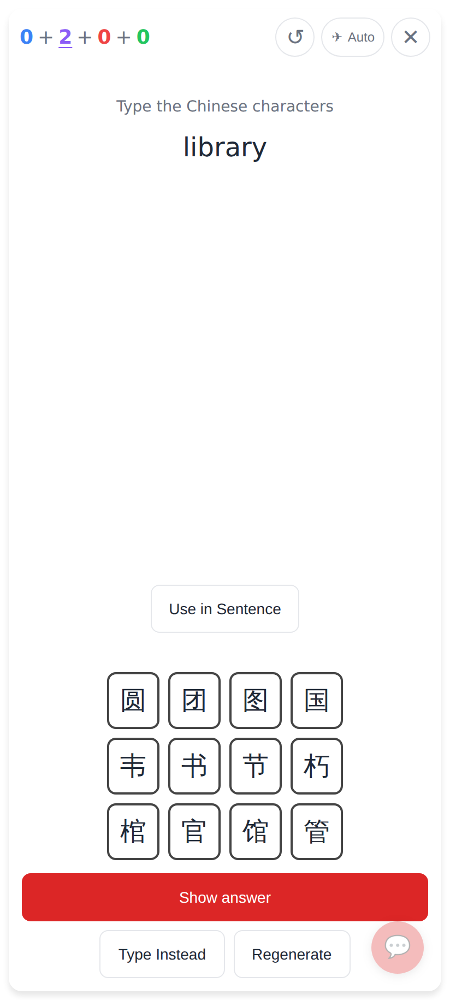
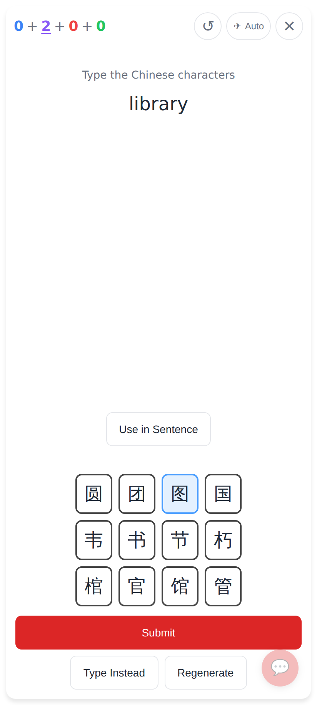
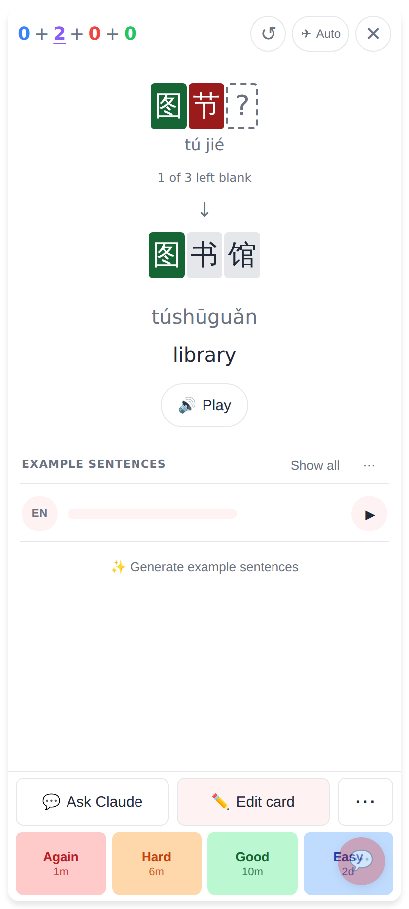
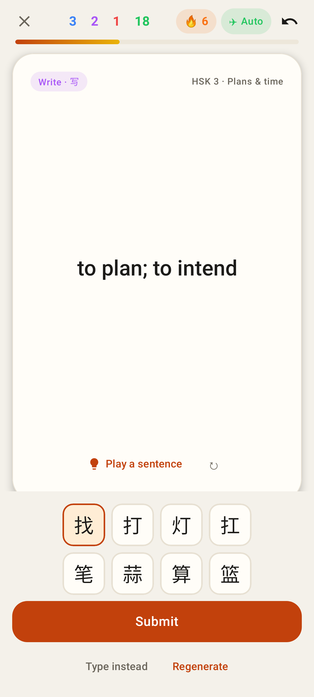
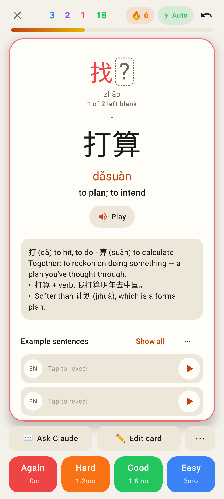

# Multiple choice: one tap, partial answers allowed

Phone viewport (412×915 @2×), card 图书馆 "library".

## Before (web)

Before: every row had to be picked, then Check Answer coloured the grid, then Continue flipped the card (two taps).

Before: the back, diffed position by position.

## After (web)

Nothing picked: the button reads **Show answer**, so you can give up and move on (the review has no answer).

Something picked: **Submit** works at once, even with rows left blank.

One tap later, the back shows each row: 图 right (green), 节 wrong (red), the blank row as a dashed "?", "1 of 3 left blank", and the answer below. The review's user_answer is "图节".

## After (Lab app)

Lab: the same rule. With one pick the button reads Submit.

Lab: the back, row by row. The wrong pick is red, the blank row is dashed, and the card glows red.
