# MCP Apps for tutors — screenshots

Captured from the built bundles (`mcp-server/dist/<app>/index.html`) with the
`window.__MCP_APP_PREVIEW__` hook and sample data (a 小明 student, a restaurant
reader, a weather lesson, a 餐厅点菜 deck). Phone shots are 412×915; wide shots
1024px. Illustrations are placeholder SVGs standing in for the R2 images.

## Students dashboard (`open_students_dashboard`)

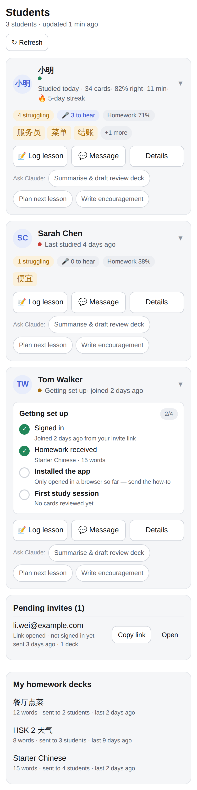
One card per student: status line, pills, words that need attention, setup checklist for a new student, quick actions and Ask Claude chips; pending invites and homework decks below.

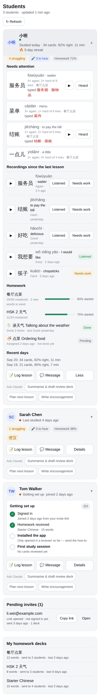
Expanded card: needs-attention words with the wrong answers typed and a Heard button on their recordings, the recordings inbox (Listened / Needs work + comment), homework decks with progress bars, lessons and recent days.

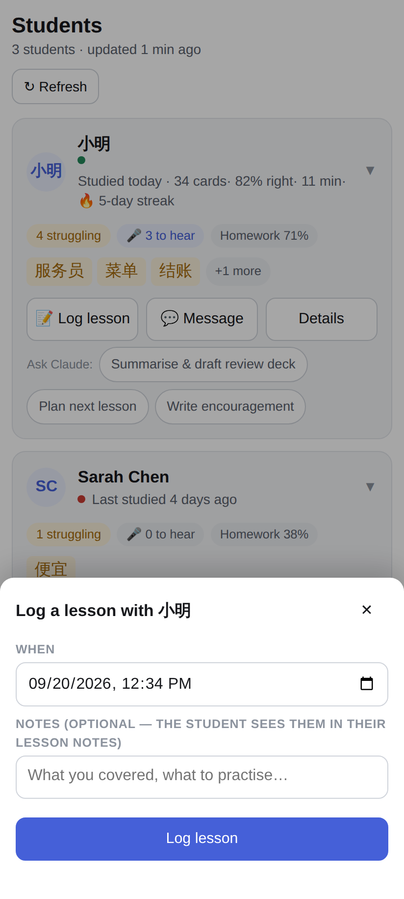
Log lesson sheet (date-time + notes that also land in the student's lesson notes).

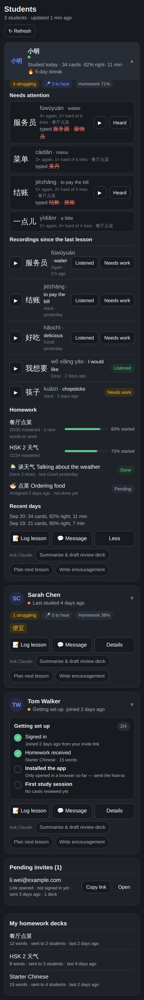
Dark theme (host `data-theme` / style variables).

No students yet.

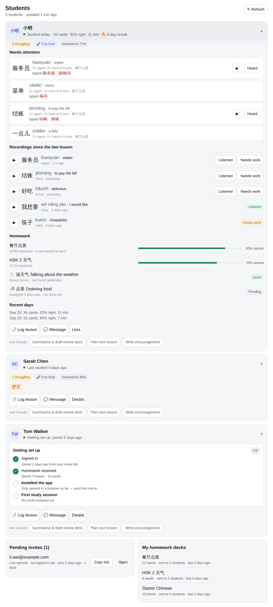
1024px layout with a student expanded; invites and homework decks side by side.

## Review reader (`review_reader`)

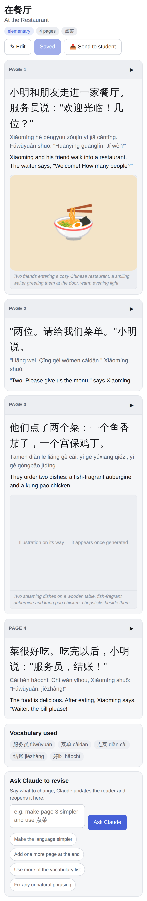
Page by page: large Chinese, pinyin, English, illustration (or "on its way" when only the prompt exists), vocabulary used, Ask Claude to revise.

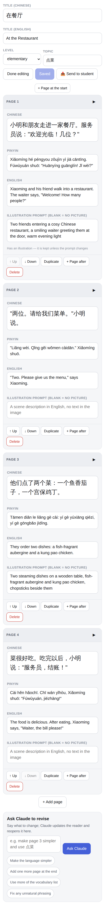
Edit mode: titles / level / topic, per-page Chinese, pinyin, English and illustration prompt, move / duplicate / insert / delete pages, Save with inline validation problems.

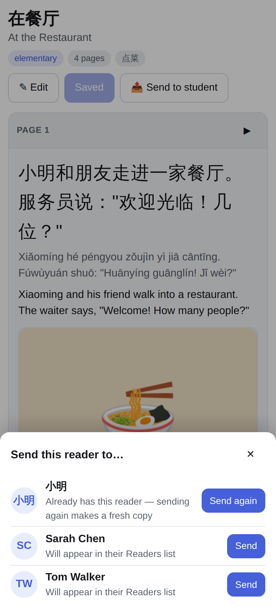
Student picker (already-shared students are flagged).

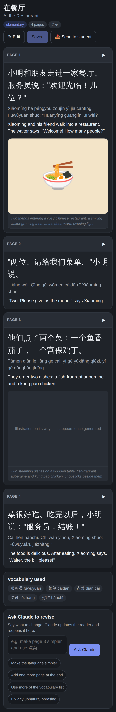
Dark theme.

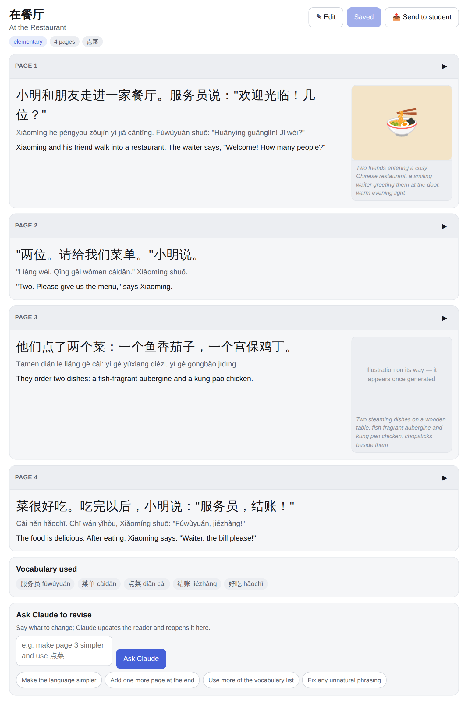
1024px: illustration beside the text.

## Review lesson (`review_lesson`)

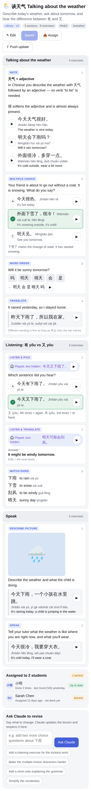
All nine exercise types rendered: note + sentences, multiple choice with the answer marked, word order, translate, listen & pick (played sentence shown to the tutor), listen & translate, match pairs, describe picture, speak; assignments with up-to-date / behind; Ask Claude to revise.

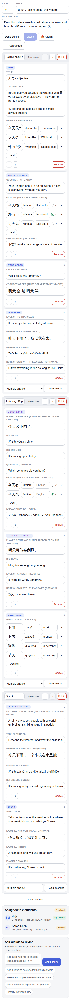
Edit mode: every field editable, options / sentences / pairs as row editors with the correct answer tick, add exercise by type, reorder and remove.

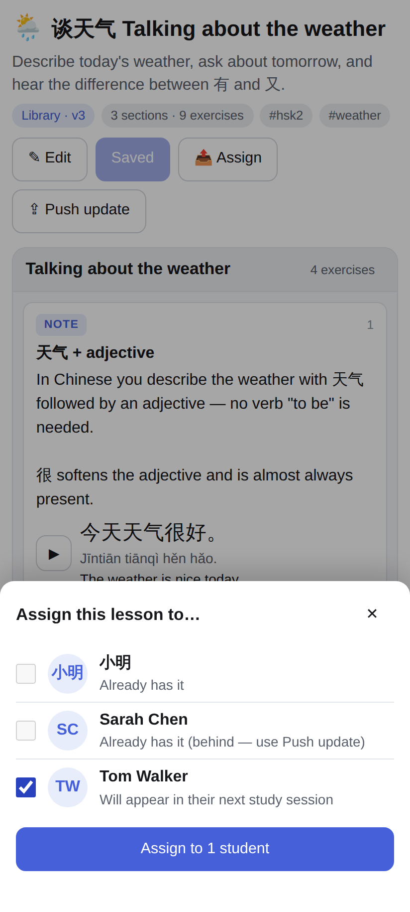
Multi-select student picker (students who already have it are disabled).

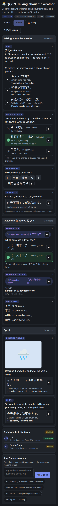
Dark theme.

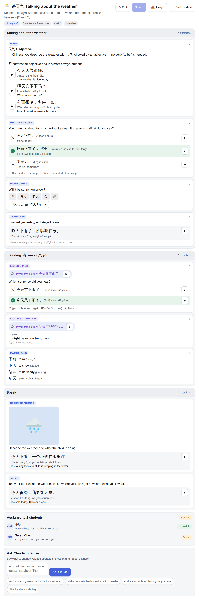
1024px layout.

## Review deck (`review_deck`)

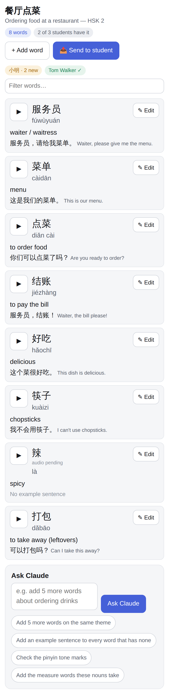
Word rows with play, hanzi, pinyin, English and example sentence; which students have the deck; filter; Ask Claude chips.

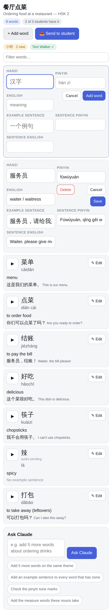
Inline row editor (Save / Cancel / Delete) and the "Add word" row.

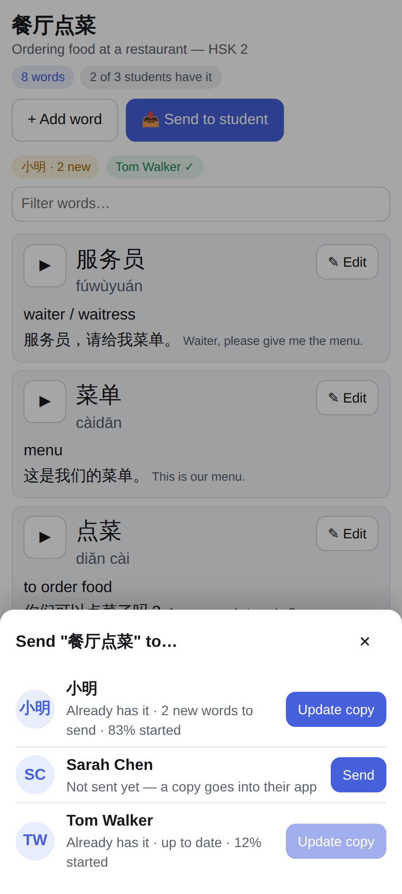
Student picker: Send, or Update copy when the student already has it (with the number of new words).

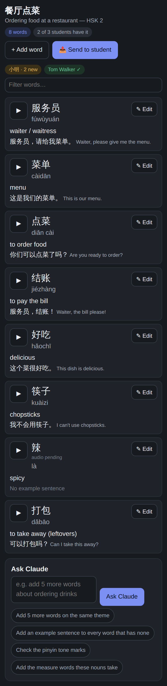
Dark theme.

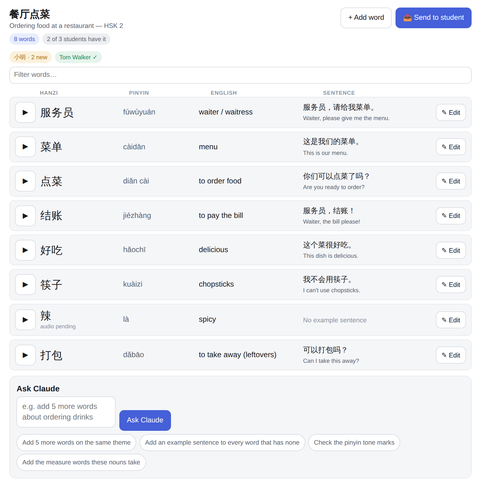
1024px: table layout.
