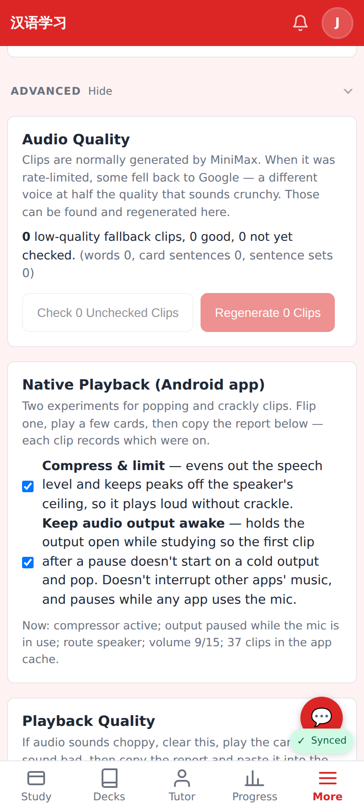

# Keep-alive pauses while the mic is in use — PR screenshot

Captured on the dev server with Playwright at the phone viewport (412×915, 2×), with a
stand-in `window.AndroidAudio` (injected before load) reporting that another app has the
microphone open, as the real bridge does via `AudioRecordingCallback`.

Settings → More → Advanced → Native Playback: the keep-awake caption now says it pauses while
any app uses the mic, and the status line reads "output paused while the mic is in use"
instead of "held open" / "idle".
