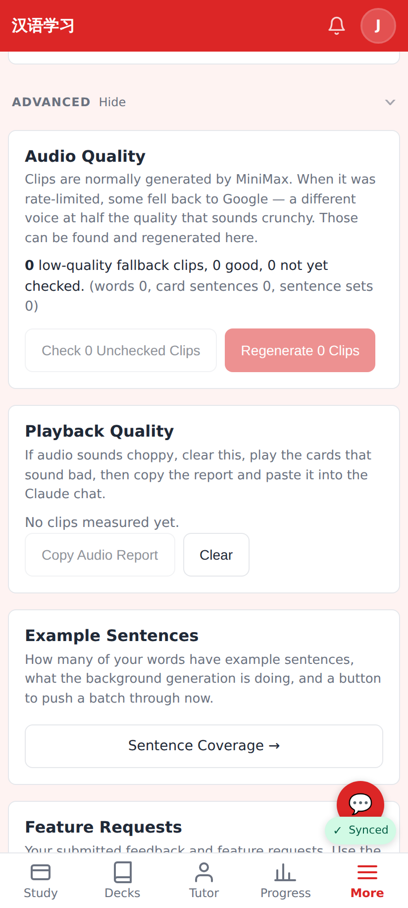
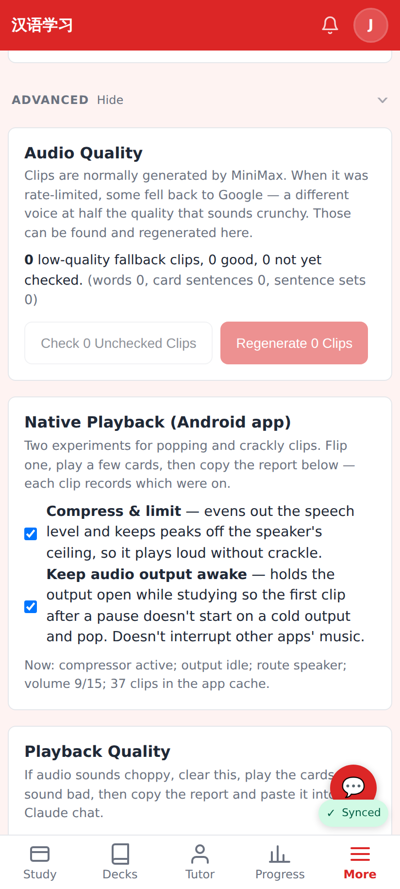
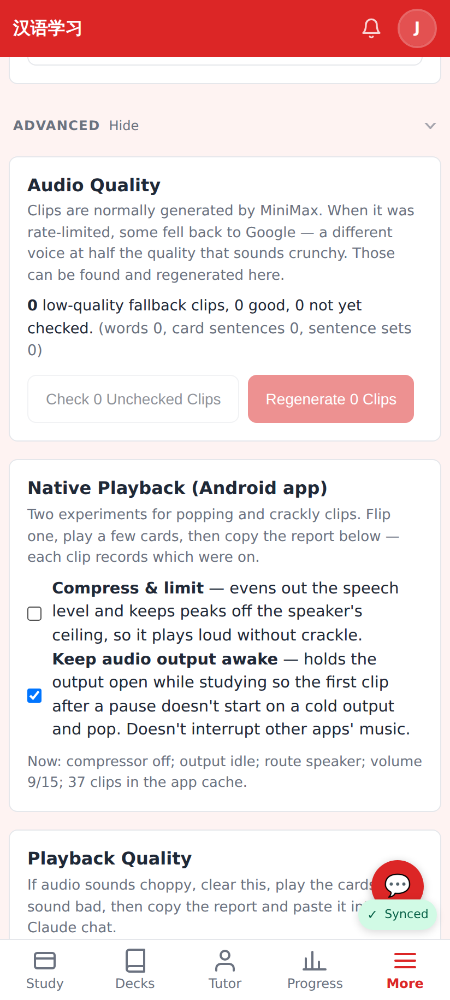
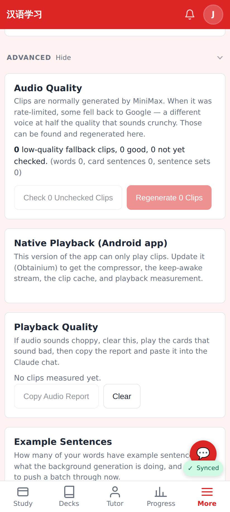

# Native audio v2 — PR screenshots

Captured on the dev server with Playwright at the phone viewport (412×915, 2×).
The Native Playback panel only renders inside the Android app, so for shots 2–4 the
page was given a stand-in `window.AndroidAudio` (a script injected before load) that
behaves like the real bridge: v2 keeps the toggles' state and reports it back through
`describe()`, v1 has only `play`/`stop`. Nothing else about the page was changed.

All shots are Settings → More → Advanced.

## Before

A browser (no bridge): no panel. Audio Quality, then Playback Quality, as on main.

## After

The app on the v2 bridge, defaults: **Compress & limit** and **Keep audio output awake**
both on, and the status line from the bridge — compressor active, output idle (no study
screen is holding it), route speaker, volume 9/15, 37 clips in the app cache.

Compressor toggled off: the status line follows the bridge ("compressor off"). Each clip
played from here on records `effect: "off"` in the audio report, so the ear and the
numbers can be lined up.

The app still on the v1 (1.51) bridge: the panel explains what the update brings instead
of showing toggles that would do nothing.
