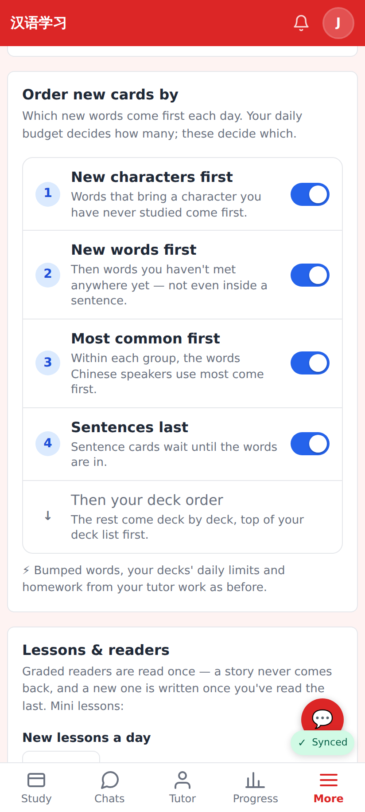
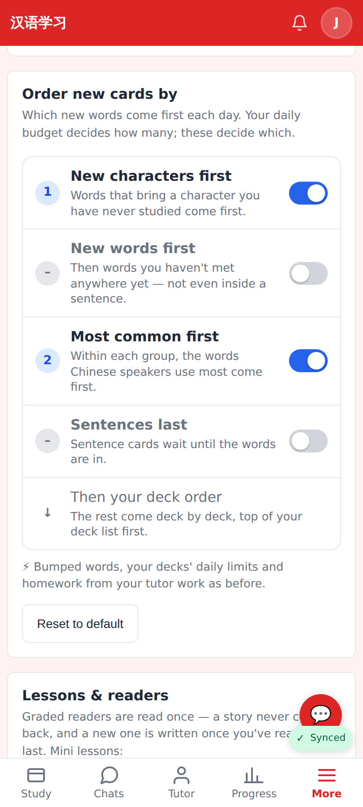
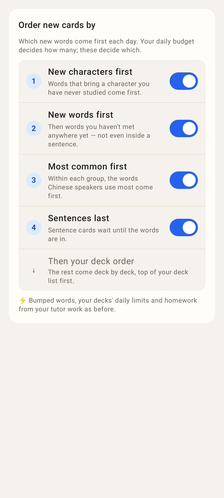
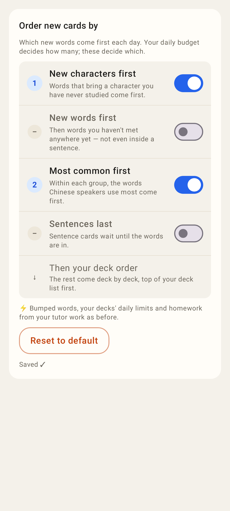

# Order new cards by — screenshots

Settings → New cards → "Order new cards by" (412×915 phone viewport).

Web: every switch on (the default) — new characters, new words, most common, sentences last, then the deck order.

Web: "New words first" and "Sentences last" switched off (saved to the account), numbering follows, Reset to default appears.

Lab app: the same section with the defaults.

Lab app: two switches off, saved.
