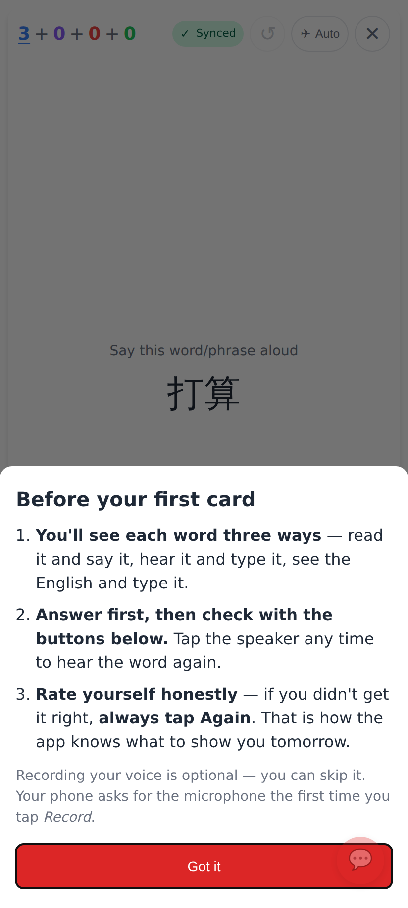
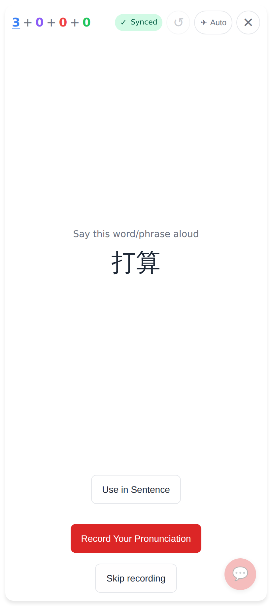
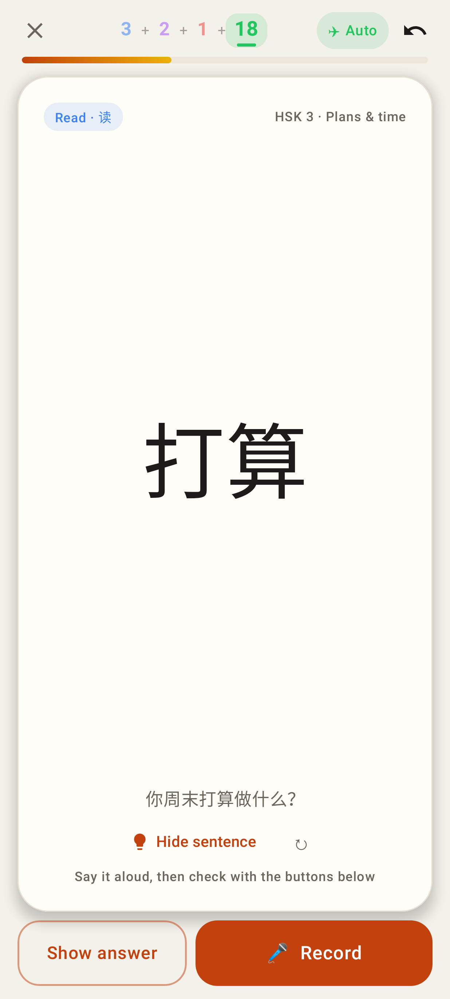
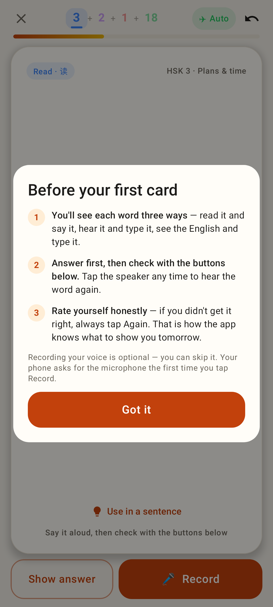
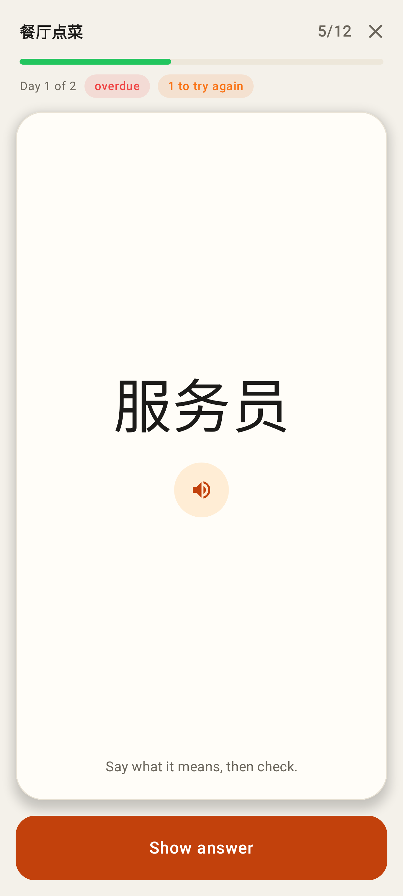

# Only the buttons reveal an unanswered card

Phone viewport (412 wide). Tapping, swiping or long-pressing the face of an unanswered card
(study card or homework pass card) does nothing; the answer comes up only through the bottom
buttons. Peek on a revealed card is unchanged.

Web: the explainer now says "Answer first, then check with the buttons below."

Web: after tapping 打算 the card is still on the question (the web card already had no front tap; now covered by e2e).

Lab: the read card's hint is now "Say it aloud, then check with the buttons below" — a tap on the face no longer reveals.

Lab: the explainer, same wording as the web.

Lab: the pass card's face is inert; only Show answer turns it.
