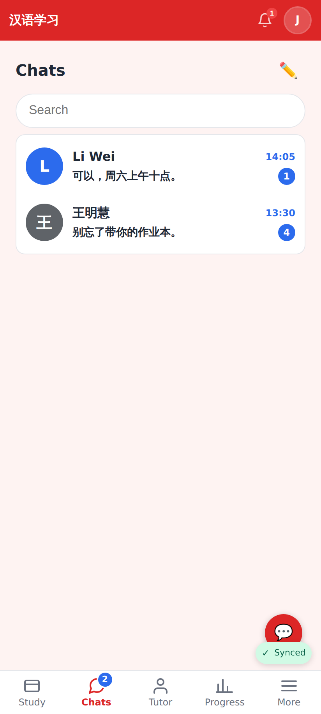
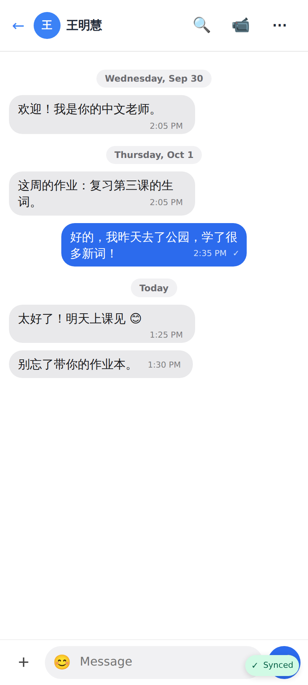
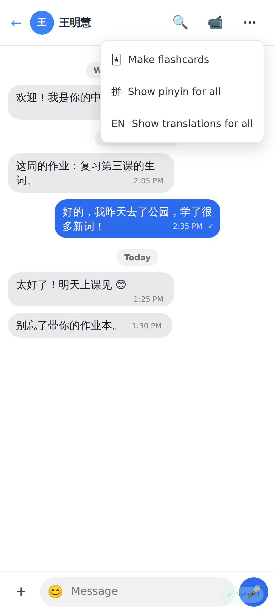
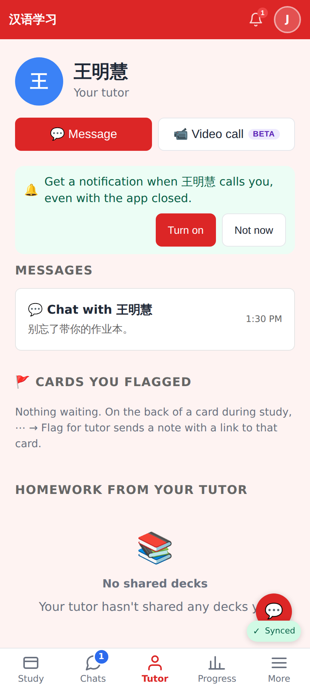
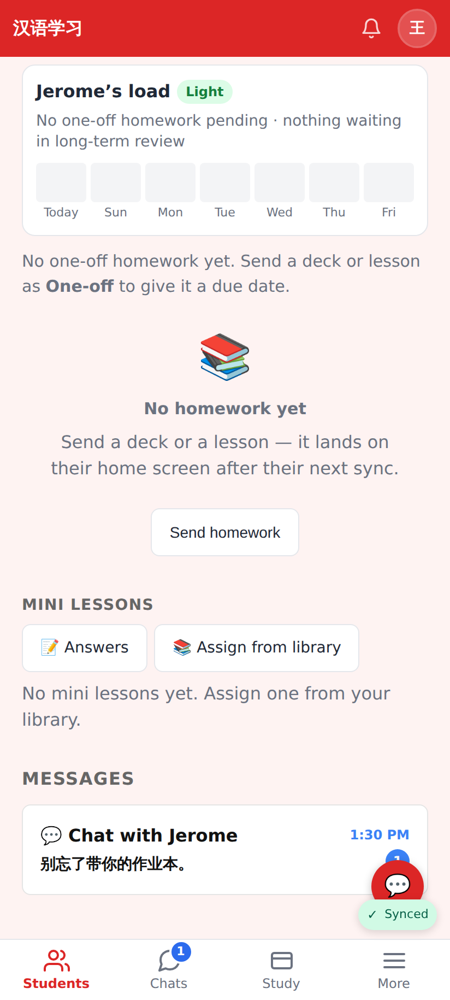

# One chat per pair — screenshots

Phone viewport 412×915 @2×. The chat with 王明慧 used to be three conversations
("Welcome", "Homework" and an untitled one); migration 0099 merged them into one.

## Web

The Chats inbox: one row per person, no conversation titles.

Opening an old conversation link lands in the one chat, every message from the old threads in order.

The chat header ⋯: no New conversation, Add a title / Rename or All conversations.

The student's page for their tutor: one "Messages" row instead of a conversation list.

The tutor's student page: the same single "Chat with Jerome" entry point with the unread count.
