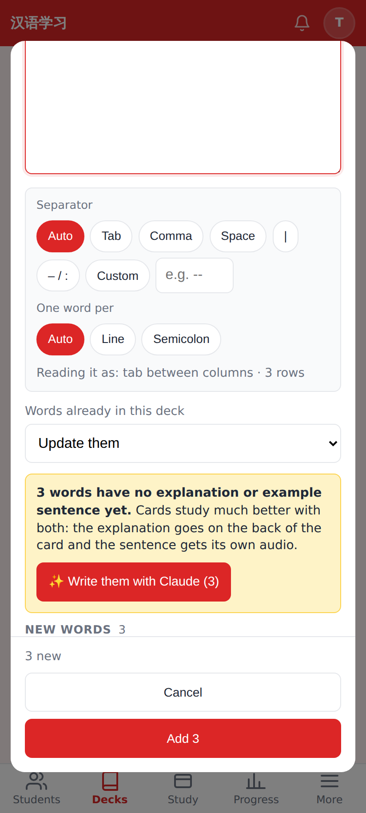
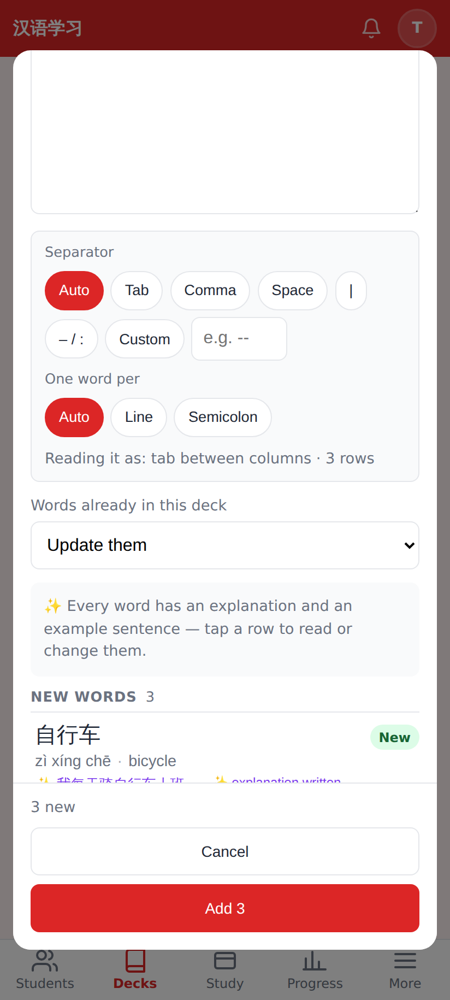
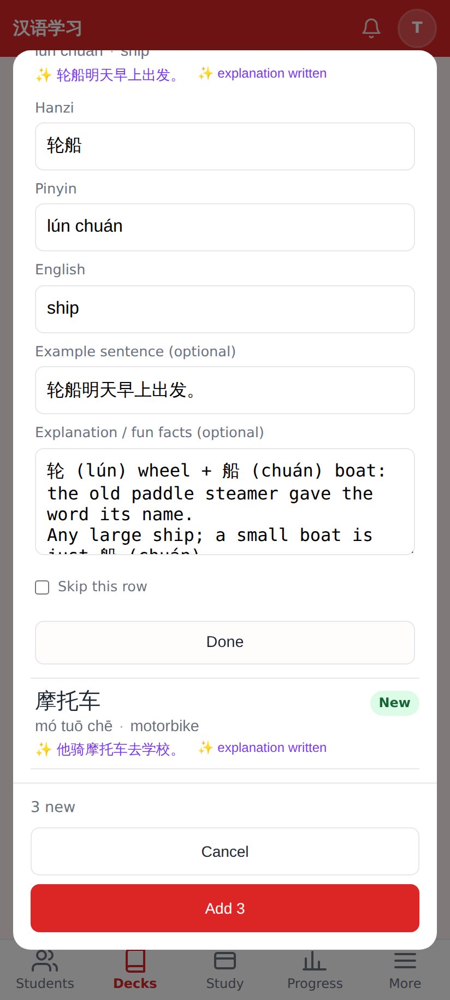
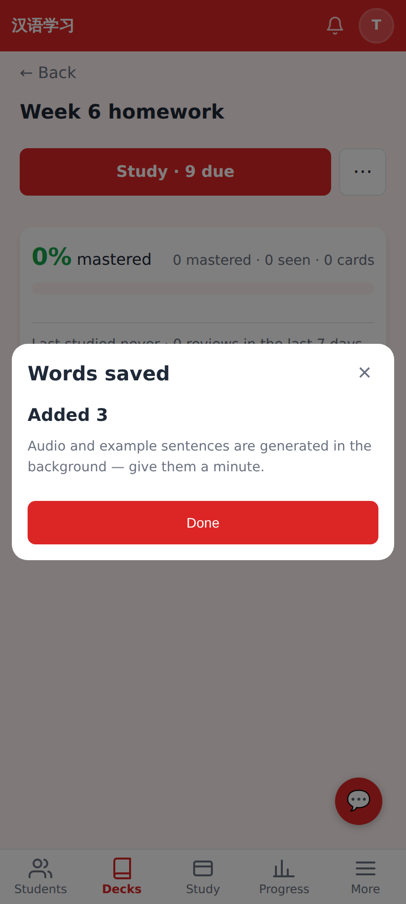
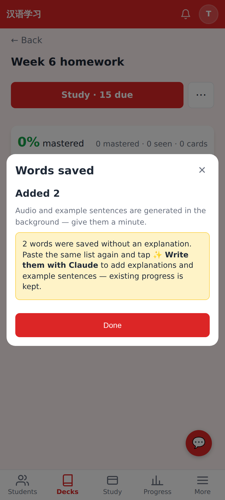

# Paste a list → write explanations with Claude — PR screenshots

Captured at 412×915 @2× from this branch running locally in E2E test mode as tutor **Tutor Li** on a deck. The Claude call (`POST /api/ai/enrich-words`) is stubbed in the screenshot script with canned card-standard text; everything else is the real app.

**The nudge.** After pasting three bare words (hanzi · pinyin · English), a yellow box says "3 words have no explanation or example sentence yet" and offers **✨ Write them with Claude (3)**.

**After tapping it.** Every row now shows its ✨ example sentence and an "✨ explanation written" flag; the box turns into a quiet "Every word has an explanation and an example sentence — tap a row to read or change them."

**Row editor** — the new *Explanation / fun facts* textarea beside the existing example-sentence field; anything edited loses its ✨ (it is now the tutor's text).

**Saved.** The notes carry fun_facts, sentence_clue, its pinyin and translation (verified against the API in the smoke test).

**Saved without the step.** A second list saved without tapping ✨ gets a reminder on the done screen: paste the same list again later and tap ✨ to add the explanations, progress kept.

