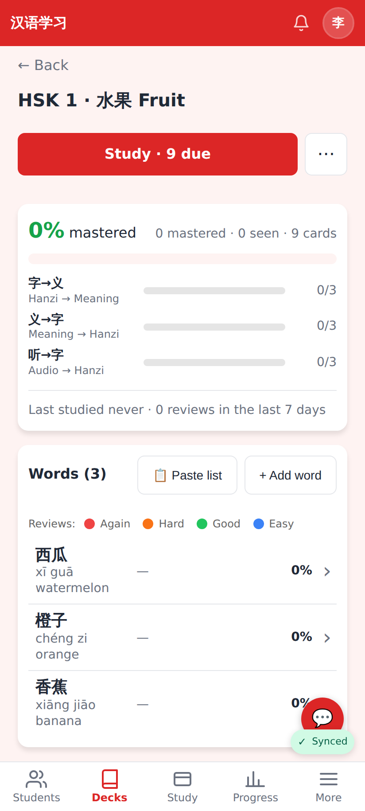
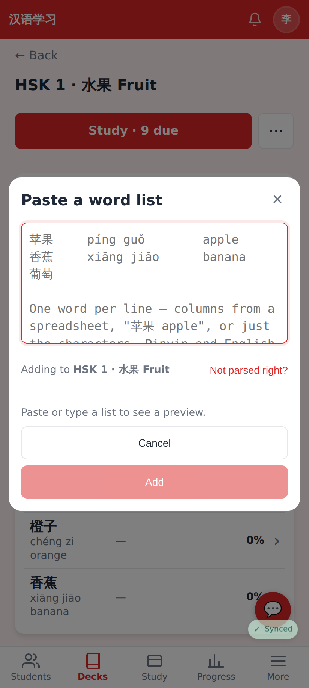
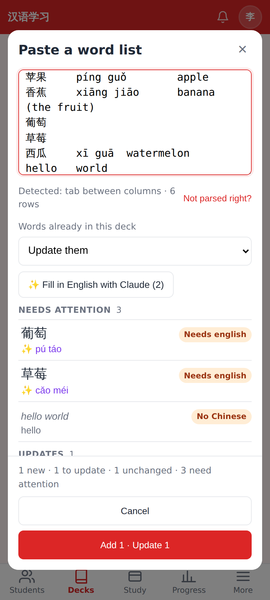
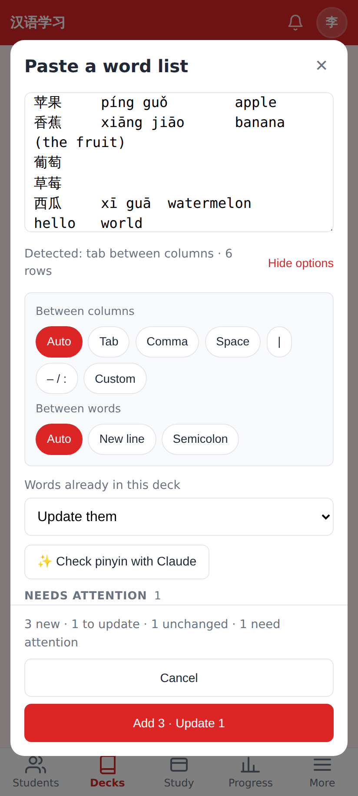
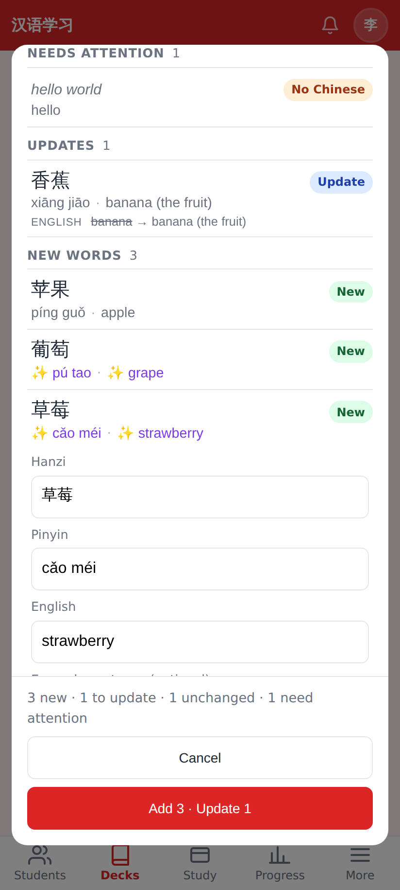
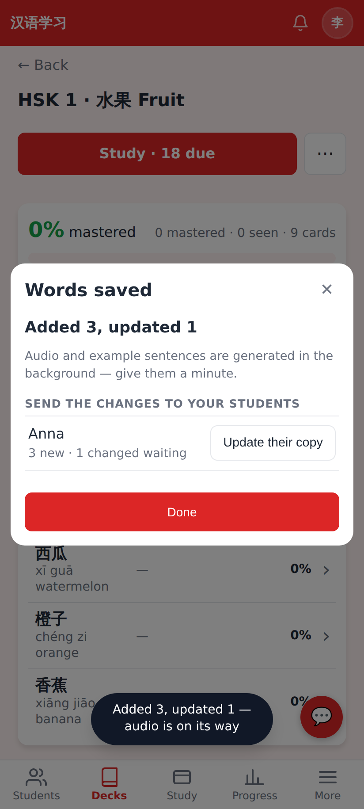
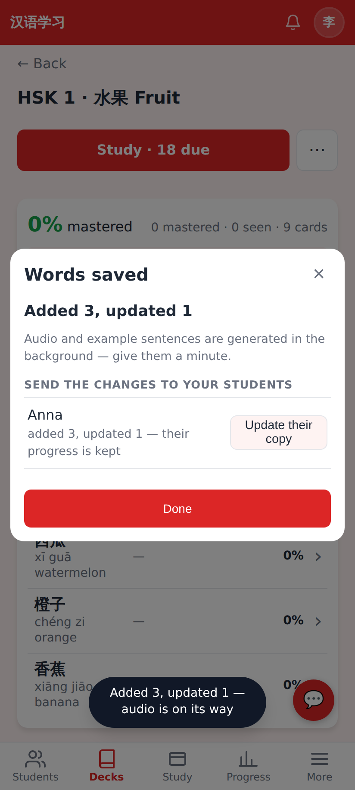
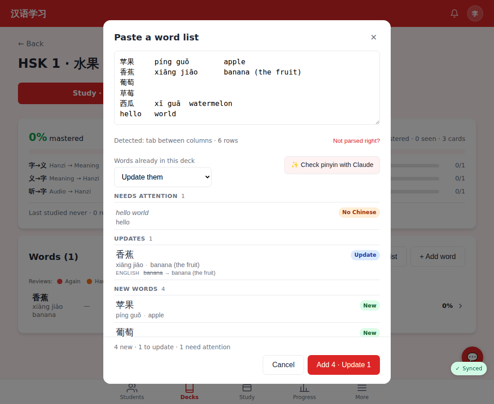

# Paste a word list — add or update many words at once

Phone viewport 412×915 at 2× unless noted. A tutor's deck "HSK 1 · 水果 Fruit" (three words, shared with the student Anna). Claude's answer to the "Fill in English" call is mocked in the capture script (no API key in the container); the layout and states are real.

The deck page: **📋 Paste list** next to **+ Add word** (also in the empty-deck state).

The empty sheet. The placeholder shows the three shapes it takes: spreadsheet columns, "苹果 apple", or bare characters.

Straight after pasting: "Detected: tab between columns · 6 rows", the policy for words already in the deck, and the rows grouped as Needs attention / Updates / New words. 香蕉 shows the change it would make (english: ~~banana~~ → banana (the fruit)); 葡萄 and 草莓 had only characters, so pinyin was filled in on the device (✨) and they need English.

After **✨ Fill in English with Claude**: the bare words are complete and counted in the button. Anything filled in stays marked ✨ until it is edited.

**Not parsed right?** opens the overrides: Auto / Tab / Comma / Space / | / – : / Custom between columns, New line / Semicolon between words.

Tapping a row opens it for editing (hanzi, pinyin, English, optional example sentence) with **Skip this row**.

After saving: the counts, a note that audio and sentences are generated in the background, and — for a tutor — each student's copy with what it is missing.

**Update their copy** pushes the new words and the tutor's edited text into the student's deck; review history and scheduling are untouched.

1100 px wide: the same sheet as a centred dialog.
