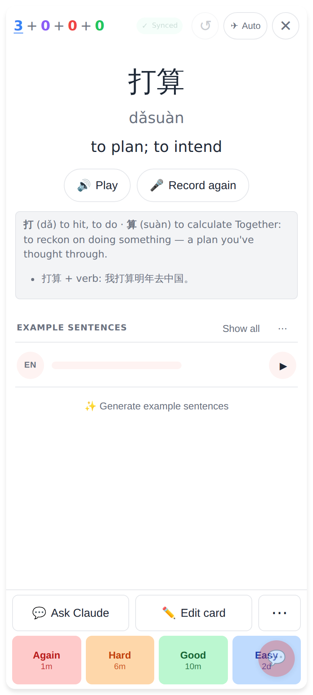
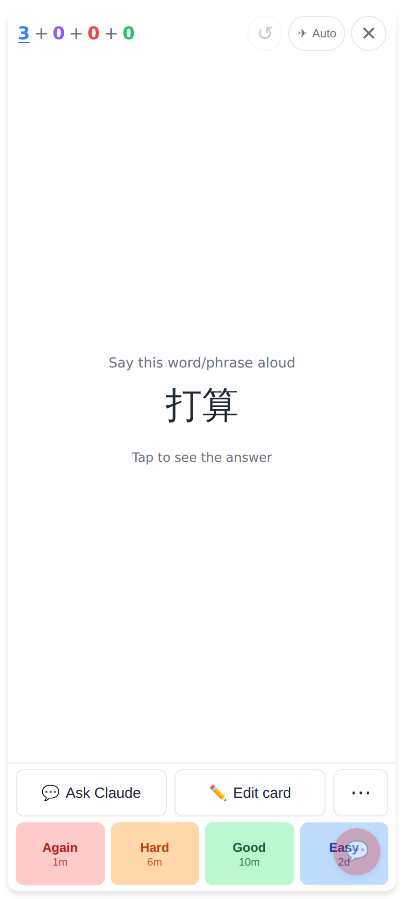
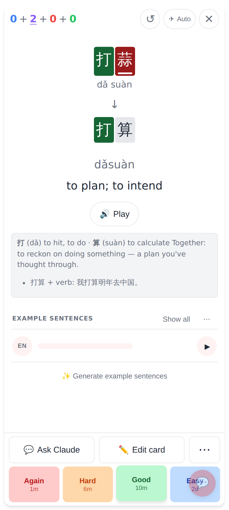
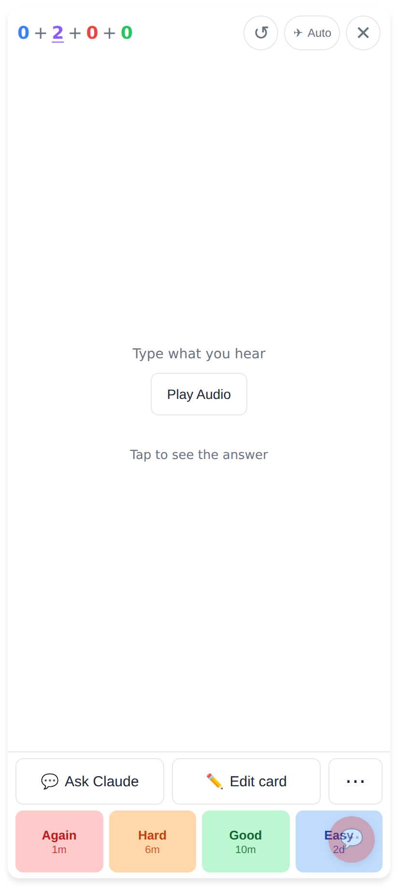
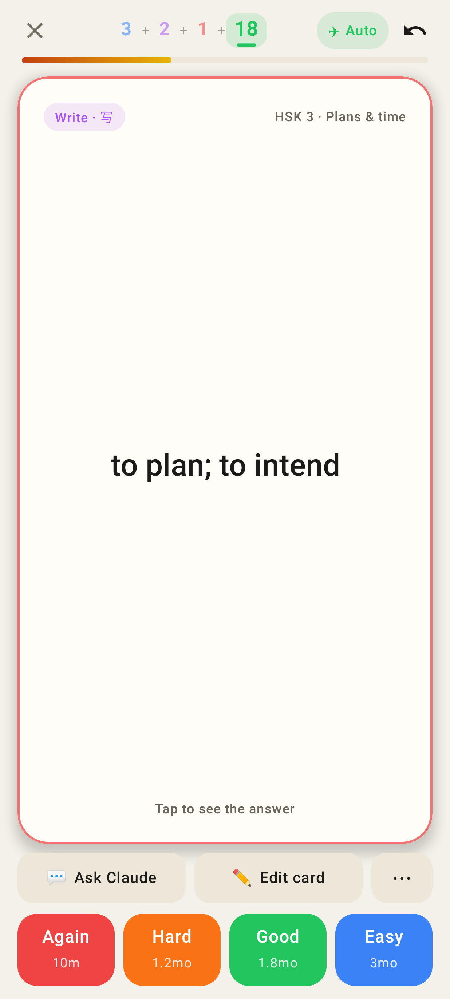
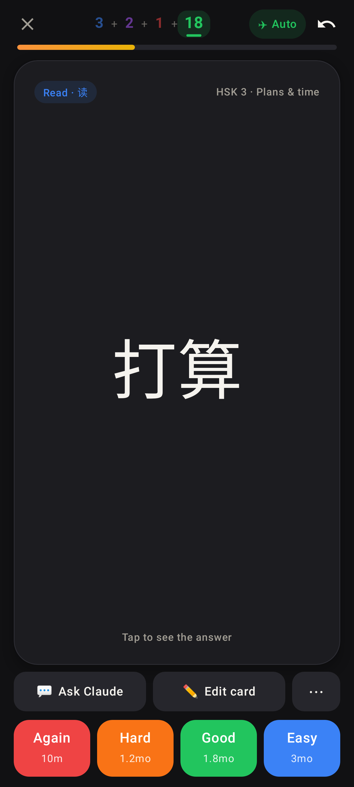

# Peek at the question (tap empty space on the answer side)

Web app (412×915, 2×):

The answer side of a read card — tap anywhere empty to peek.

The question again, with a quiet "Tap to see the answer"; action row and ratings stay up.

A listen card after a wrong typed answer (打蒜).

Peek on the typing card: the prompt only — no input box, no re-check; the answer and its diff come back on the next tap.

Lab app (Roborazzi, 412dp phone):

A write card peeked back at its question after a wrong answer (red border kept), ratings still up.

A read card peeked back at its hanzi, dark mode.
