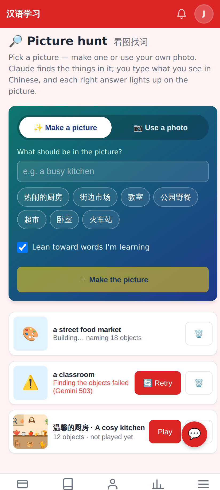
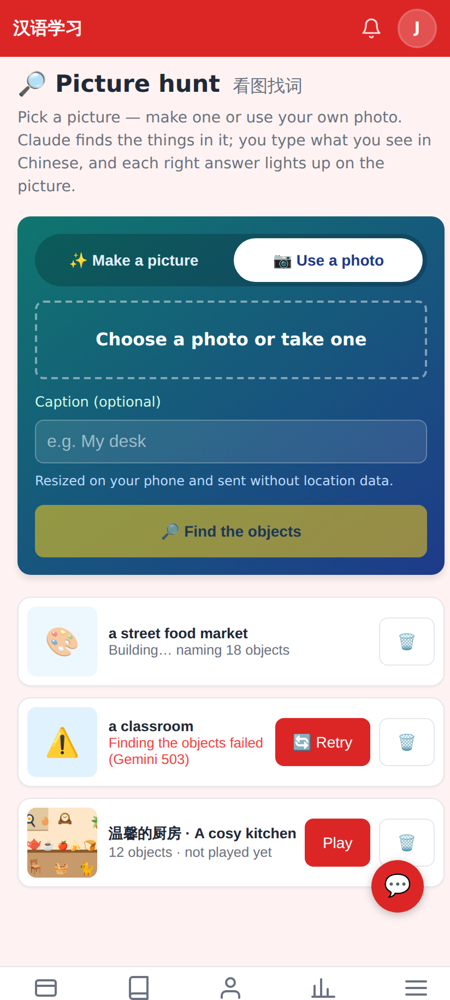
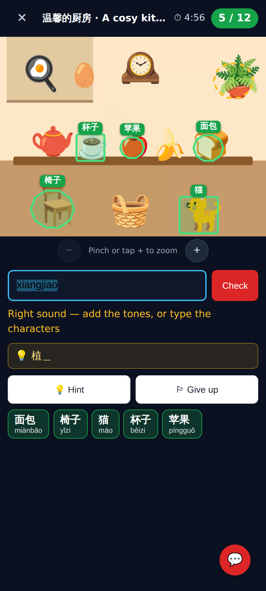
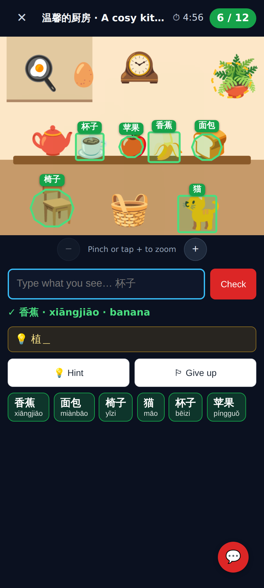
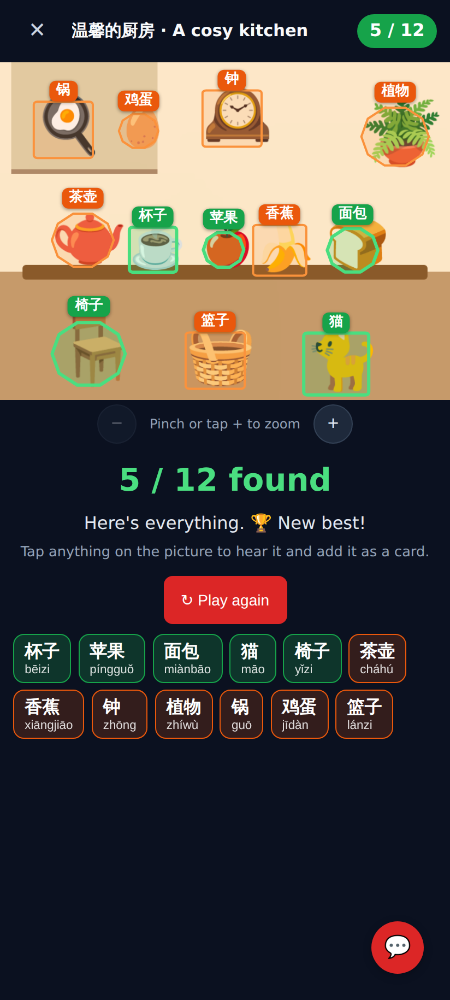
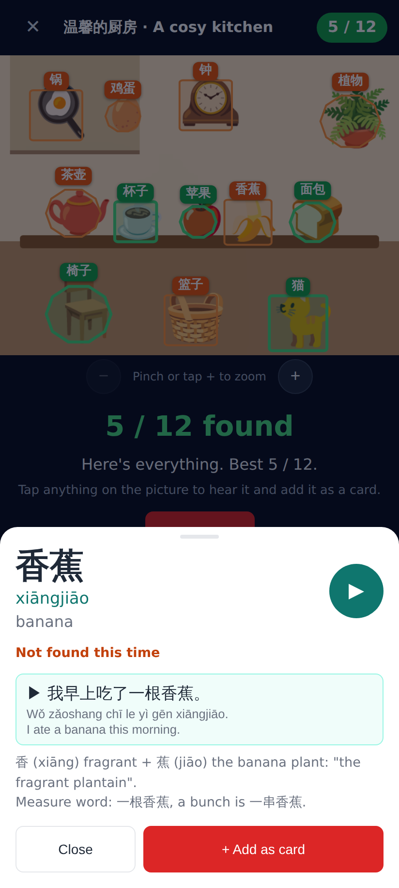
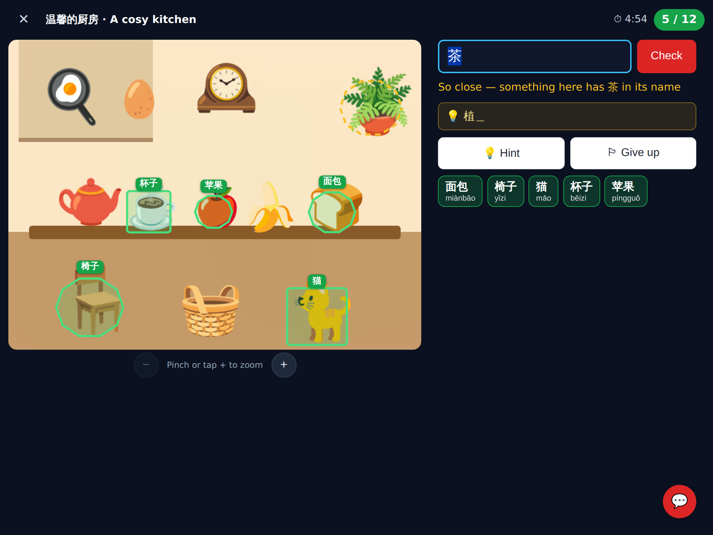
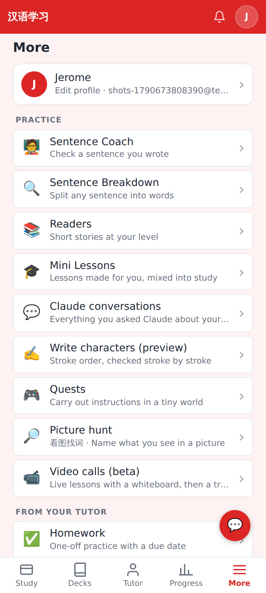

# Picture hunt (看图找词) — screenshots

Web app at the phone viewport (412×915, 2×) unless noted. The picture is a test scene drawn with emoji
(seeded through `POST /api/test/picture-hunt` — no Gemini / Claude in these shots); half the objects
carry an outline polygon (octagons), half fall back to their box.

List: make a picture (scene chips, "lean toward words I'm learning"), a ready hunt, one building (progress breadcrumb), one failed with Retry.

"Use a photo" mode: resized on the phone, sent without location data.

Playing: 5 found (green outlines + labels), a hint (dashed amber outline, 植＿), toneless pinyin gets "add the tones".

一根香蕉 is accepted (measure word dropped).

Give up → everything revealed (missed in orange), score and best.

Tap an object: hanzi, pinyin, English, ▶, example sentence, explanation, + Add as card.

1024px wide (unfolded Fold / tablet): picture beside the answer box.

More → Practice → Picture hunt.

Lab app screenshots (Roborazzi): [lab/](lab/)
