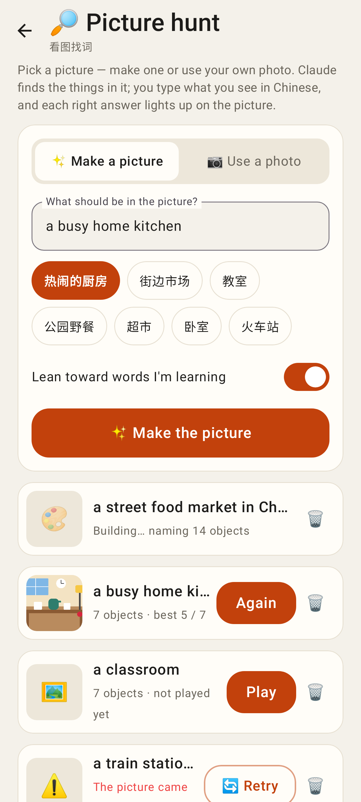
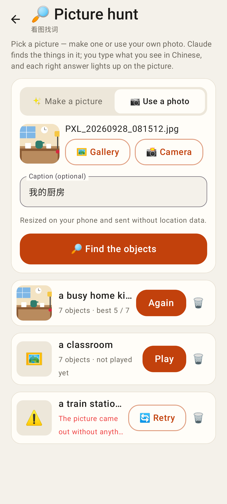
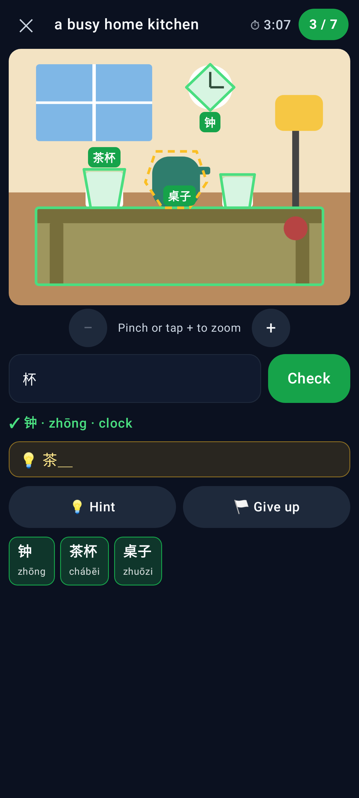
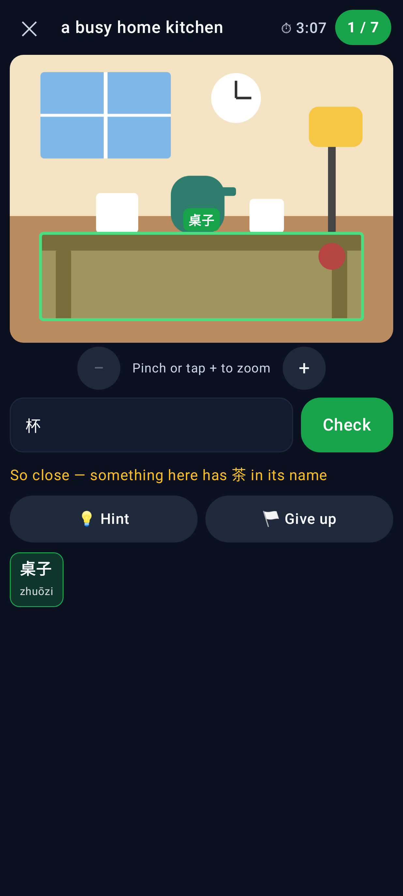
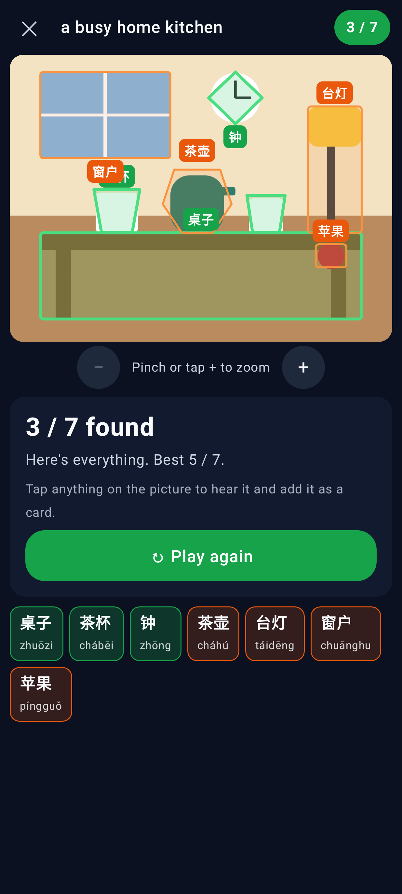
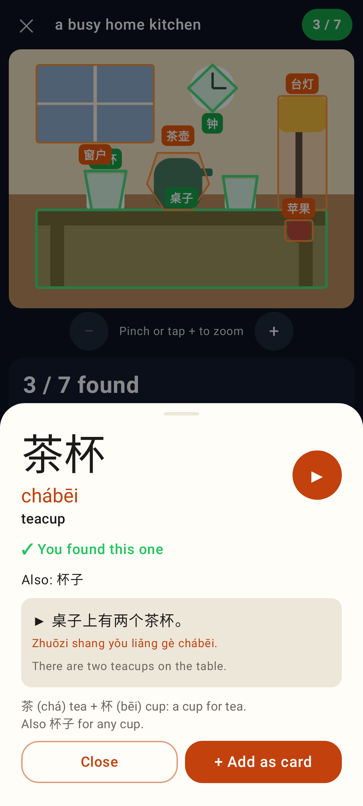
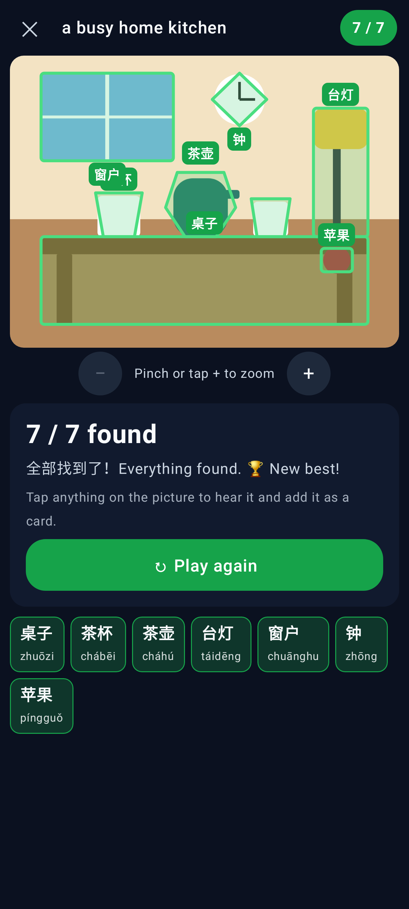
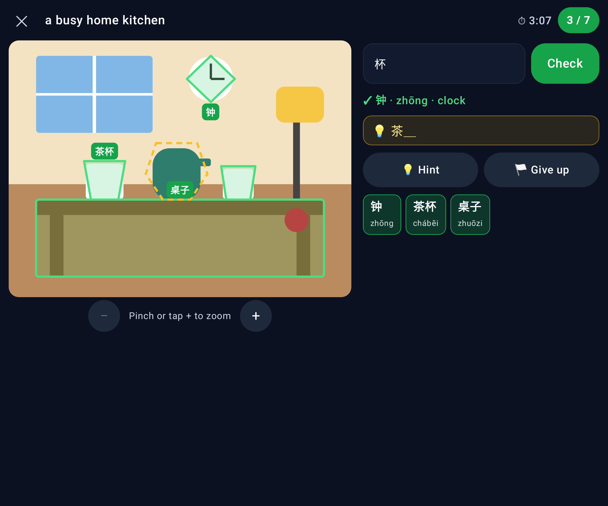
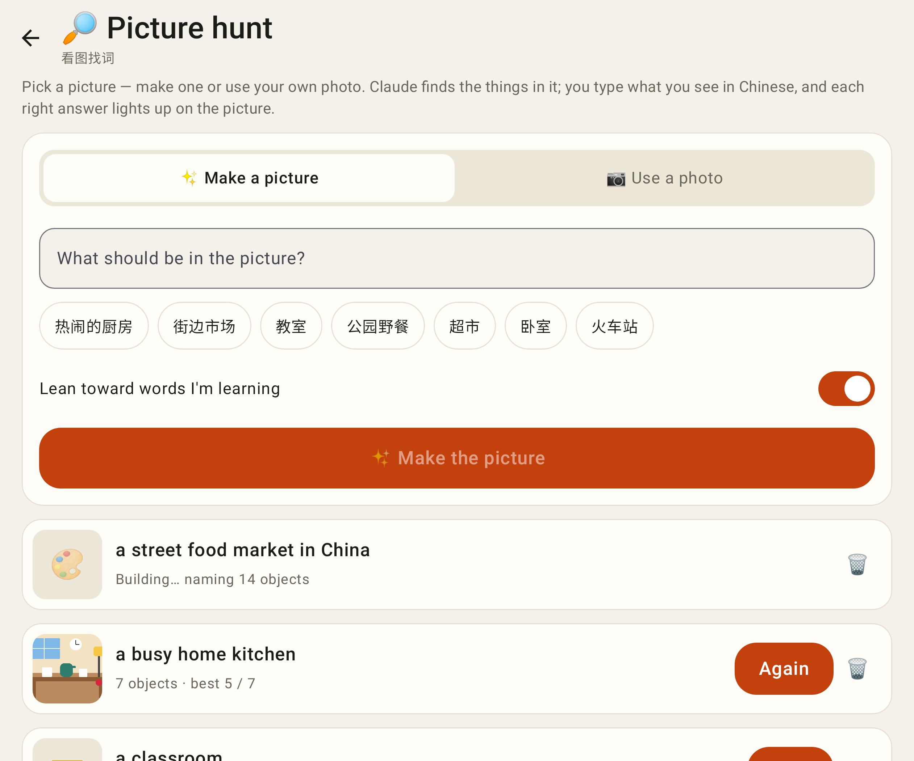
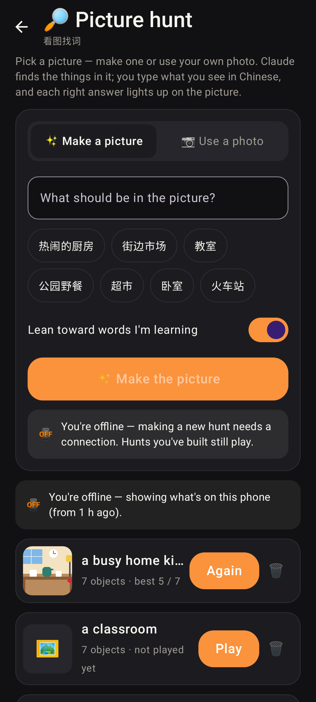

# Picture hunt — Lab app (Roborazzi, 412dp phone unless noted)

 List: generating / ready / not played / failed rows.
 "Use a photo" mode.
 Playing: 3 found (Canvas outlines + labels), dashed hint.
 A near miss ("so close").
 Give up → everything revealed.
 Object sheet (drawn inline for the capture; the app uses LabBottomSheet).
 Everything found.
 Unfolded: picture beside the answer box.
 Unfolded list.
 Offline, dark theme.
