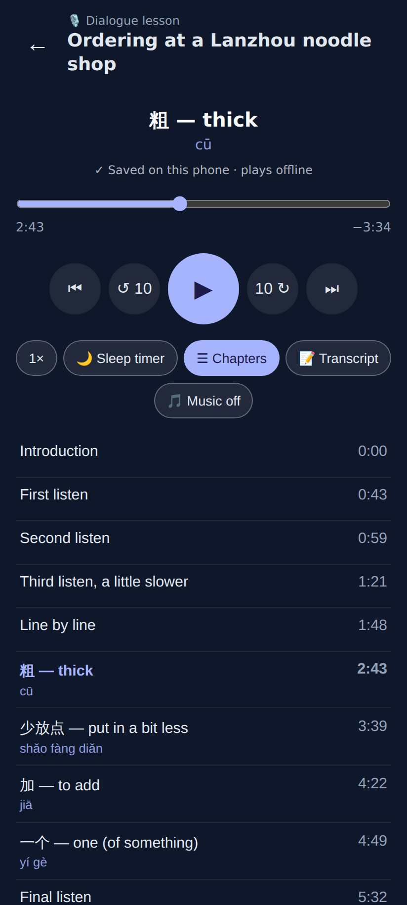
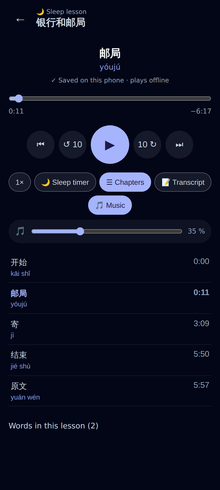
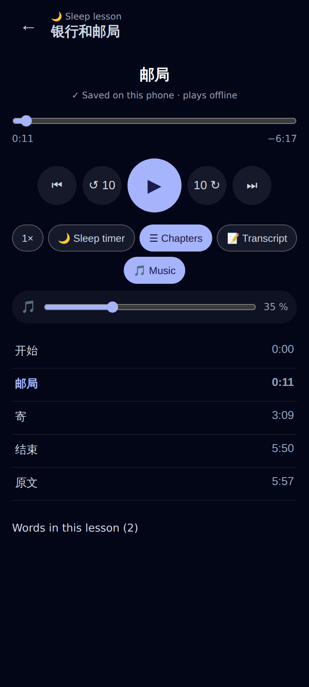
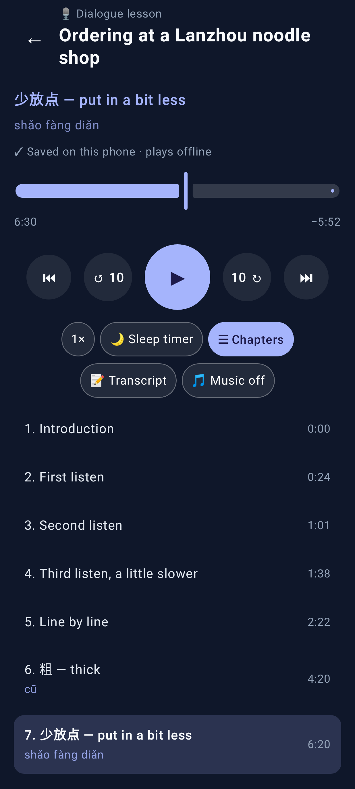
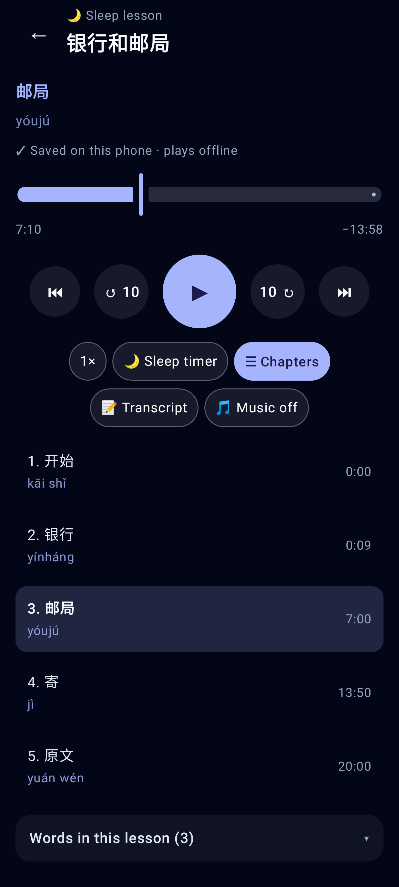
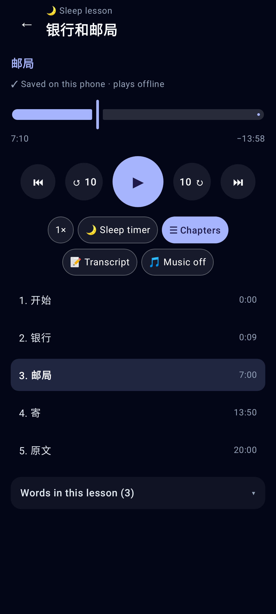

# Pinyin in audio-lesson chapter titles

The podcast metadata (what Pocket Casts shows) — `chapters.json` and the episode notes, from a local worker:

```
Chapters:
0:00 Introduction
2:43 粗 cū — thick
3:39 少放点 shǎo fàng diǎn — put in a bit less
4:49 一个 yí gè — one (of something)
5:32 Final listen

0:00 开始 kāi shǐ      ← automatic pinyin
0:11 邮局 yóujú        ← a sleep title's own pinyin, not doubled
```

## Web (412×915)


Dialogue lesson: each taught word's chapter has its pinyin under it, English chapters none.


Sleep lesson: "邮局 yóujú" now shows as 邮局 with yóujú on the pinyin line; 开始 / 结束 / 原文 get automatic pinyin.


拼 off hides the chapters' pinyin too.

## Lab app


Dialogue lesson in the Lab app.


Sleep lesson, dark theme.


拼 off.
