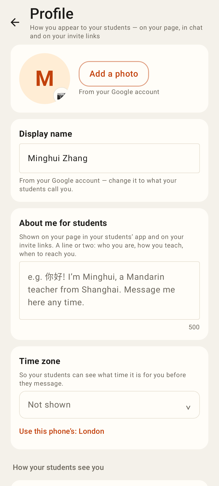
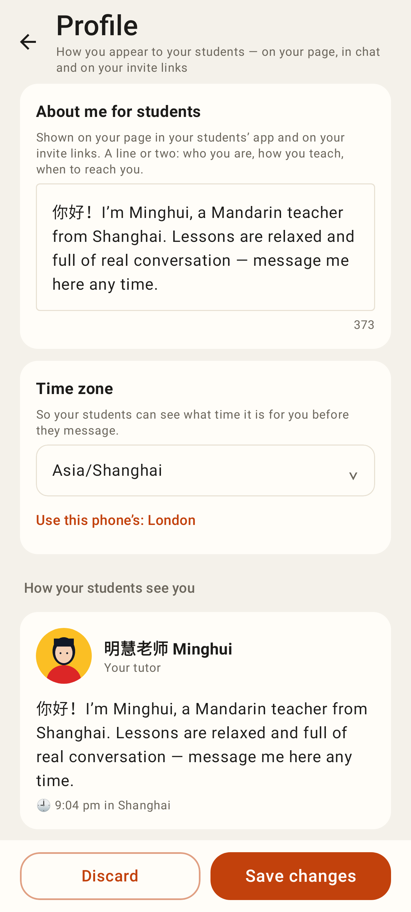
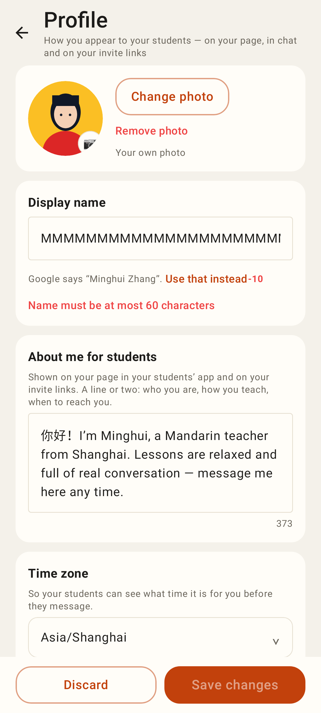
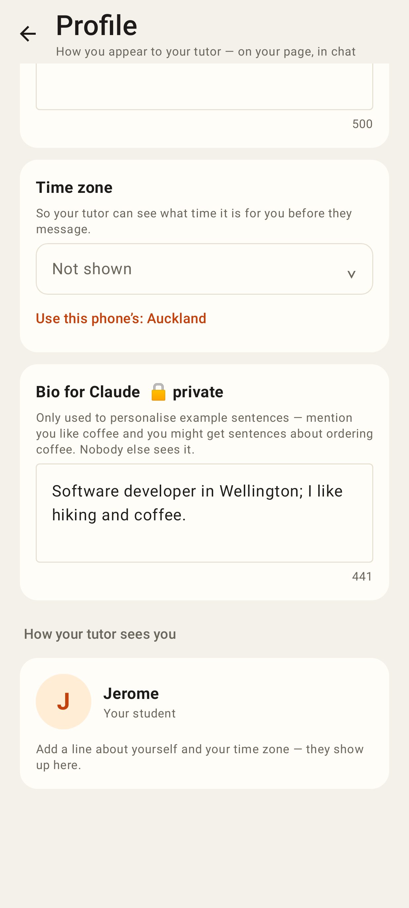
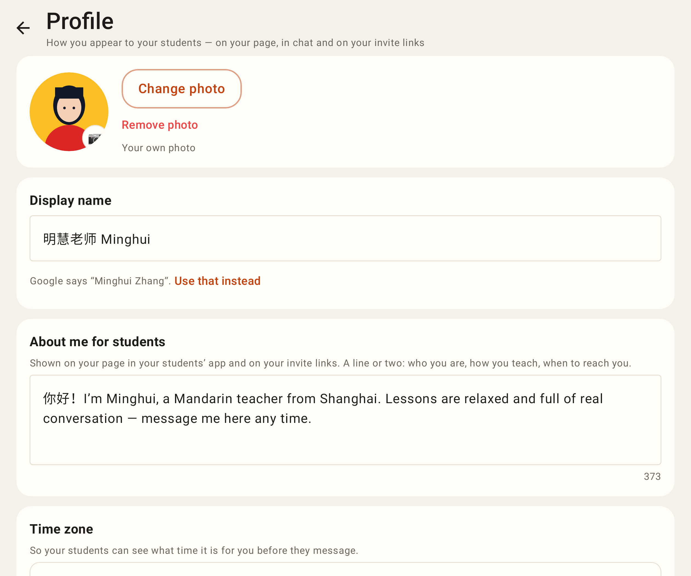
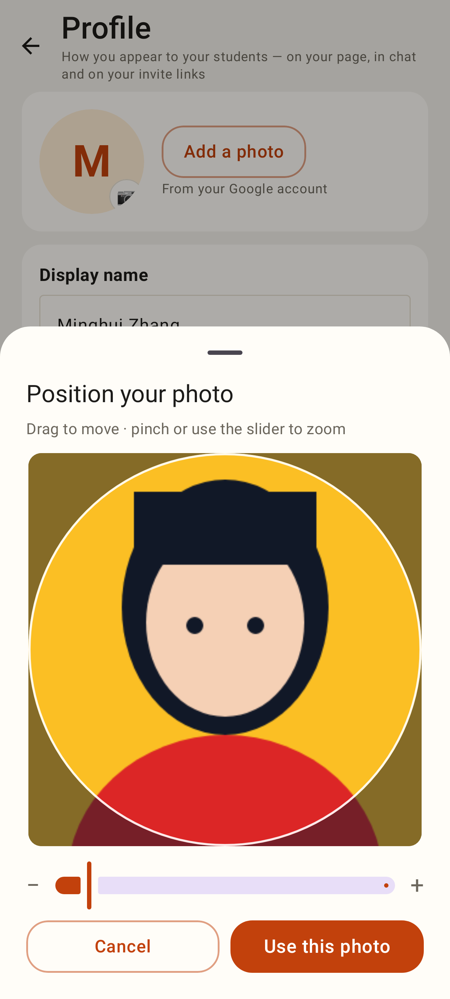
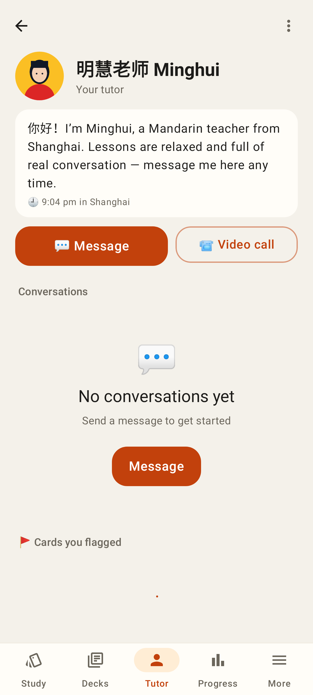

# Lab app — Profile screen (Roborazzi)

The native half of the Profile screen (web: #428). Phone 412dp, one unfolded shot.

Profile as it comes from Google: photo (tap or "Add a photo"), display name.

Editing: About me for students, time zone ("Use this phone's"), live "How your students see you" preview with her local time; the save bar rises.

The same checks as the server, live, under the field; Save disabled.

A learner: About me for my tutor, time zone, and the private Bio for Claude (moved from Settings).

Unfolded.

Position your photo: drag / pinch / slider, round guide → 512px JPEG upload.

The student's tutor page: her photo, About me and local time.
