# Profile screen — screenshots

Phone shots at 412×915 (2×), one desktop shot at 1280px. Seeded locally: tutor "Minghui Zhang" (role tutor) with student "Jerome Swannack"; the photo is a drawn portrait uploaded through the real crop → upload path.

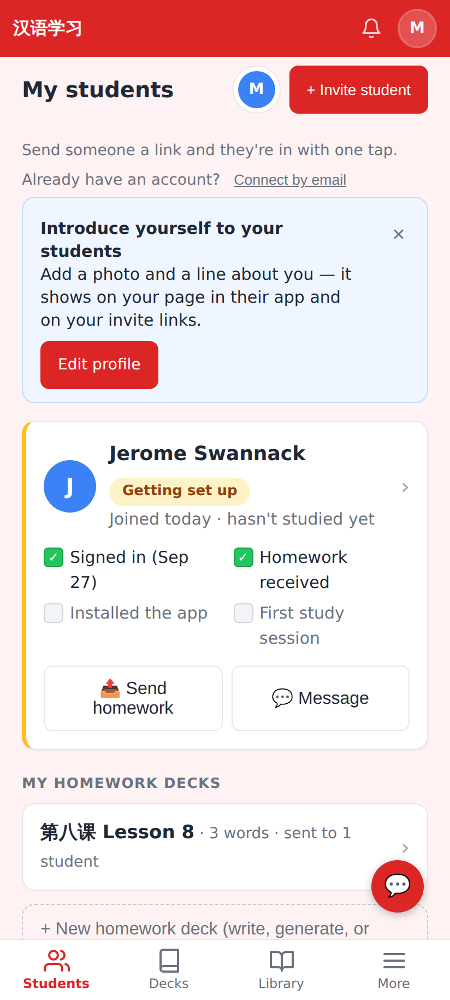
Students dashboard before: the profile chip in the header and the "Introduce yourself" nudge (until she writes an About me; dismissable).

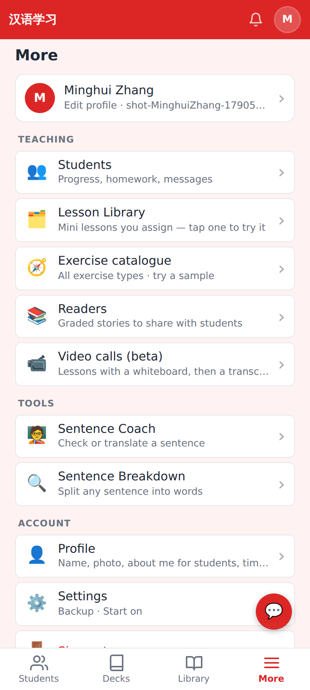
More: the user card and the new Account → Profile row.

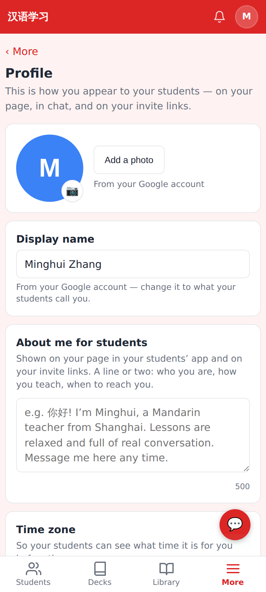
Profile as it comes from Google (no photo yet).

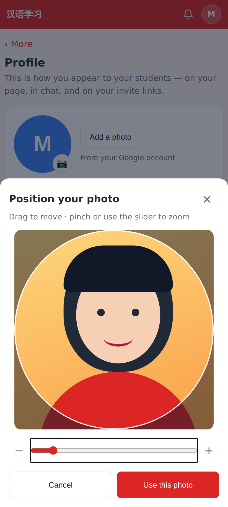
Picking a photo opens the crop sheet: drag / pinch / slider, round guide; the square is resized to 512px JPEG on the device.

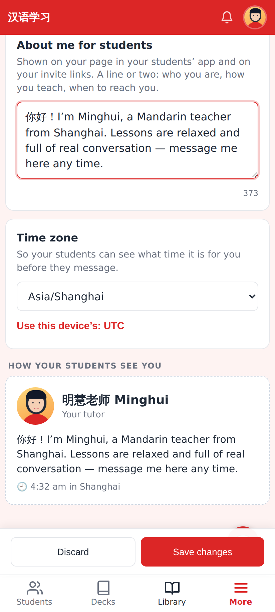
Editing: live "How your students see you" preview (About me + local time); the save bar slides up when something changed.

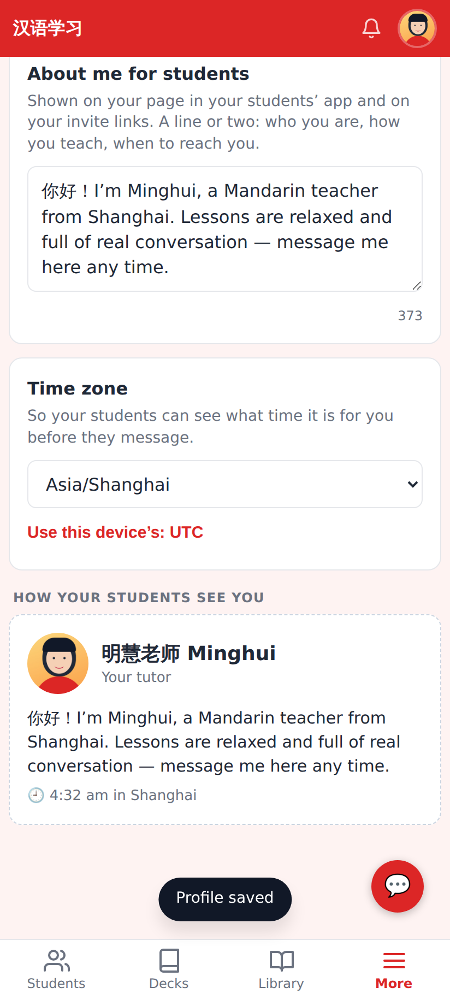
Saved.

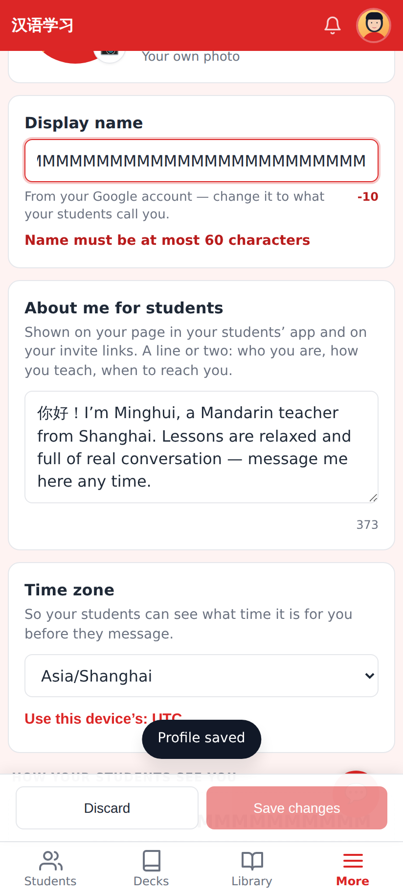
Validation runs live (same rules as the server): the problem is shown under its field and Save is disabled.

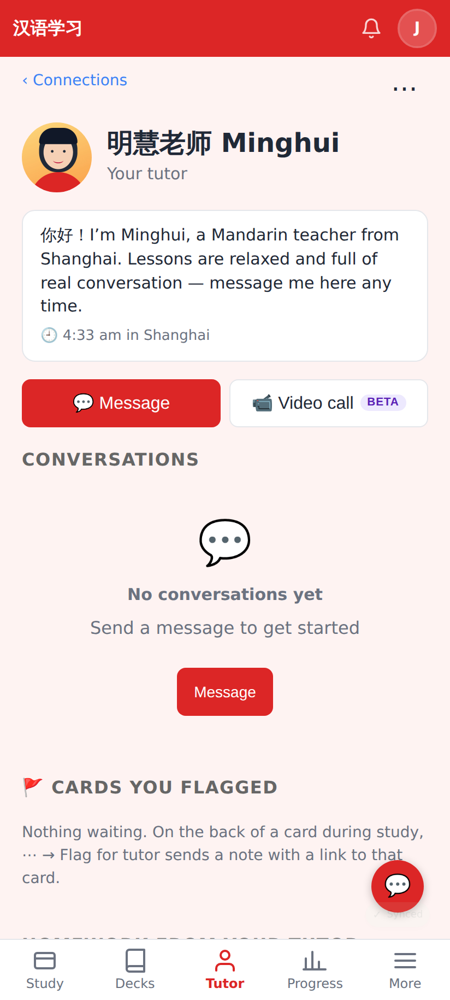
The student's page for their tutor: the edited name and photo, About me and her local time.

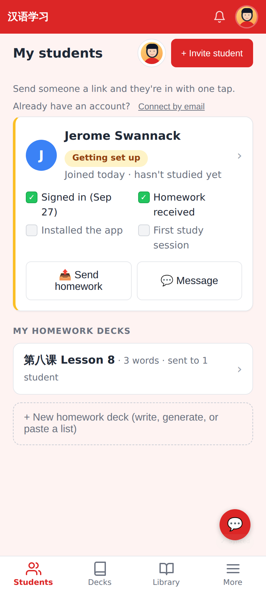
Dashboard after: the chip shows her photo, the nudge is gone.

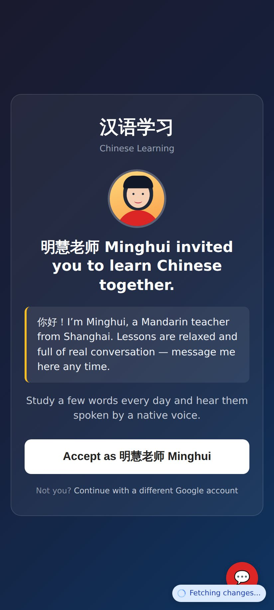
The /join page for her invite link quotes her About me.

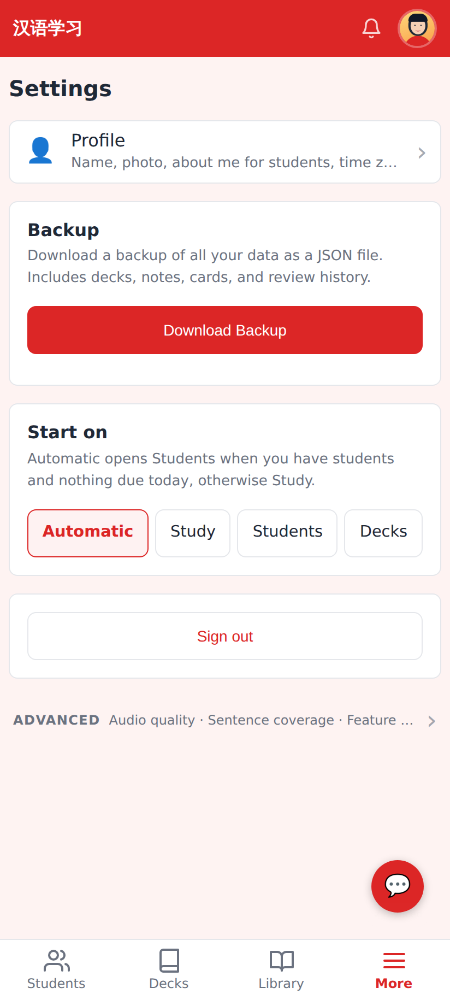
Settings: the old Personal Bio box is now a Profile row.

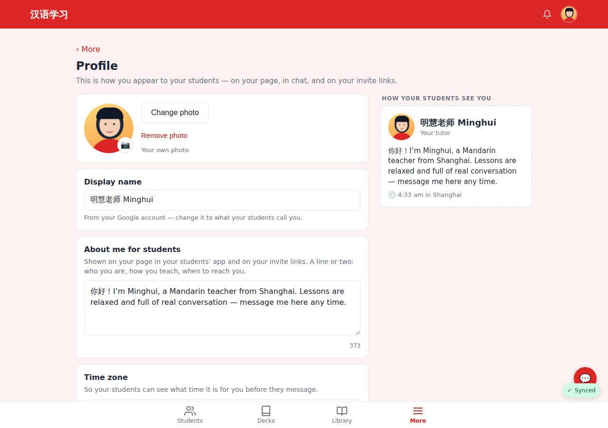
≥1024px: form and preview side by side.

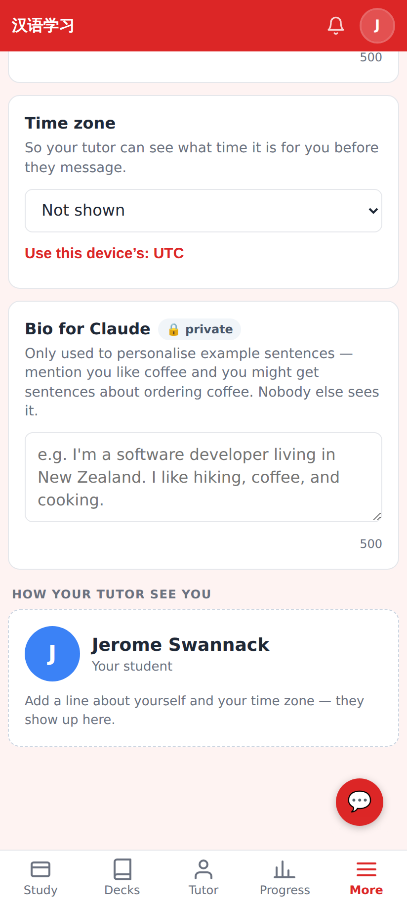
A learner's profile keeps the private "Bio for Claude" (moved from Settings).
