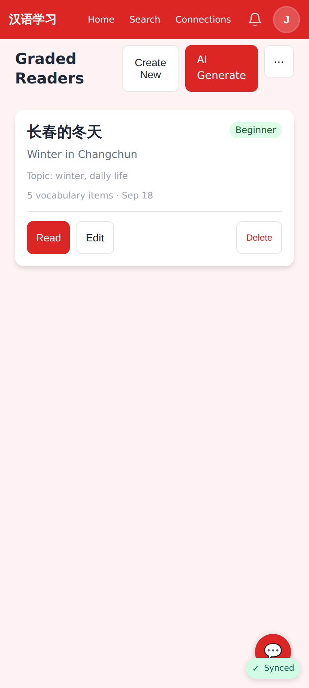
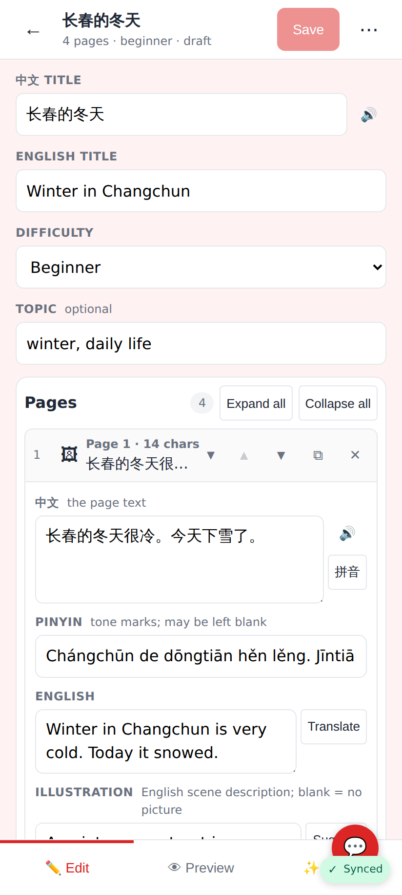
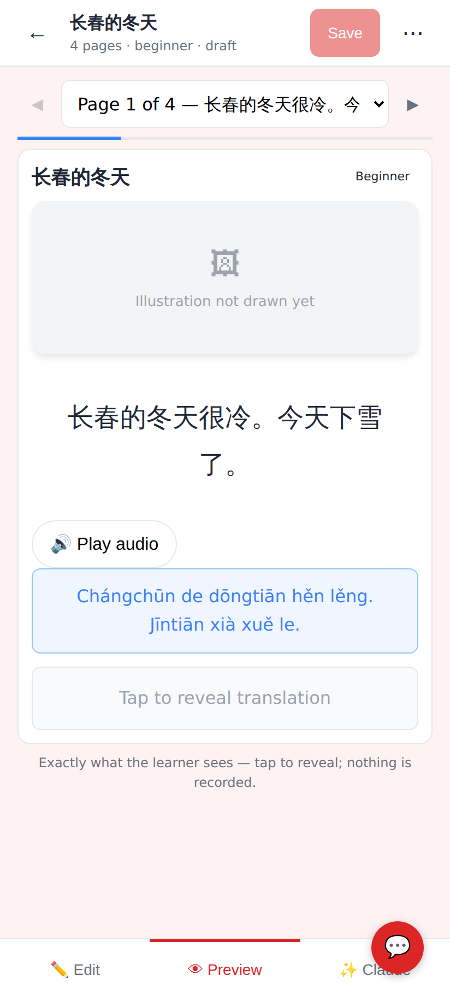
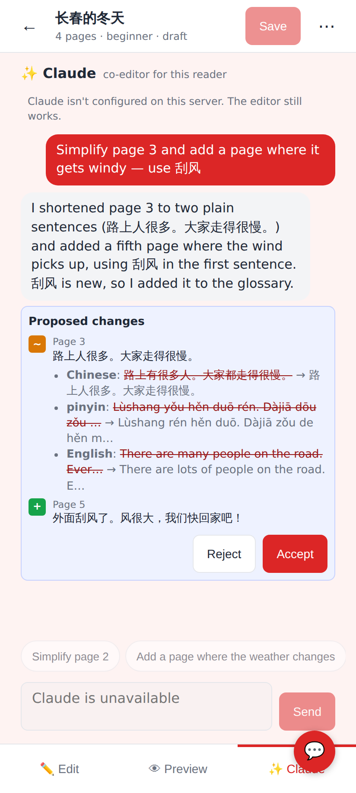
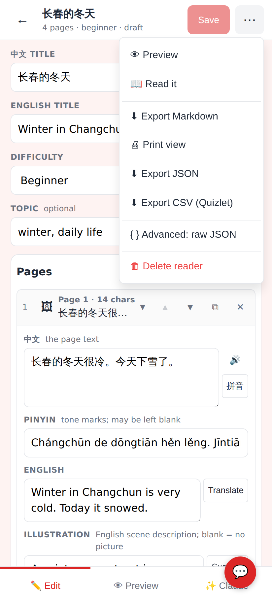
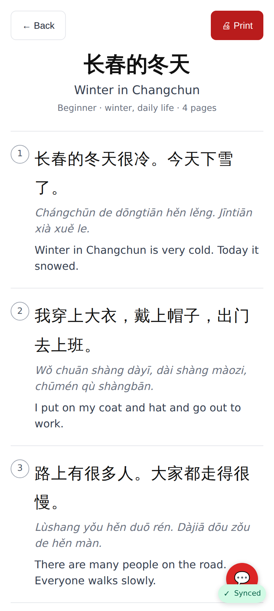
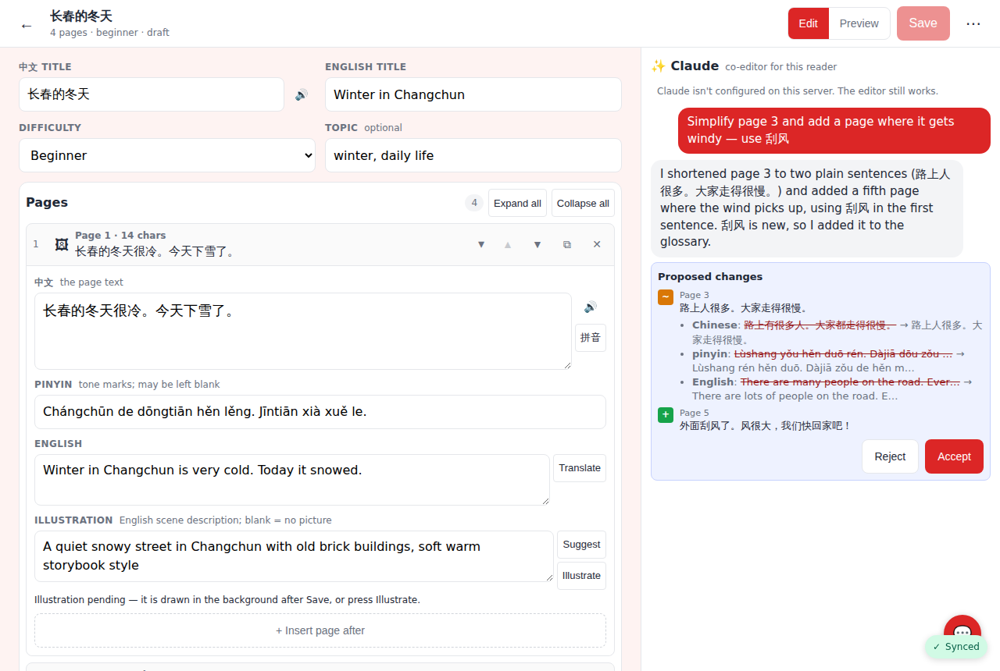

# Reader editor — PR screenshots

Captured at 412×915 @2× unless noted. Rendered from this branch; see the PR for context.

**Readers list with the new ⋯ (Import JSON) and Edit**

**Editor — Edit tab**

**Editor — Preview tab** (the real reading view; Chinese and pinyin revealed)

**Editor — Claude tab** with a proposal diff card (page 3 changed, page 5 added; the exchange was seeded into the local chat table since the dev container has no API key — the "not configured" line is the 503 path)

**Export menu**

**Print view**

**Side-by-side editor at 1280px**

