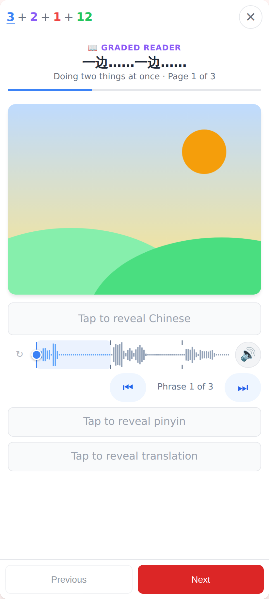
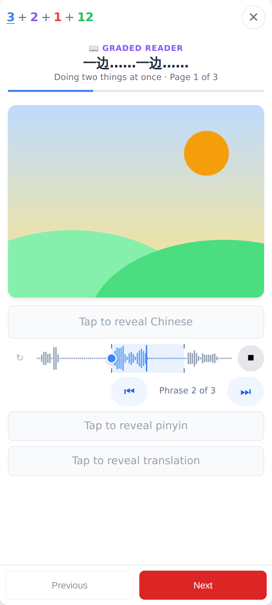
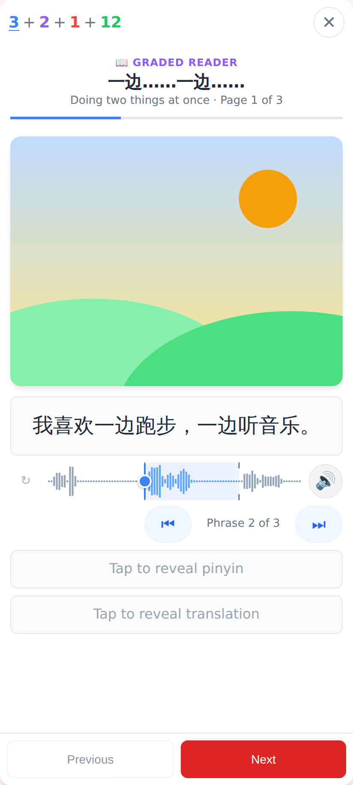
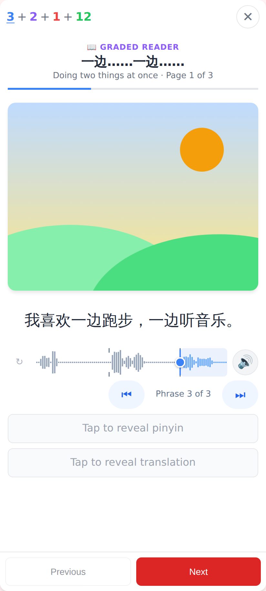
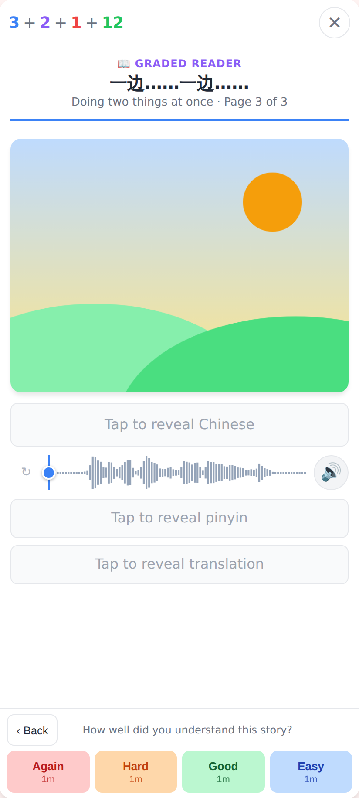
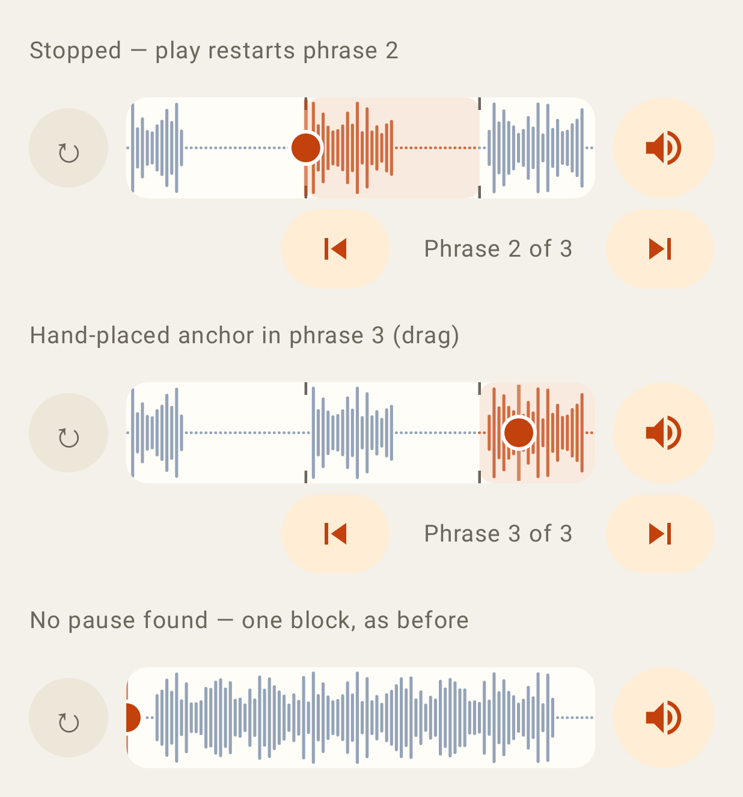
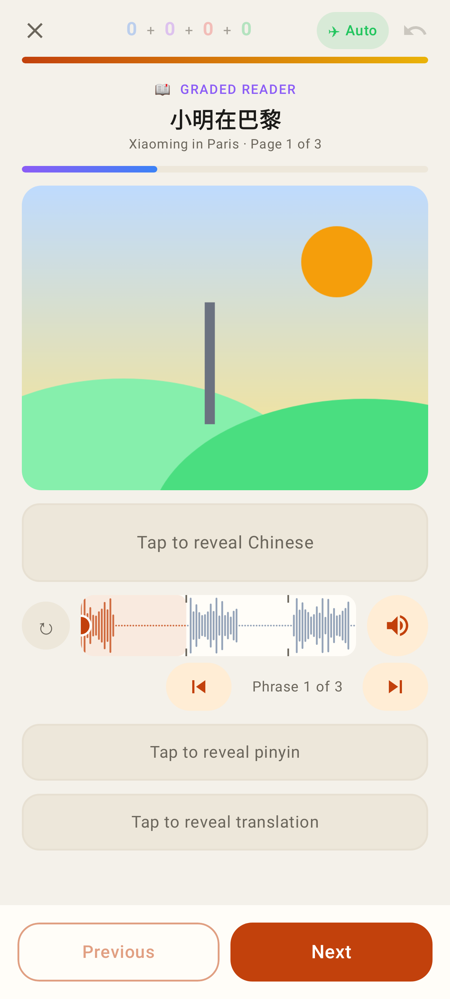
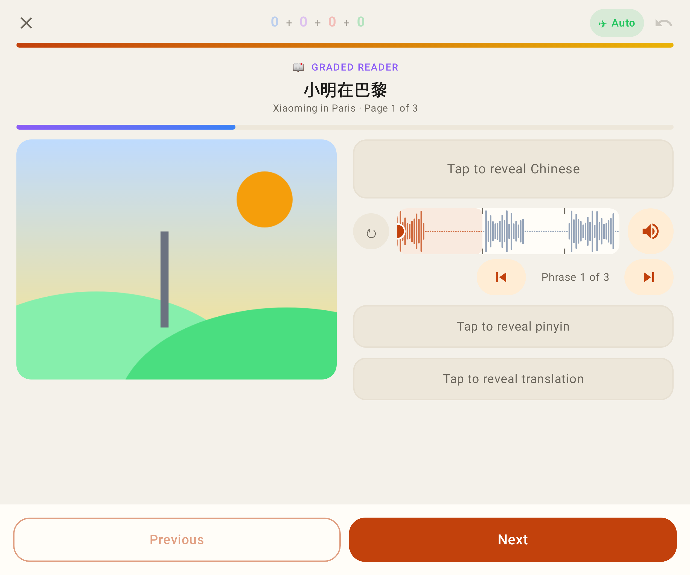
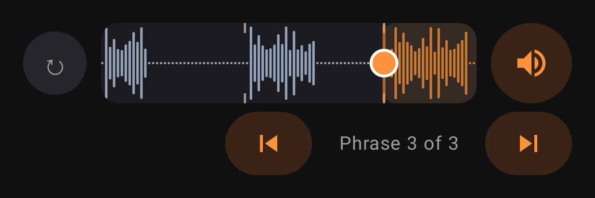

# Reader page audio: phrase blocks

Web (412×915 @2×, real MiniMax clips of 我喜欢一边跑步，一边听音乐。 and 咱们一边吃一边聊吧。 decoded in the browser):

The page's clip split into 3 phrases at its pauses: ticks on the waveform, phrase 1 highlighted, ⏮ Phrase 1 of 3 ⏭ under play.

Playing: phrase 1 finished, so the restart point (the circle) moved to the start of phrase 2.

Stopped 1.3 s into phrase 2 → play will restart phrase 2.

⏭ steps to phrase 3 (a stop within 1 s of entering phrase 3 had sent the restart point back to phrase 2).

A short clip with no pause: one block — exactly the old scrubber, no ⏮ / ⏭ row.

Lab app (Roborazzi):

Stopped on phrase 2; a hand-placed (dragged) anchor inside phrase 3; one block as before.

The in-session reader page with phrase blocks.

Unfolded (Pixel Fold inner screen).

Dark theme.
