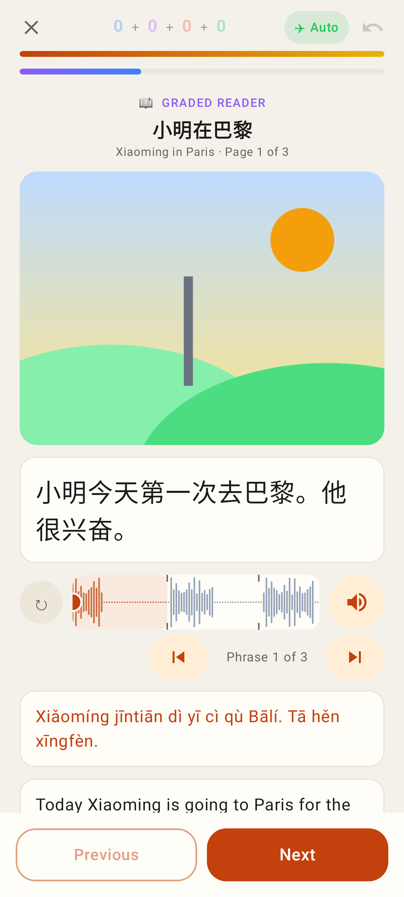
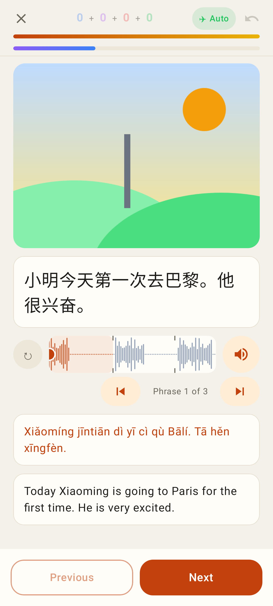
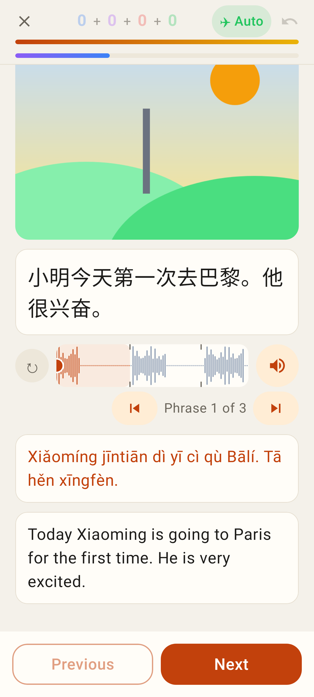
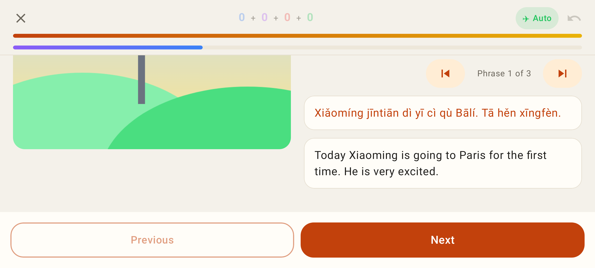
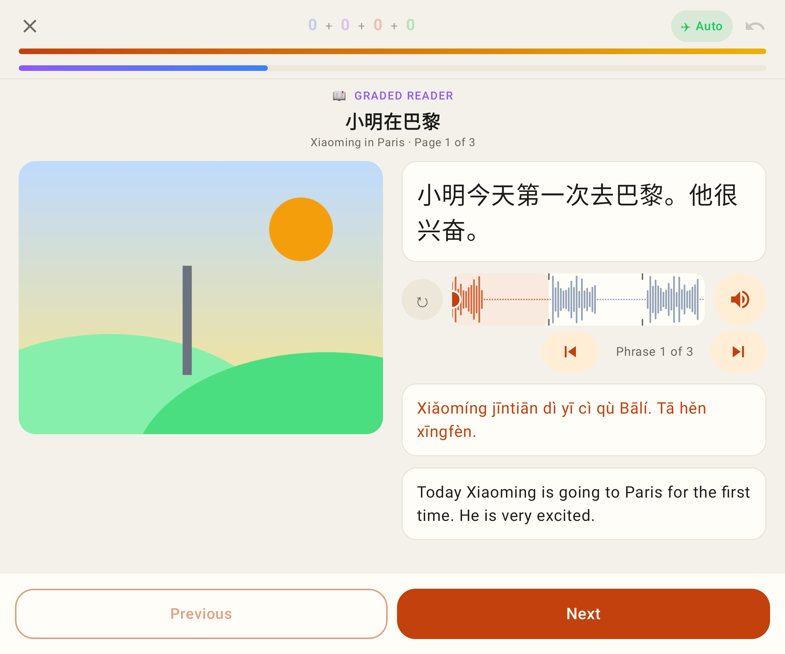
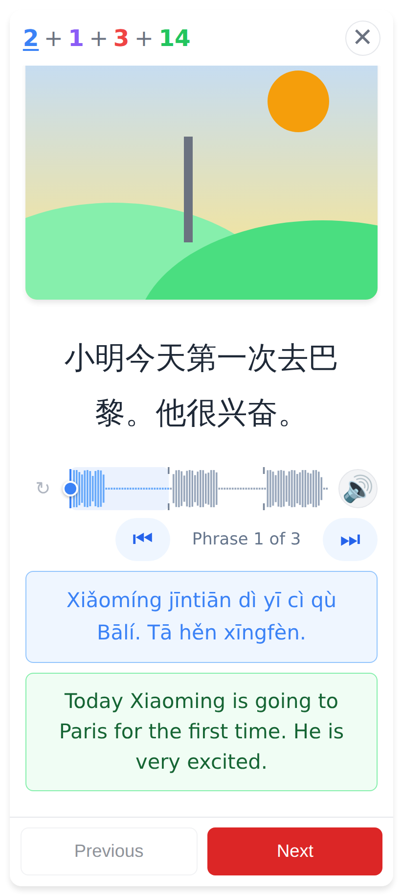
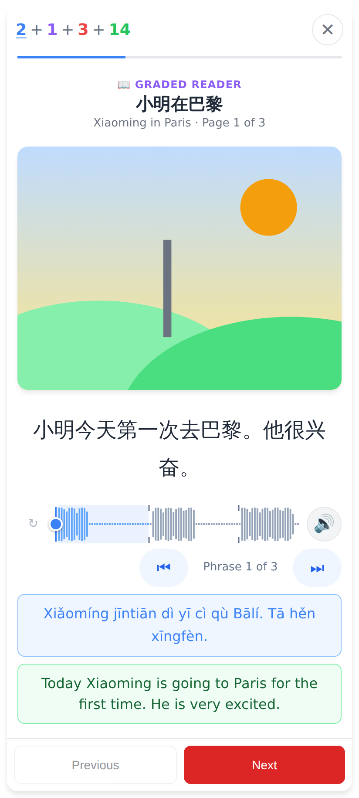
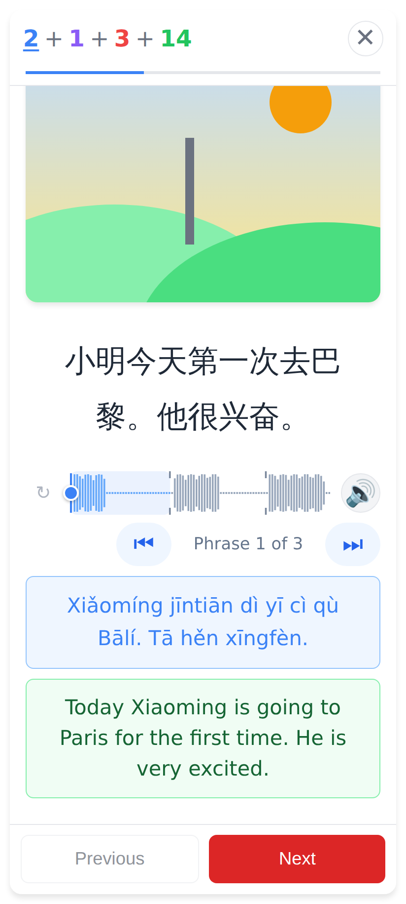
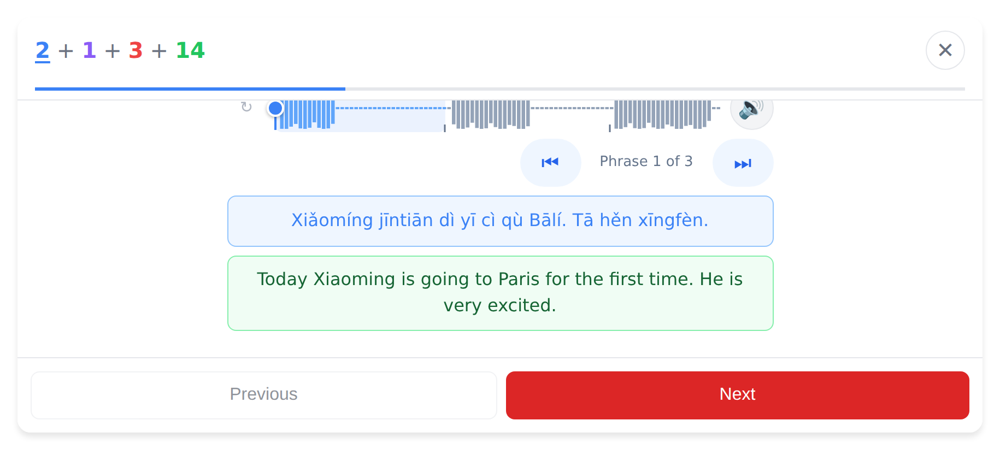

# Reader: the blue progress bar stays at the top

The bar that stays put is the graded reader's **page-progress bar**: violet → blue in the Lab app, blue on the web.
It sits under the "📖 GRADED READER / title / Page n of N" heading. It moves out of the scrolling page into a fixed
row under the study top bar, so the page scrolls beneath it. The audio scrubber is unchanged and still scrolls with the page.

Lab app (Roborazzi, Pixel Fold folded 412×915dp unless noted):

Top of the page: the blue bar sits right under the session's orange bar, above the reader title.

Scrolled to the translation: the title has scrolled away and the blue bar stays pinned, with a hairline under it.

Font scale 1.3, scrolled: the illustration scrolls beneath the bar without covering it.

Landscape, scrolled.

Unfolded (inner screen).

Web (412×915 @2×):

Before (text at 130%, scrolled): the blue bar scrolled away with the title.

After, top of the page: the bar sits under the top bar.

After (text at 130%, scrolled): the bar stays and the page scrolls beneath it.

Landscape, scrolled.
