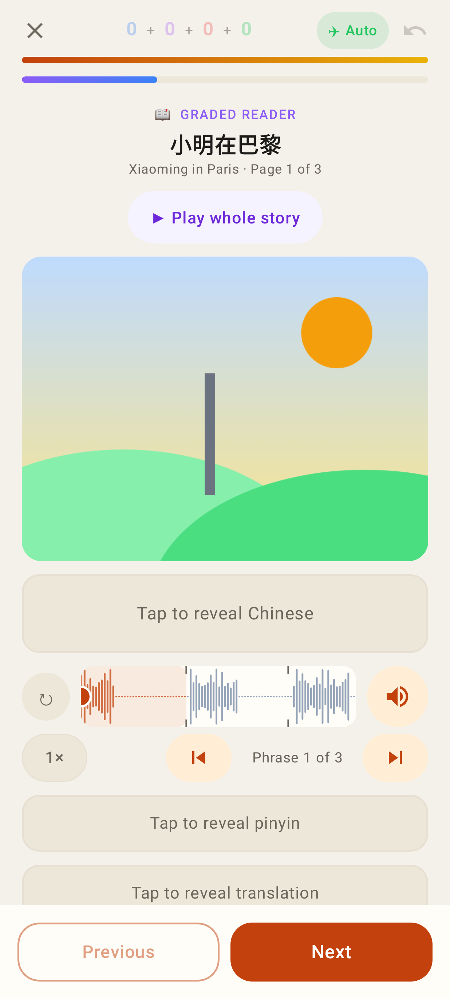
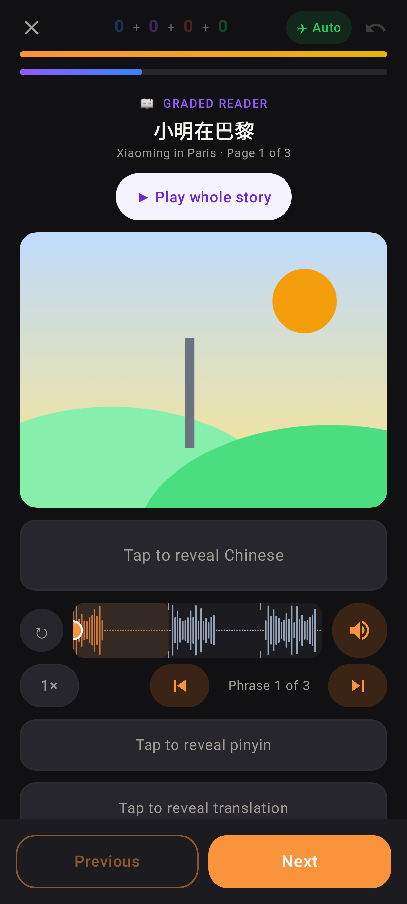
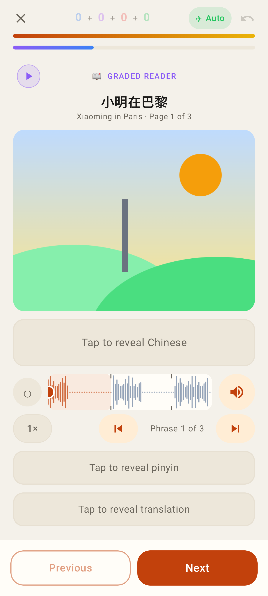
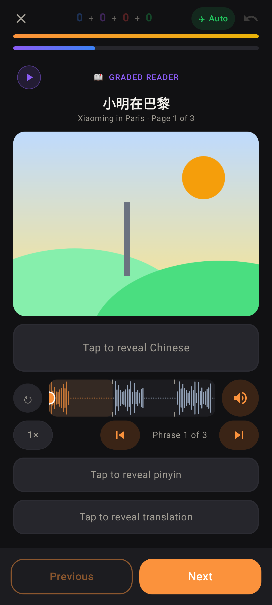
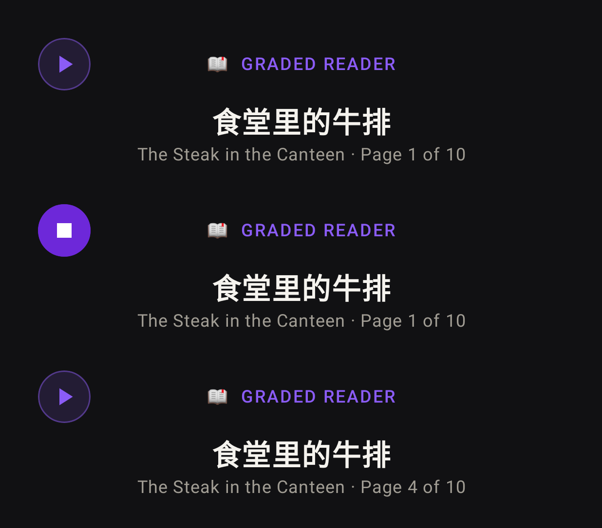
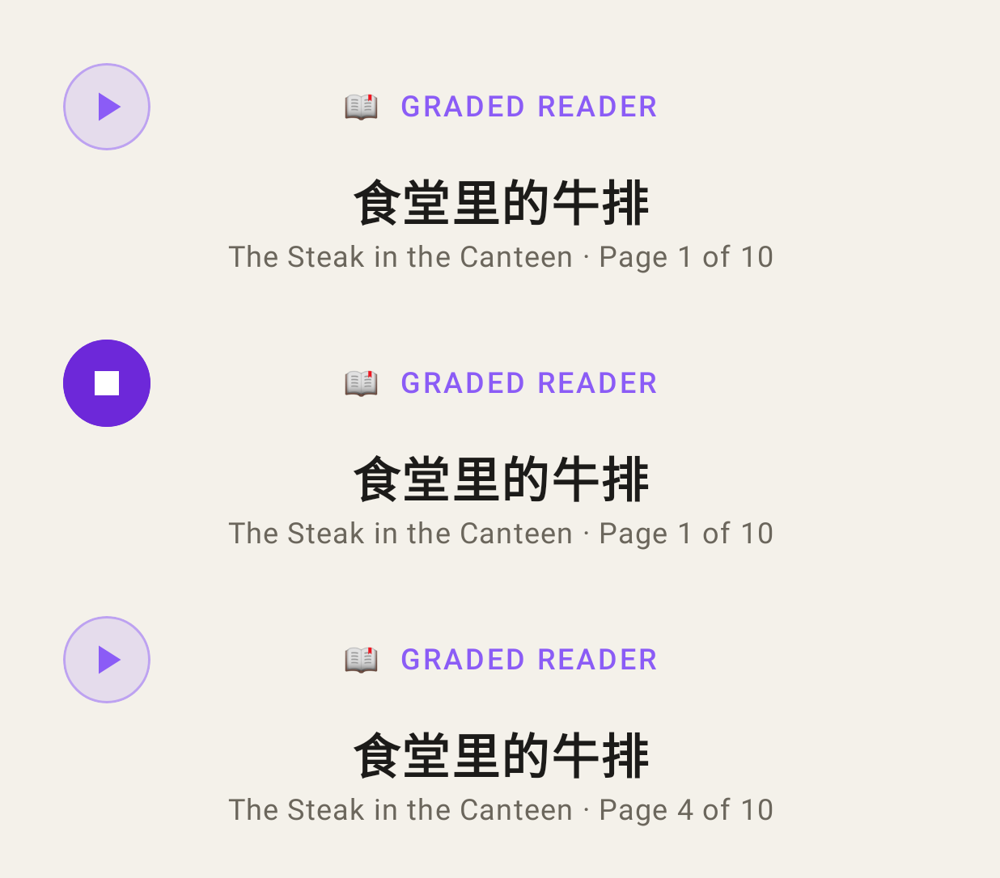
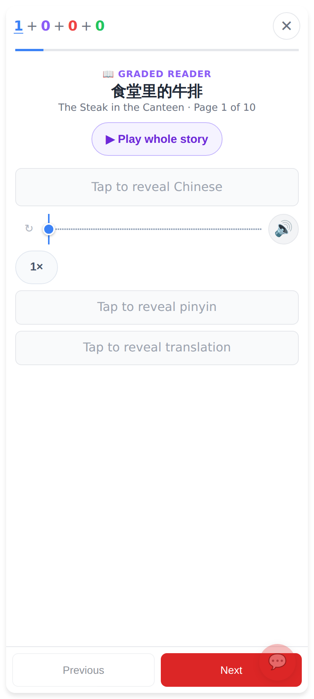
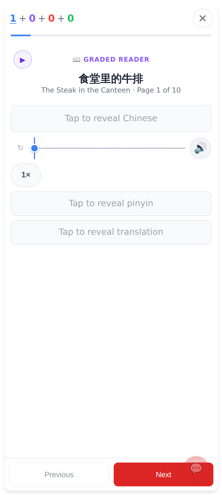

# Reader: "▶ Play whole story" tucked into the label row

The big "▶ Play whole story" pill under the title is now a small violet round button at the
start of the "📖 GRADED READER" row (label and title stay centred). It shows ■ while the story
plays; tapping it does exactly what the pill did. The picture moves up by the pill's row.

## Lab app (phone, 412dp)

Before (light): the full-width pill between the title and the picture.

Before (dark).

After (light): ▶ at the start of the label row, picture moved up.

After (dark).

The button idle ("Play whole story"), playing (■, "Stop the story") and on a later page ("Play the rest") — dark.

The same three states — light.

## Web (412×915 @2×)

Before: the pill under the title.

After: ▶ at the start of the label row.

After, playing: the button filled violet with ■ (aria-label "Stop the story").
