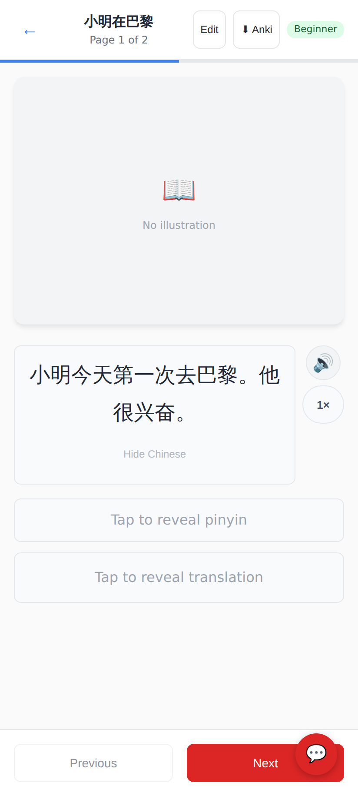
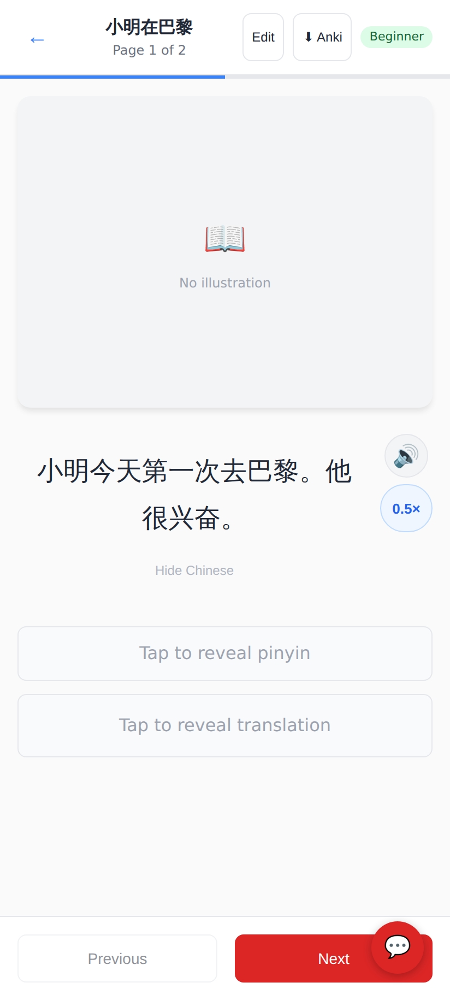
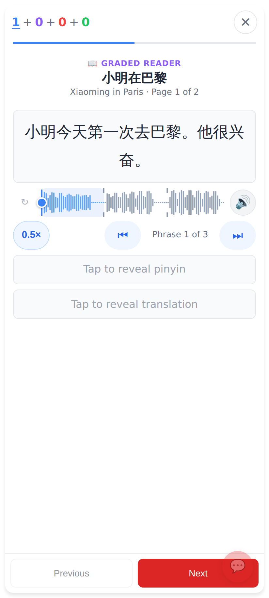
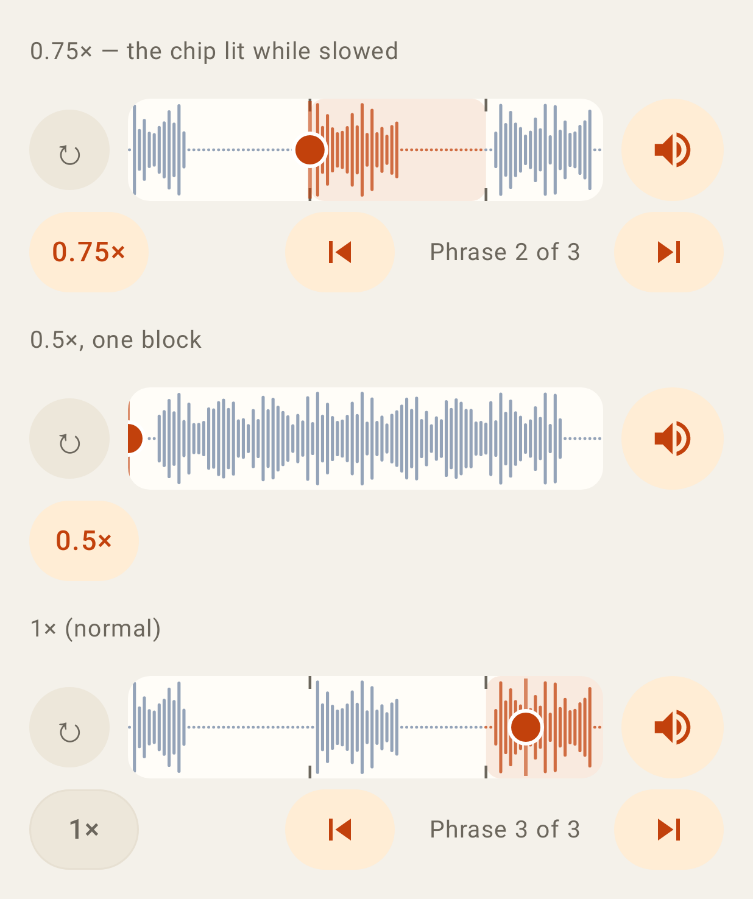
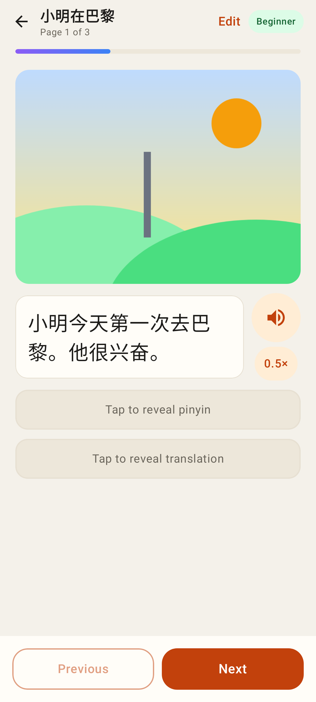
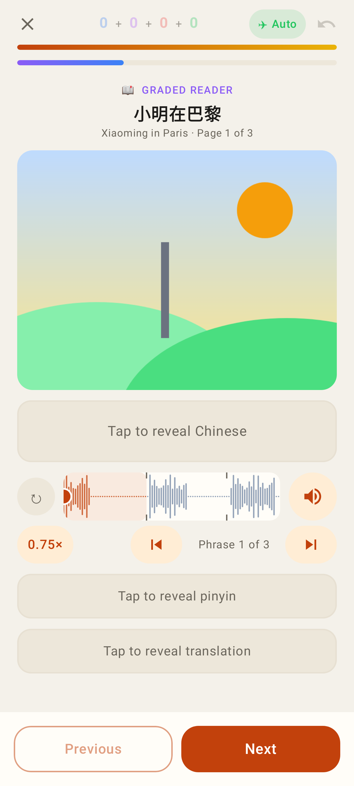

# Reader playback speed (1× · 0.75× · 0.5×)

Phone viewport 412×915 @2×. One chip cycles the speed; neutral at 1×, blue (web) / accent (Lab) while slowed.

## Web

The reading page: the speed chip sits under 🔊, at 1×.

After two taps: 0.5×, lit.

The in-session reader (same component as the homework pass): the chip on the left of the scrubber's ⏮ Phrase n of N ⏭ row; the choice carried over from the reading page.

Two more taps: 0.75× (remembered in localStorage).

## Lab app

The scrubber row at 0.75×, 0.5× (one block) and 1×.

The reading page: chip under ▶.

The in-session reader (also Today's story and homework, which share the view).
