# Reader word chips — every reader, web + Lab

## Web (412×915 @2×, local worker with seeded data)

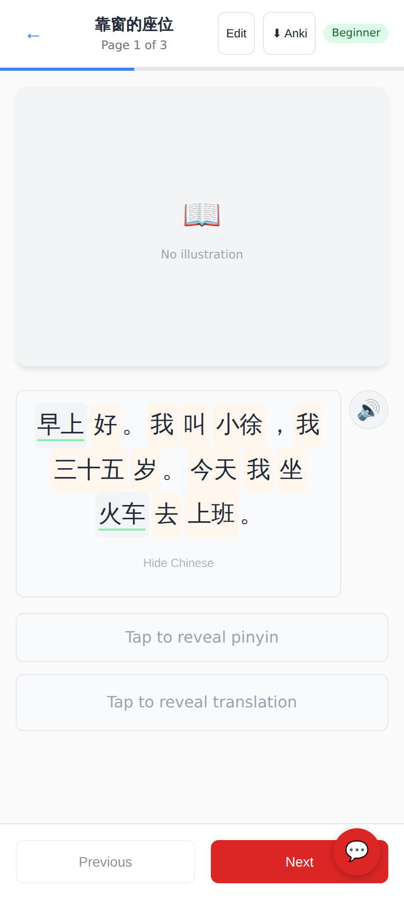
The revealed page as word chips; 早上 and 火车 are already in a deck (quieter chip, green underline).

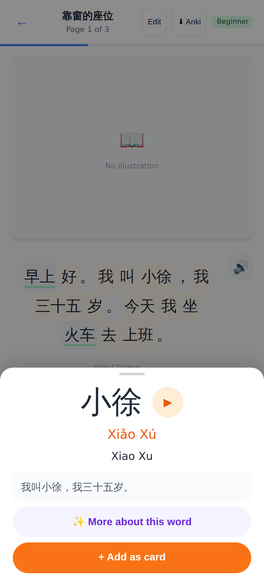
Tap 小徐 → hanzi · pinyin · gloss, ▶, the sentence it was read in. The Chinese stays revealed underneath.

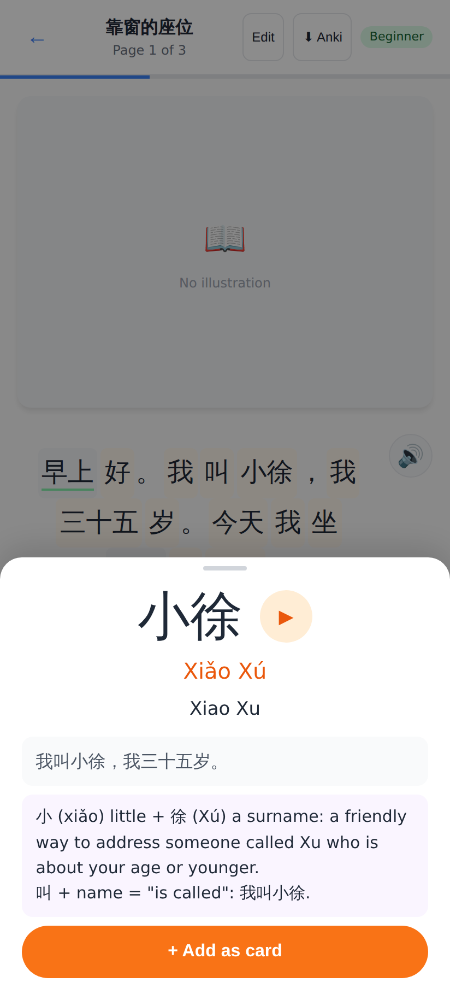
✨ More about this word → Haiku's explanation of the word in that sentence (cached server-side and on the device).

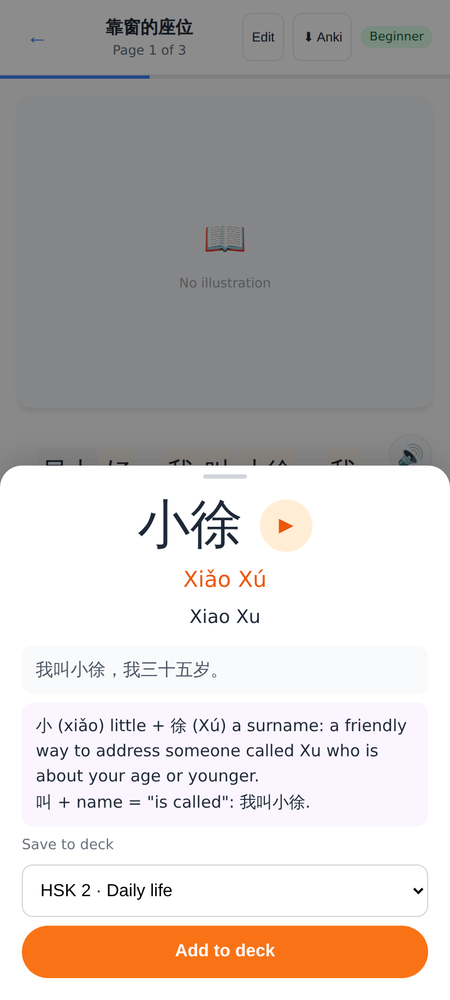
+ Add as card → deck picker (pinned first).

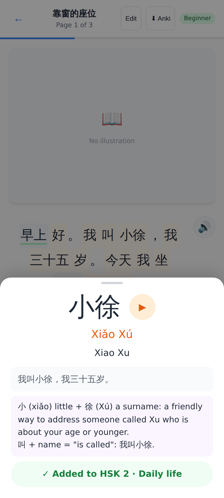
The note is created with the explanation's card-standard fun_facts and sentence clue.

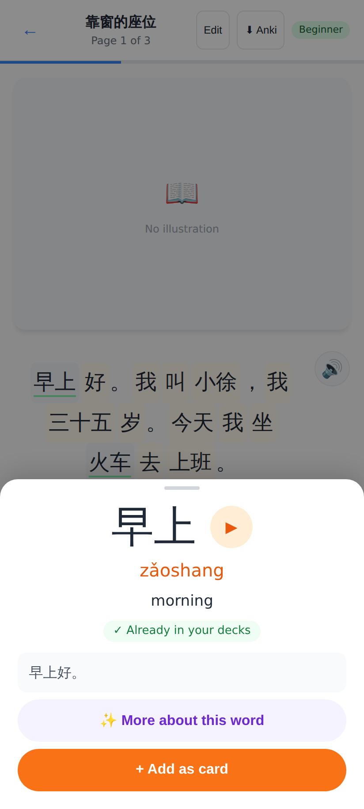
A word already in a deck says so.

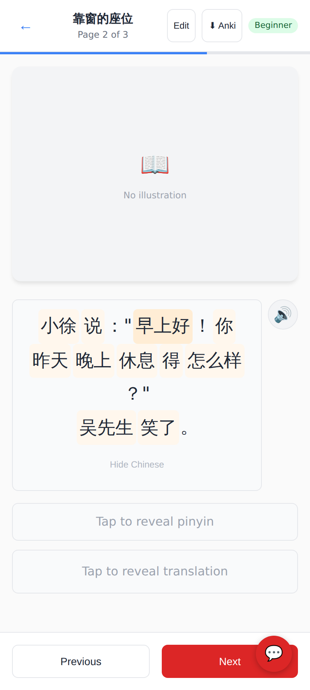
A dialogue page with ASCII quotes and a line break — the kind of page that never got chips before.

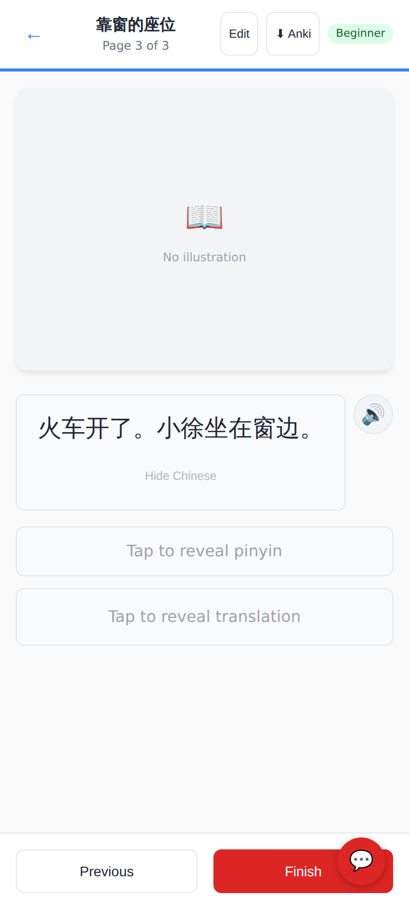
A page without words yet (and no API key locally to make them): plain text, reading never blocked.

## Lab app (Roborazzi)

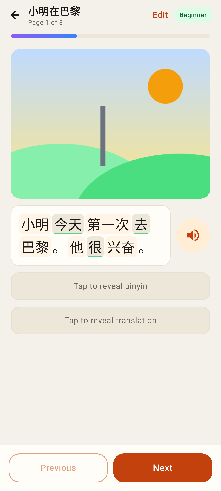
Reading page with chips; 今天 / 去 / 很 are known words.

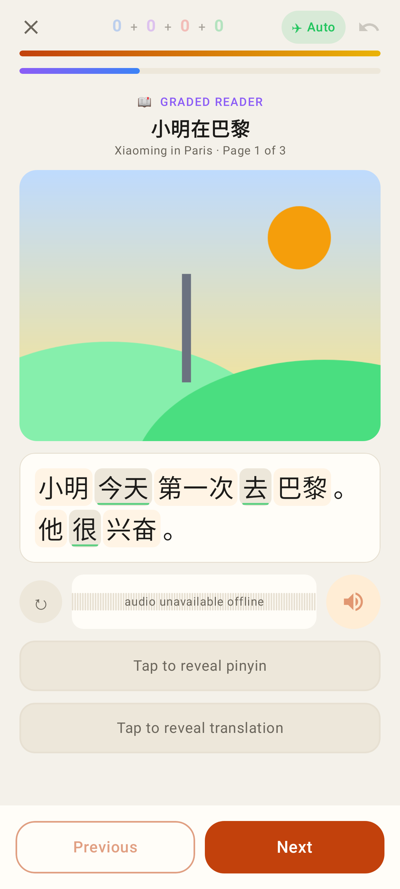
The in-session reader now has chips too (it was plain text before).

Quotes stay plain, the line break starts a new row.

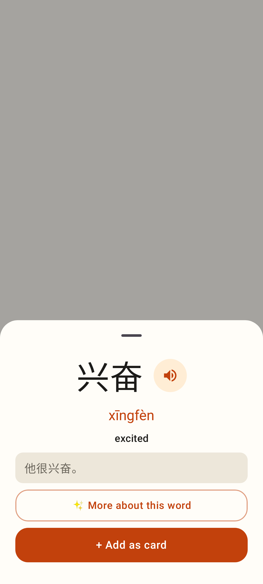
The word sheet.

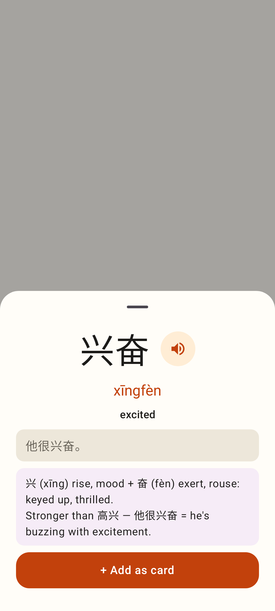
After ✨ More about this word.

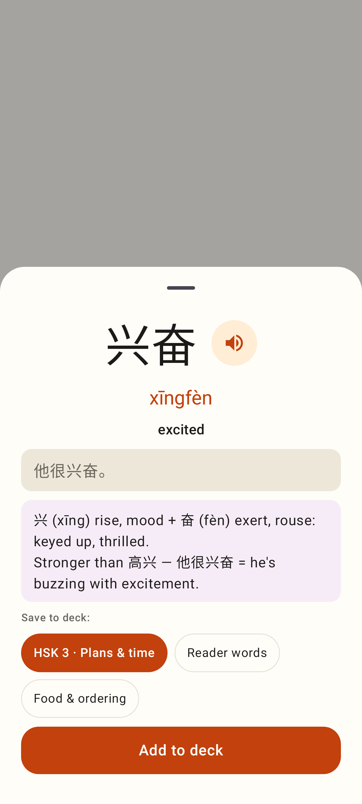
+ Add as card → deck chips → Add to deck.

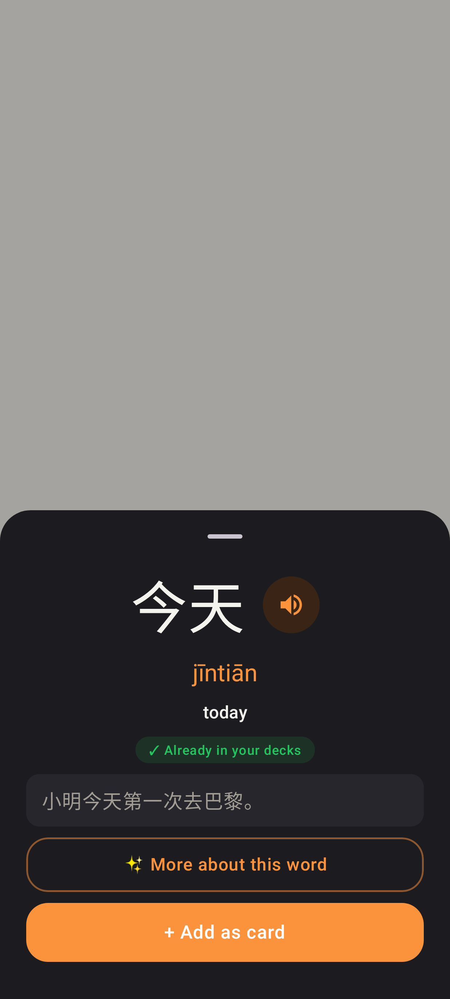
A known word, dark theme.
