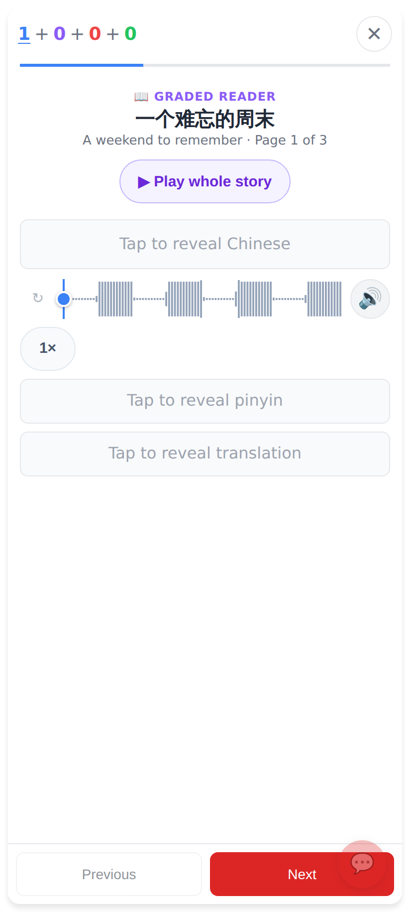
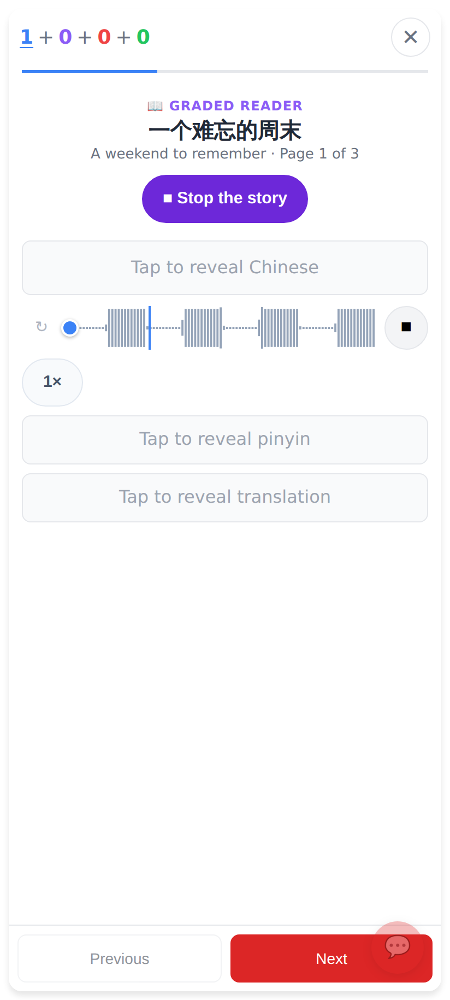
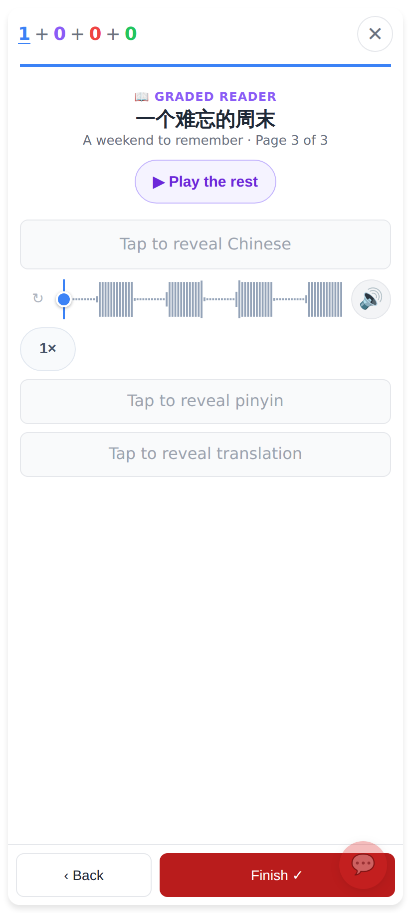
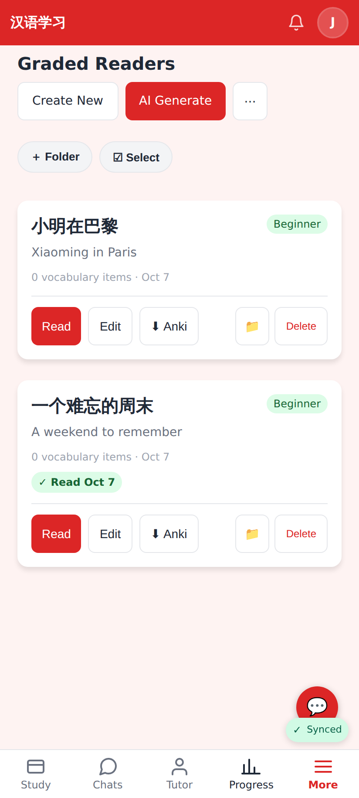
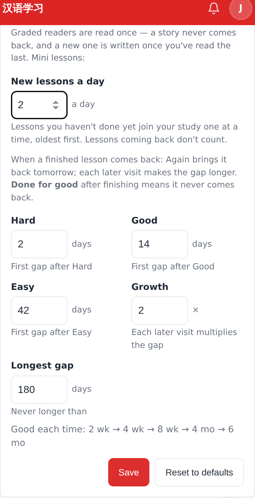
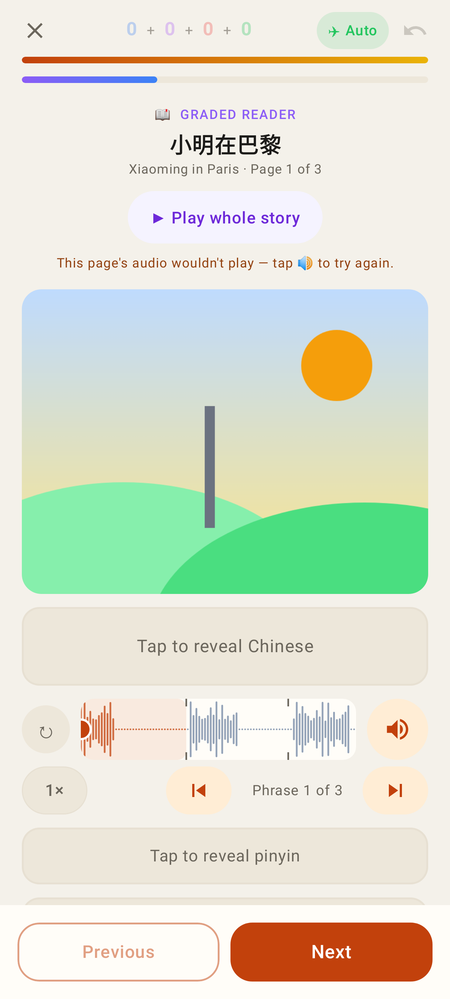
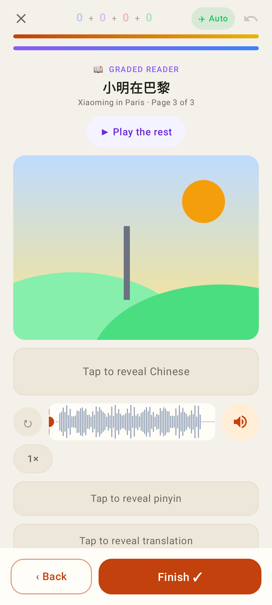
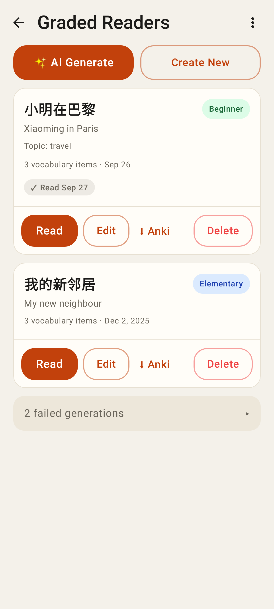
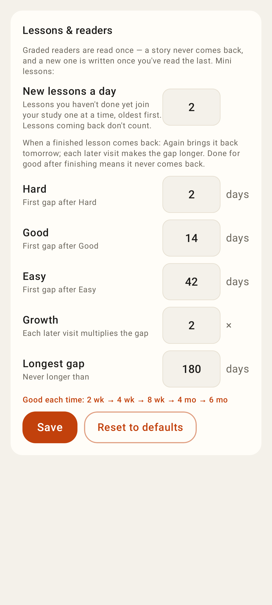

# Readers read once, listen-first; one new lesson a day

Web (412×915 @2×):

The in-session reader: "▶ Play whole story" under the title.

Playing: the button turns into "■ Stop the story"; pages turn by themselves.

The last page ends with Finish ✓ — no rating row, no Done for good (a story is read once).

A read story says "✓ Read Oct 7" on the Readers list (open it to read again by hand).

Settings → Lessons & readers: "New lessons a day" (default 1) above the lesson gaps; readers have no settings.

Lab app (Roborazzi, 412dp):

The in-session reader with "▶ Play whole story".

Playing: "■ Stop the story".

The last page: ‹ Back · Finish ✓.

Readers list: "✓ Read Sep 27" on the story that was read.

Settings → Lessons & readers with "New lessons a day" edited to 2.
