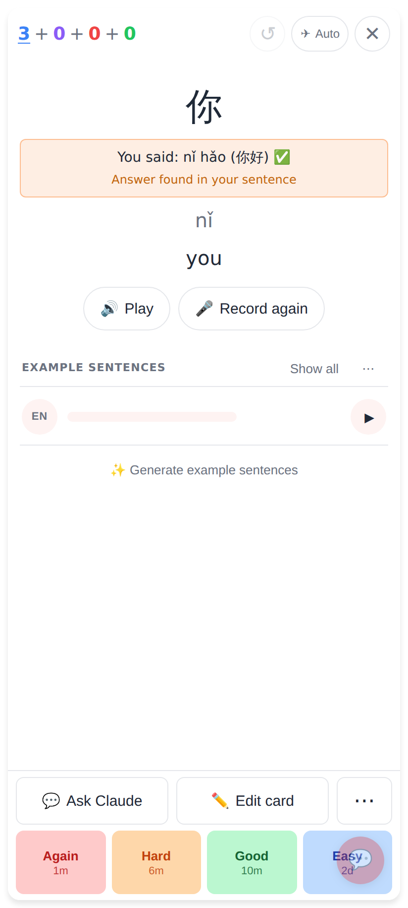
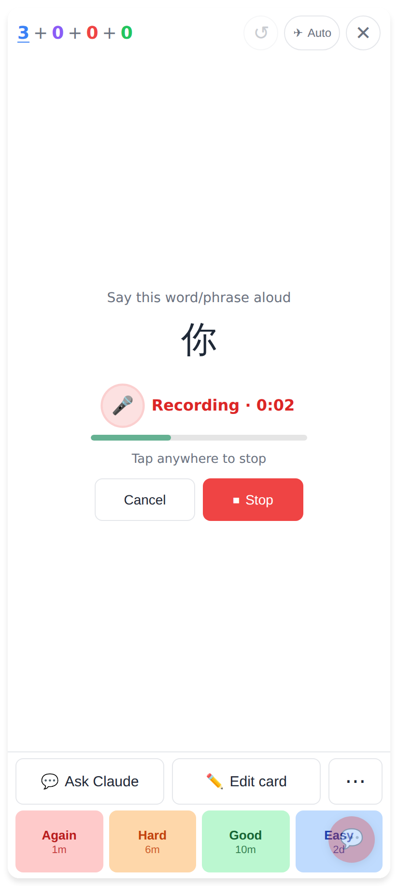
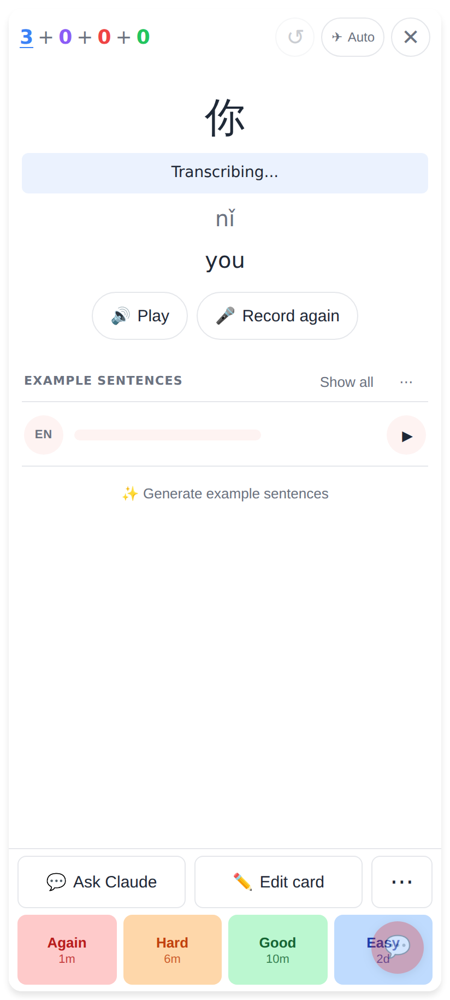
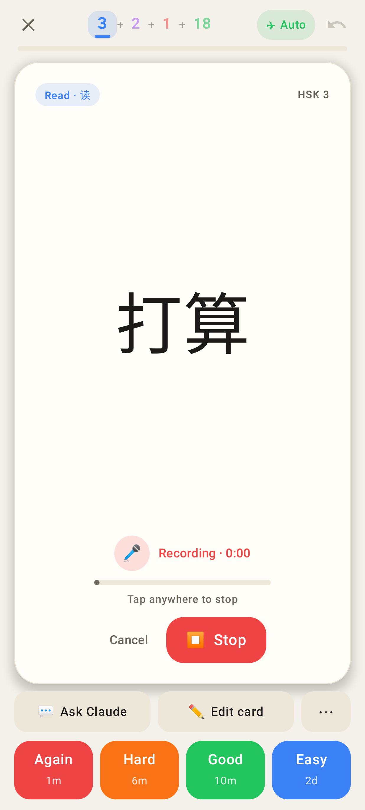
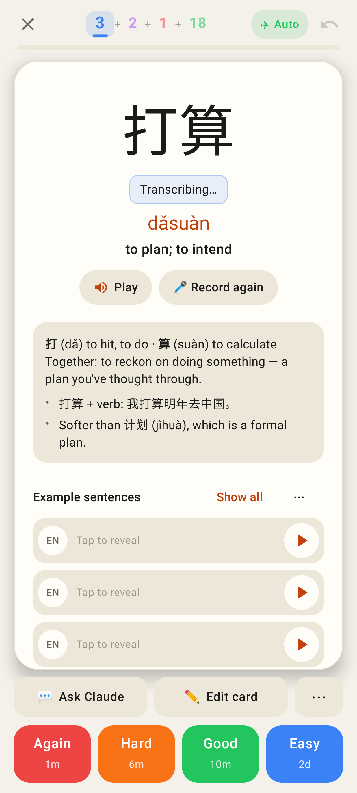

# Record again flips to the question

Phone viewport (412×915, 2×). Web = the PWA, Lab = the native Android app (Roborazzi).

Web — the answer side after the first take ("You said …", 🎤 Record again).

Web — Record again: the card is back on the question (hanzi only) while recording — pulsing mic, timer, level, "Tap anywhere to stop", Cancel / Stop; ratings stay up.

Web — a tap on the card stopped it: back on the answer, the new take transcribing.

Web — the new take's "You said …".

Lab — Record again on the question side.

Lab — after the tap: the answer side, "Transcribing…".
