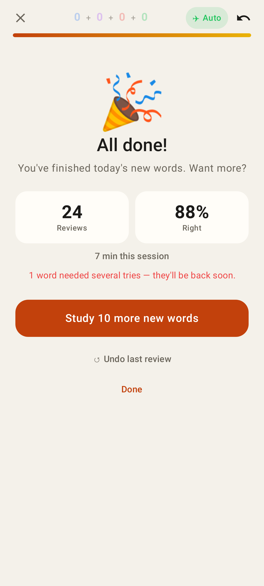
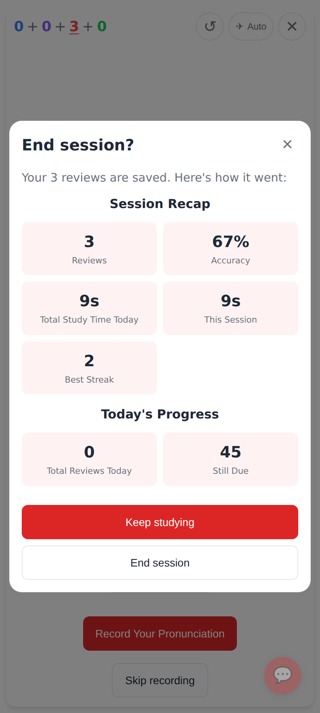
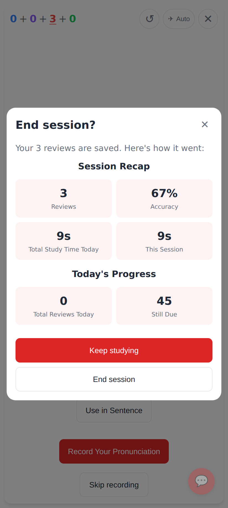
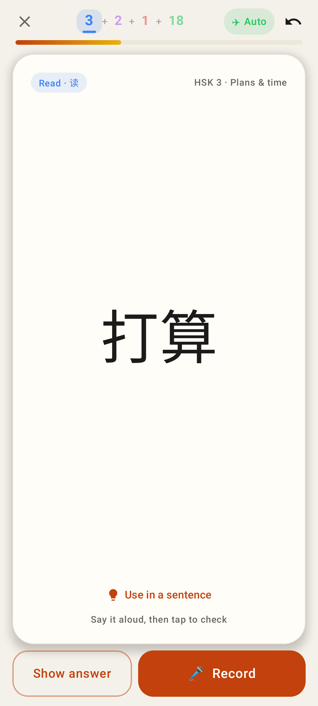
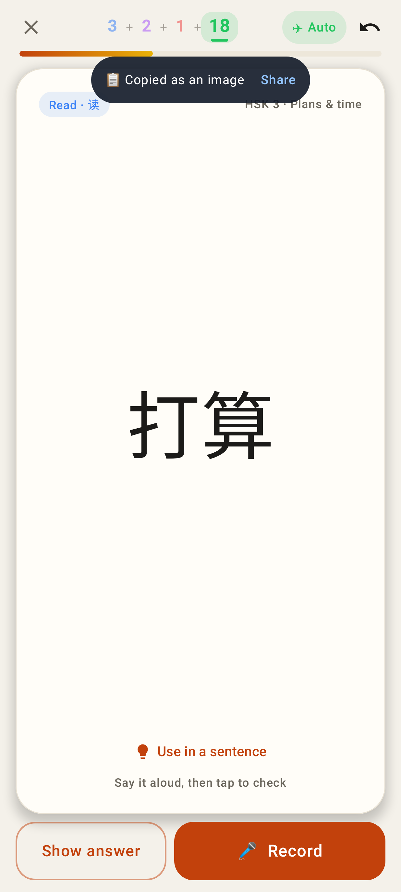
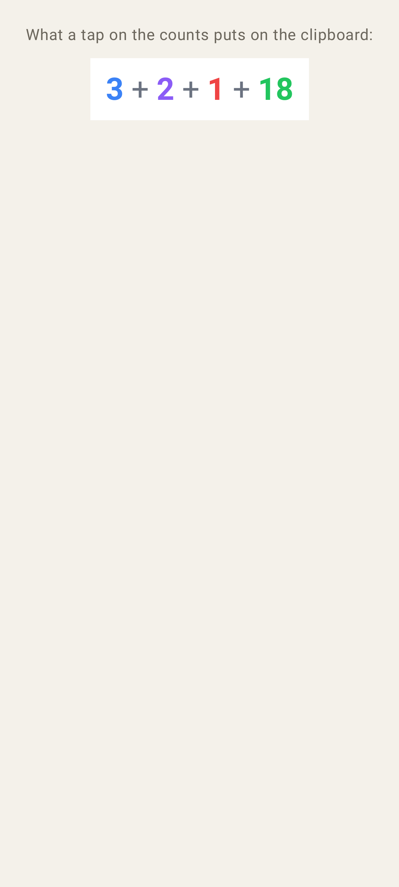

# Record first · honest ratings · counts that say where you are

## Lab app: read card front — Record is the prompt
| Before | After |
|---|---|
|  |  |

Record is now the big filled button on the thumb side; Show answer is the outlined skip (the web's "Record Your Pronunciation" / "Skip recording").

## Lab app: All done — no "Best streak"
| Before | After |
|---|---|
|  |  |

## Web: End session? recap — no "Best Streak"
| Before | After |
|---|---|
|  |  |

## Lab app: the top-bar counts show which bucket the card is in
| New (blue) | Secondary (purple) | Learning (red) | Review (green) |
|---|---|---|---|
|  |  |  |  |

Also: the 🔥 streak chip is gone from the top bar.

## Lab app: tap the counts → image on the clipboard
| Confirmation (with Share) | The image that is copied |
|---|---|
|  |  |
