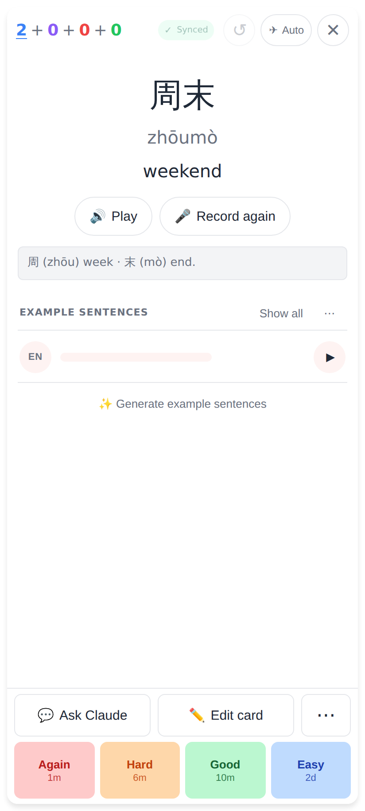
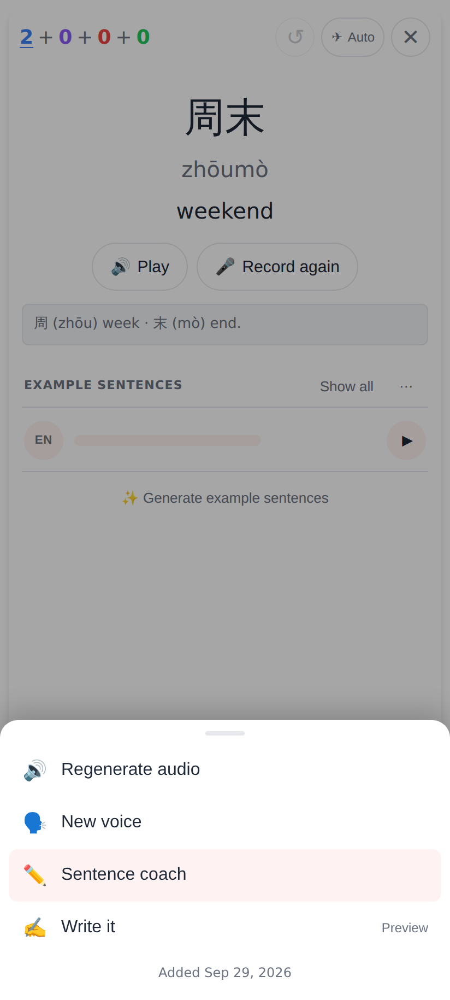
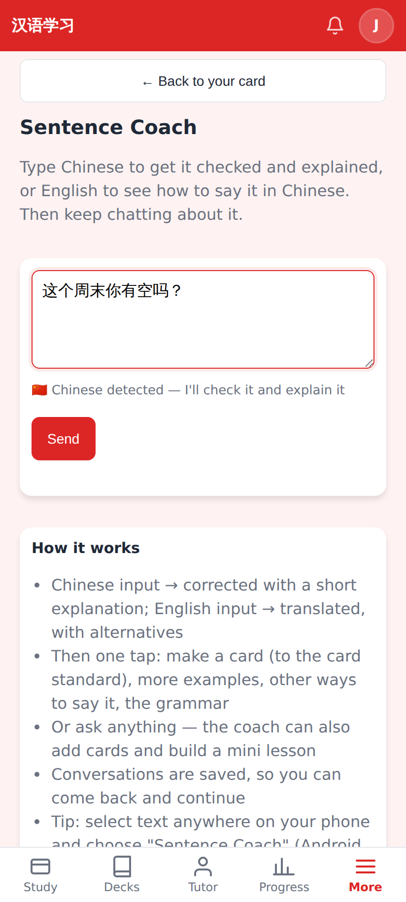
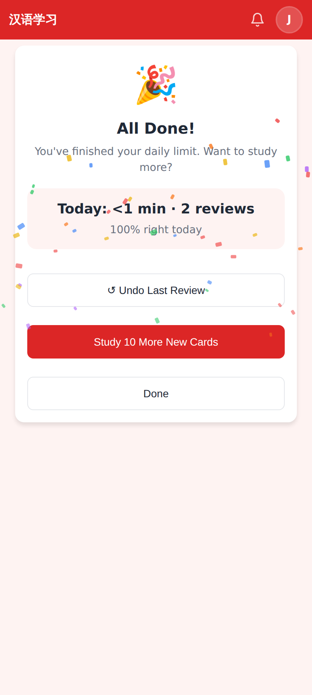
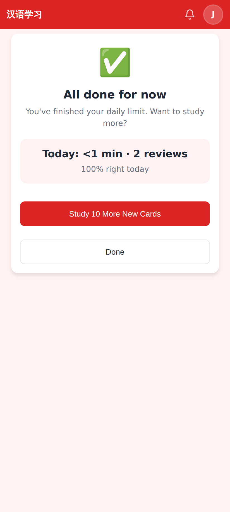
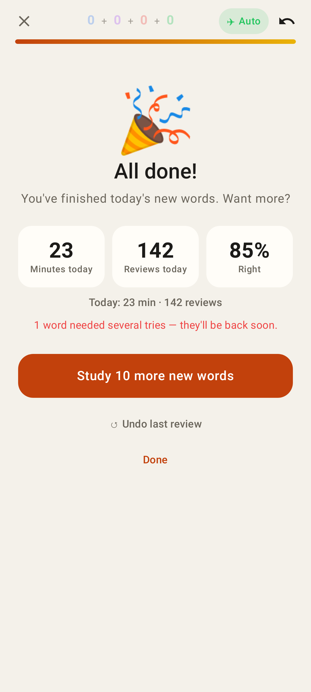
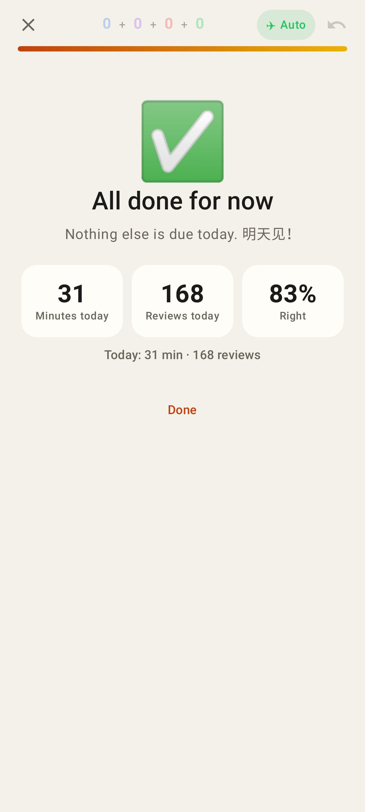
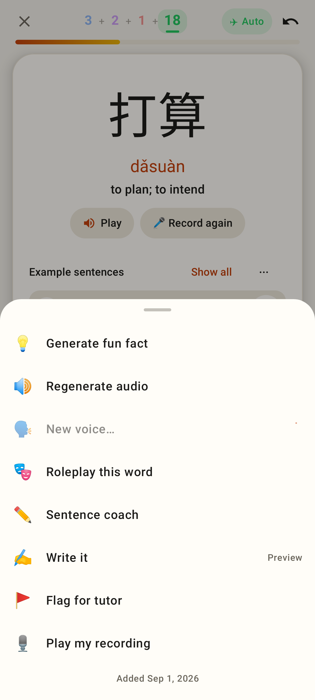
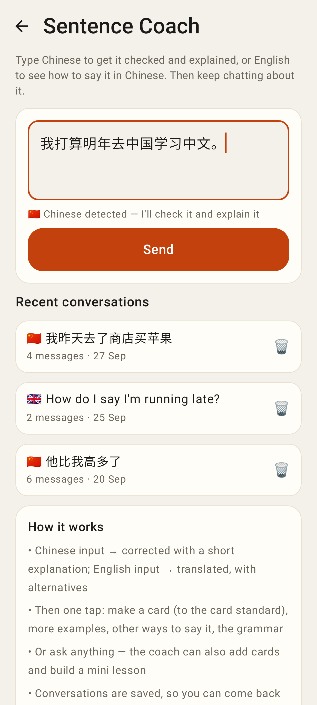

# Study no longer "ends" when you leave — web + Lab

Web (412×915 @2×, local app, real seeded data):

A revealed card. ✕ now just leaves — there is no "End session?" confirm or recap any more.

⋯ → **Sentence coach** (new).

The coach opens with the card's sentence in the box (not sent) and **← Back to your card**.

Back on the same card, still revealed (also after ✕ → Home → Study, or a reload).

Today's queue emptied: confetti + fanfare, and "Today: N min · N reviews" where the recap was.

Back to Study later the same day with nothing due: the quiet "All done for now" (celebrated once a day).

Lab app (Roborazzi, Pixel Fold folded):

All done: minutes today, reviews today, % right, "Today: 23 min · 142 reviews".

The quiet finish when today was already celebrated.

⋯ → Sentence coach.

The coach with the card's sentence, keyboard up; back returns to the card as it was.
