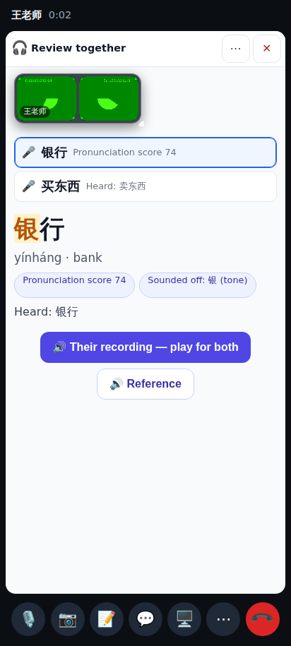
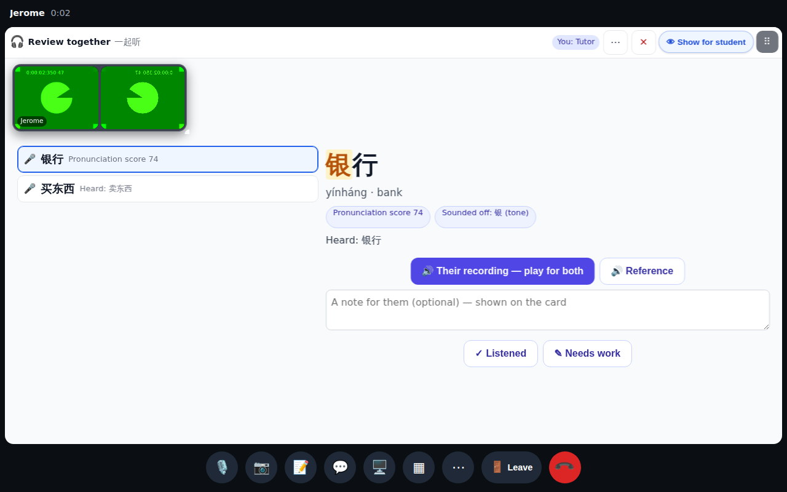
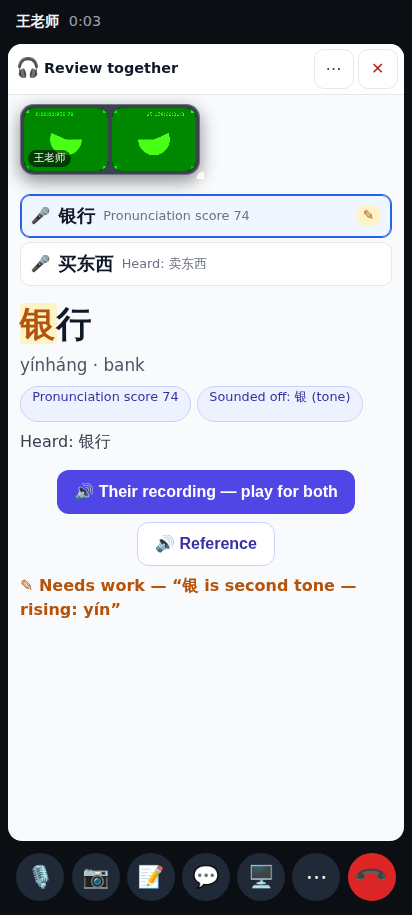
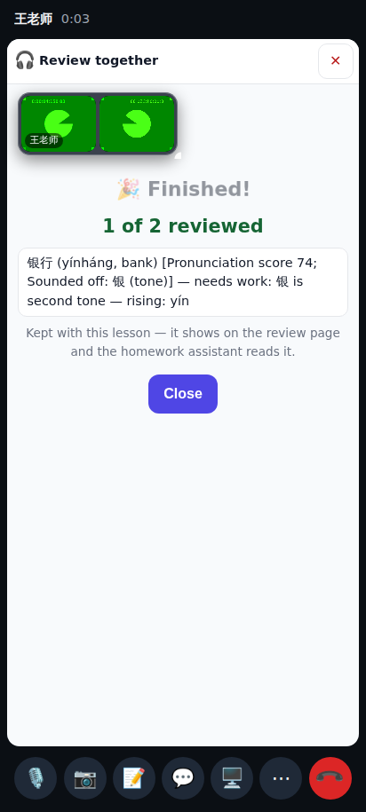
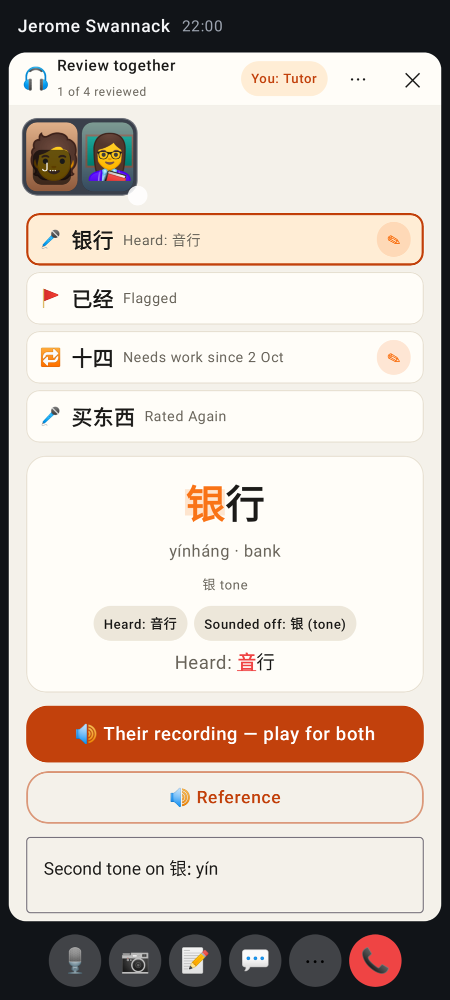
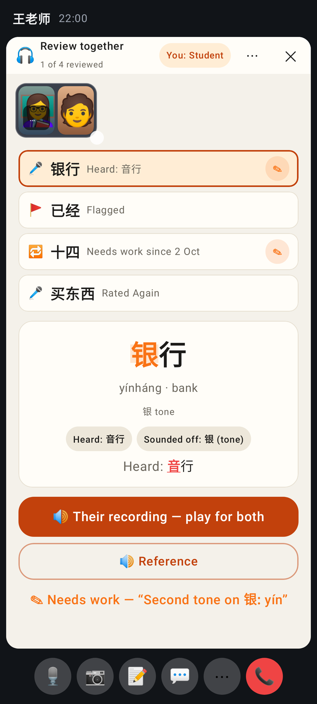
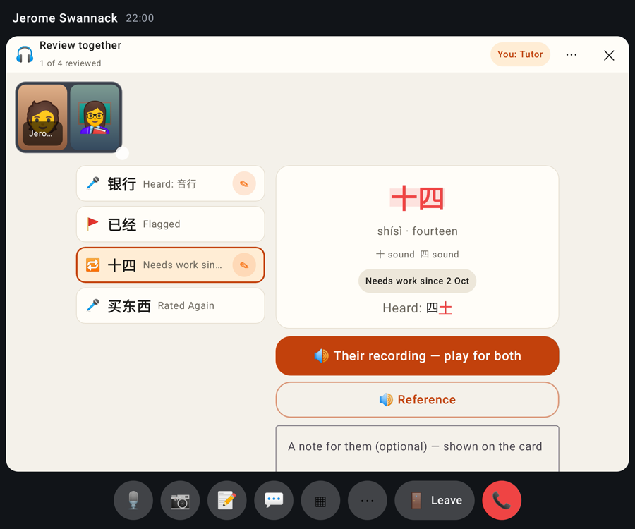

# Review together — in-call activity (PR 2)

Tutor (desktop): the shared list, 银 highlighted as a tone problem, play-for-both buttons, a note and Listened / Needs work.

Student (phone): the same list and the same selected item — they can select and play too, but not mark.

Tutor after the student selected and replayed an item.

The tutor's "Needs work" note appears on the student's screen at once.

Finished: the summary that is kept with the lesson.

Lab app — tutor view.

Lab app — student view.

Lab app — unfolded, list beside the detail.
