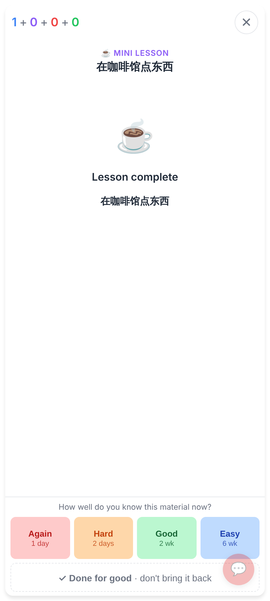
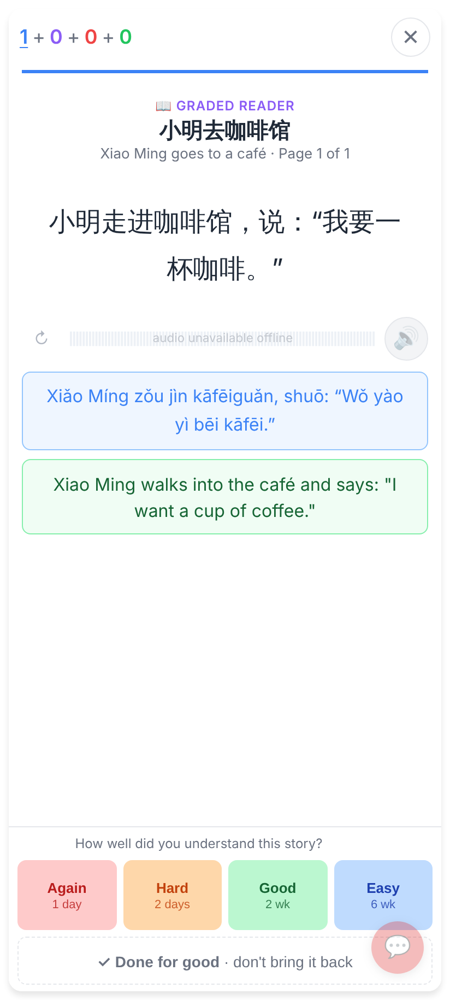
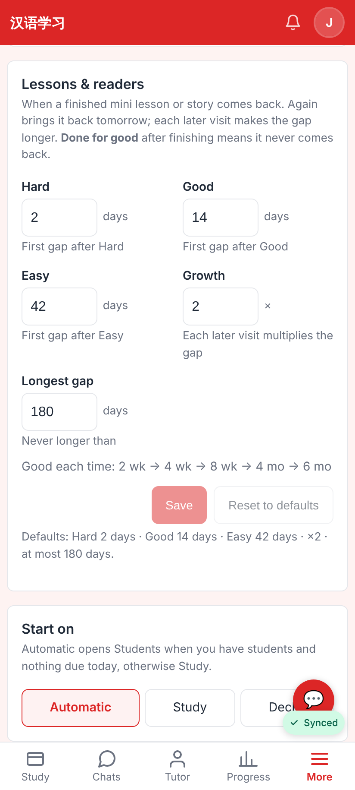
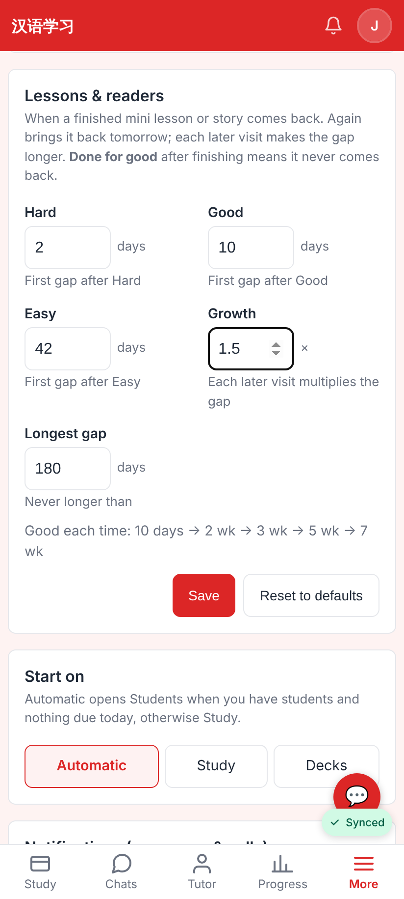
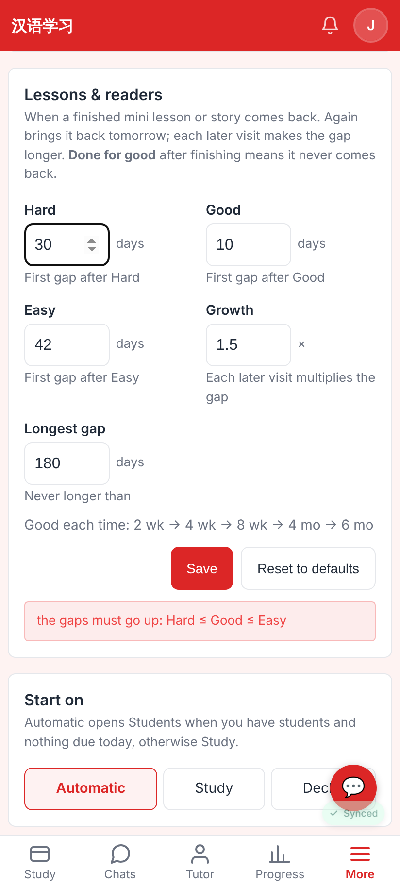
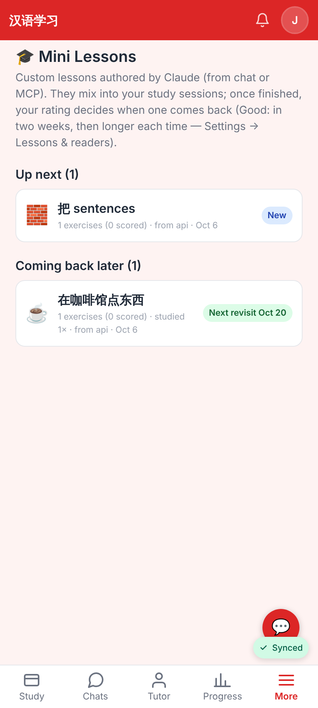

# Lessons & readers: "revisit later" (412×915 @2x)

Web app:

Lesson finished — Again 1 day · Hard 2 days · Good 2 wk · Easy 6 wk, and **✓ Done for good**.

Graded reader finished — the same row.

Settings → "Lessons & readers" with the defaults and what Good each time does.

Good 10 days, growth ×1.5 — the chain updates before saving.

Hard above Good is refused inline.

Mini Lessons: "Coming back later" with "Next revisit Oct 20".
