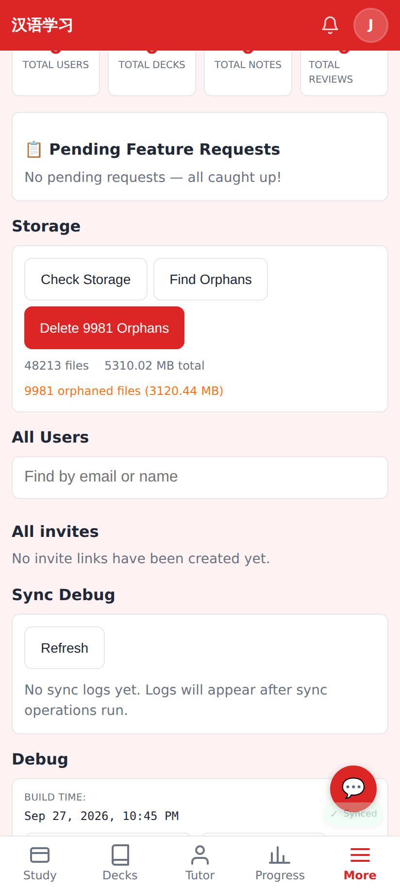
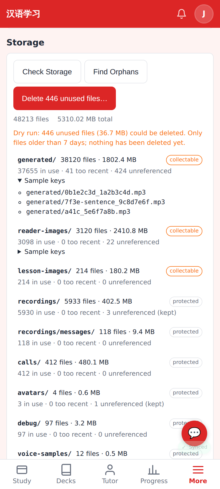

# Safe R2 storage clean-up — Admin → Storage

Phone viewport (412×915, 2×). The API responses are mocked with realistic numbers; nothing ran against production.

Before: "Find Orphans" counted every key not in `notes.audio_url` / `review_events.recording_url` / `users.picture_key` (reader images, sentence clips, lesson pictures, calls…) and one tap deleted them all.

After: "Find Orphans" is a dry run showing each registered prefix (in use, too recent, unreferenced, collectable or protected) plus unknown prefixes that are never deleted, with sample keys. "Delete N unused files…" opens a confirmation listing the per-prefix counts and then calls `POST /api/admin/storage/cleanup?apply=1`.
